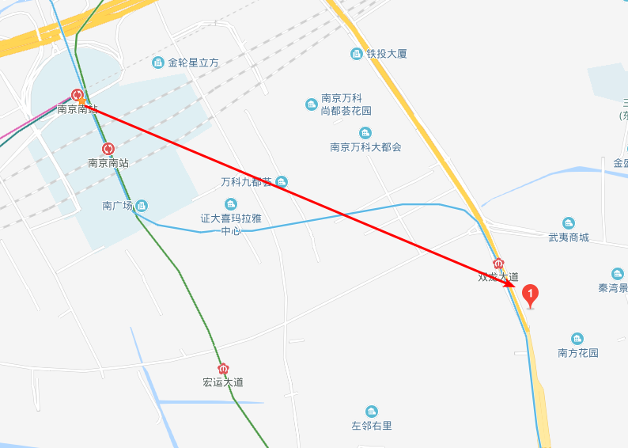
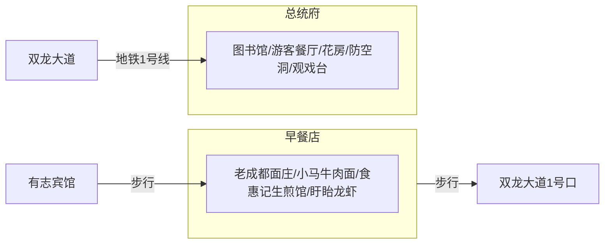
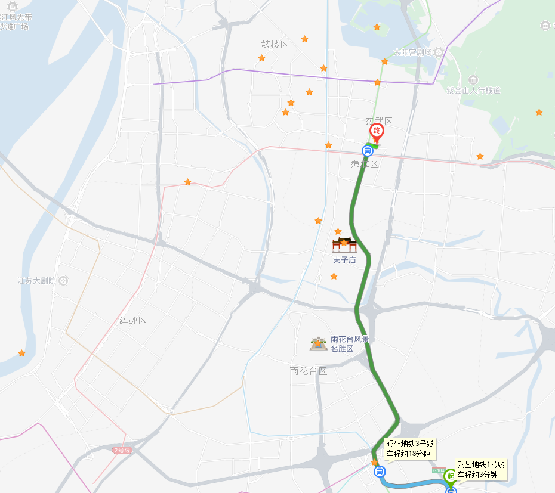
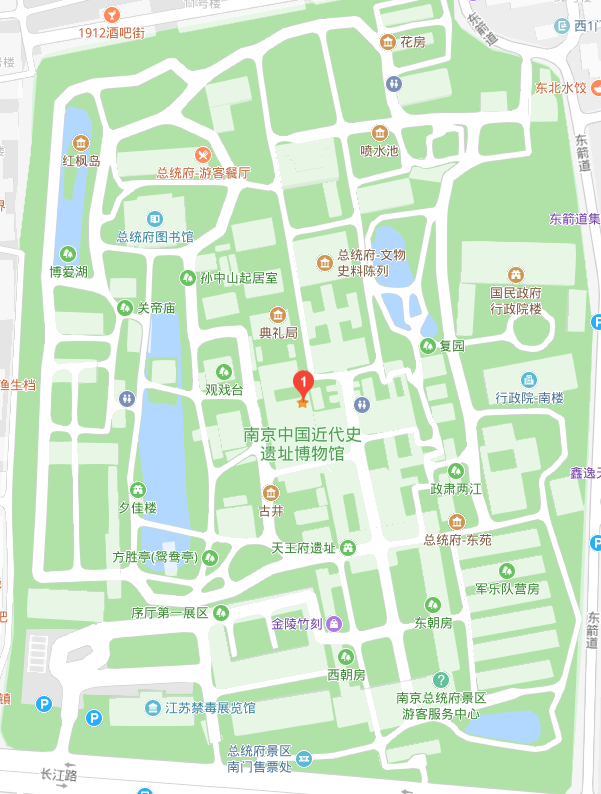

---

layout: post
title: 南京3日游攻略
categories: Tourism
description: 南京3日游攻略
keywords: Tourism, Nanjing
mermaid: true
---

# 1、Day1

# 2、Day2

## 2.1 Day2总行程

## 2.2 路线说明

### 2.2.1 双龙大道->总统府

**路线**

**总统府概况**

