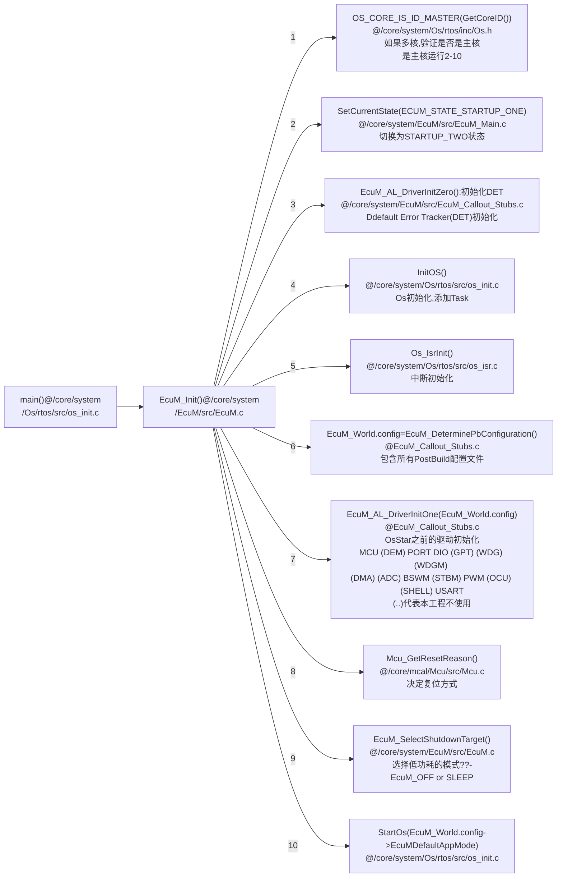
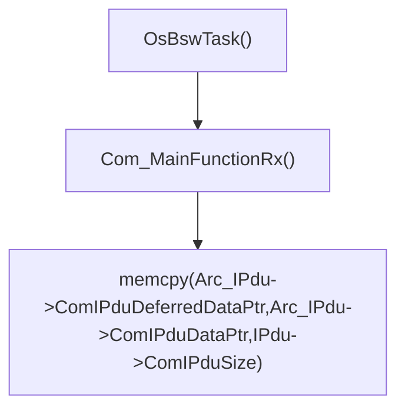
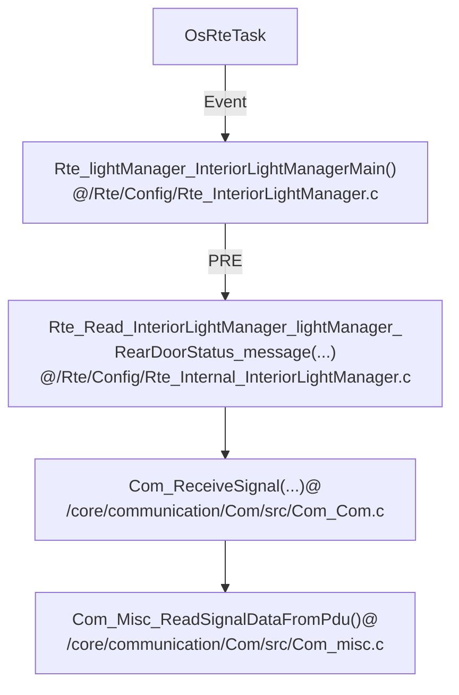
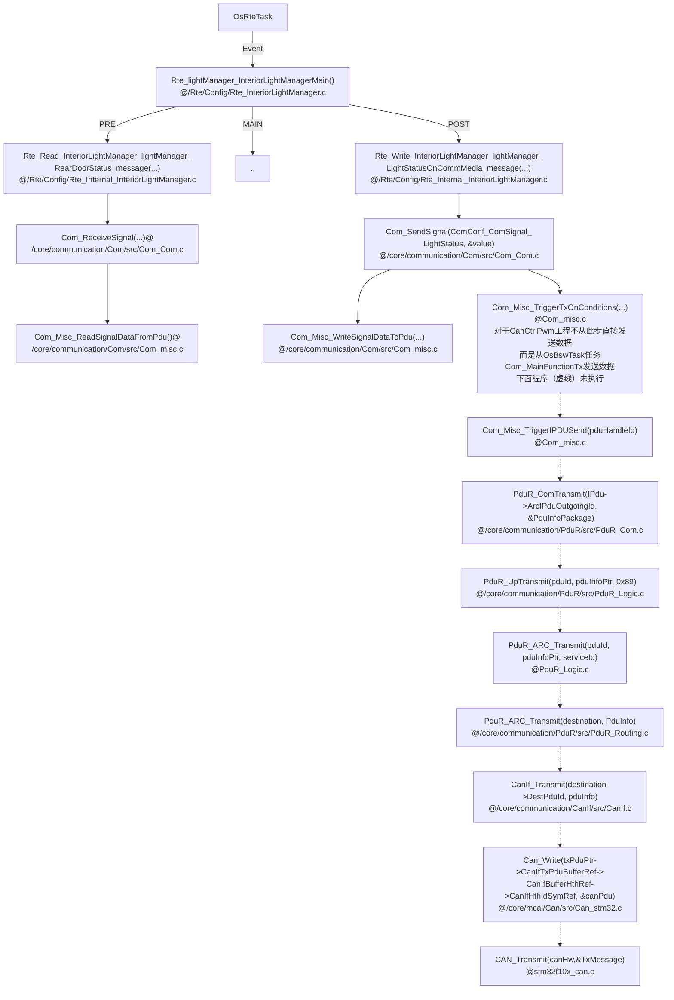
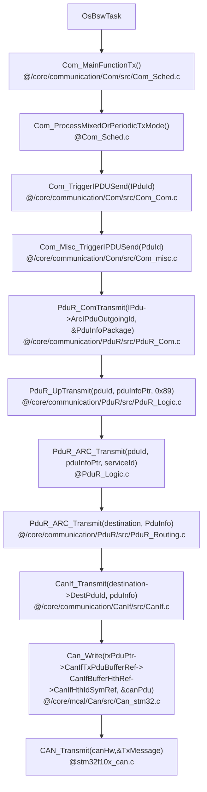
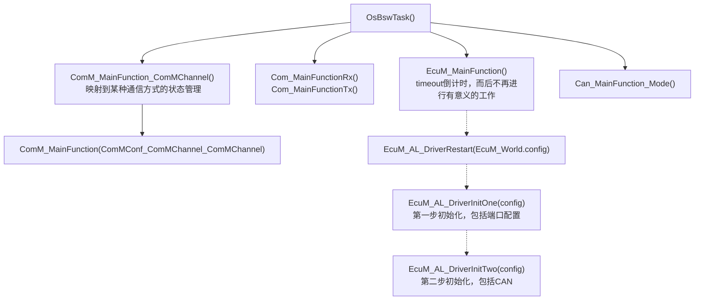
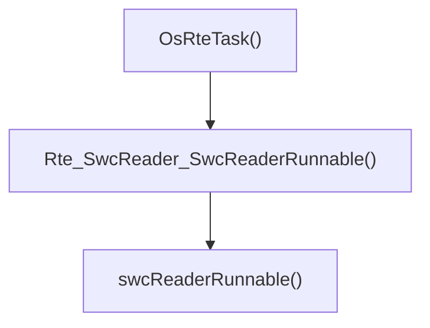

# 1、AUTOSAR介绍

AUTOSAR 是针对特定的汽车电子这一领域，提出的一套开放式软件结构。其主体思想是使得软件设计开发更易于管理，软件系统更易于移植、裁剪，以及更好的维护性和质量保证。

## 1.1 AUTOSAR目的

| 挑战                                                         | 解决方法                                 | 好处                                                         |
| ------------------------------------------------------------ | ---------------------------------------- | ------------------------------------------------------------ |
| 不成熟的过程，因为 ad-hoc 模式/缺少对功能需要的追踪能力。缺少兼容的工具（供应商、OEM） | 标准化的规范交换格式                     | 对规范的改进（格式、内容）提供无缝的工具链。                 |
| 浪费在实现和优化组件上的努力，而顾客并不承认这些努力的价值。 | 基础软件核（BSW, Basic Software）        | 软件质量的加强。将工作集中在有价值的功能上。                 |
| 微控制器模型缺乏可用性，很难适应现有软件。（由新功能引起的）微控制器性能的扩展需求所导致的升级需要（如重新设计）。 | 微控制器抽象（MCAL）                     | 微控制器能在不需要改变更高软件层的情况下调换。               |
| 重定位 ECU 之间的功能时需要做大量的工作。
功能重用时也需要做大量的工作。 | 运 行 时 环 境(RTE, RunTime Environment) | 功能封装导致的通信技术的独立性。通过标准化机制，使得通信更加简单。使功能分区和功能重定位变得可能。 |
| 非竞争性功能必须适应OEM的特定环境。因为需要从其它组件供应接口需要很多功夫，所以哪怕是很微小的革新，也需要做很多工作。基础软件和模型生成的代码间缺少清晰的接口。 | 接口标准化                               | 减少/避免 OEM 和供应商之间的接口。通过使用通用接口目录，使独立于软件功能的硬件实现所耗费的工作量。简化模型驱动的开发，允许使用标准化的AUTOSAR代码生成工具。OEM 间的模型的可重用性。不同供应商之间模块的可交换性。 |

## 1.2 AUTOSAR架构

* **精简版**


BSW可分为：

*I/O*：访问传感器、执行器、ECU板载总线

*Memery*：访问内部/外部存储器（**非易失性存储器**）

*Crypto*：访问加密原语（基本密码概念，如加密、签名、Hash等算法）

*Communication*：访问汽车网络系统、ECU板载通信系统、ECU内部软件（SW）

*Off-board Communication*：访问汽车-X通信、汽车内无线通信系统、ECU板外通信系统

*System*：提供标准化（操作系统、时钟、error memory错误存储）和ECU特定服务（状态管理、看门狗）和库函数

* **细化版**


* **完整版**


## 1.3 AUTOSAR方法


1.定义 System Configuration Input，选择软、硬件组件，标识系统总体限制

2.活动 Configure System 主要是将软件组件映射到关于资源和计时要求的 ECU 上

3.Configure System 的输出是 System Configuration Description：系统信息（如总线映射、拓扑等）和关于软件组件定位到哪个 ECU 的映射

4.活动 Extract ECU-Specific Information 从 System Configuration Description 中提取特定 ECU 所需的信息。

5.提取的信息输出到 ECU Extract of System Configuration

6.活动 Configure ECU 为实现添加了所有必需的信息，如任务调度、必需的 BSW（基础软件）模块、BSW 的配置、任务中可运行实体的赋值等。

7.活动 Configure ECU 的结果将输出给 ECU Configuration Description，它负责收集所有关于特定 ECU 的局部信息。通过这些信息可以构建该特定 ECU 的可执行软件。

8.在最后一步中，活动 Generate Executable 根据从 ECU Configuration Description中得到的信息生成可执行软件。这一步通常涉及生成代码（如为 RTE 和 BSW 生成代码）、编译代码（编译生长的代码或编译软件组件的源代码）、将所有编译后的代码连接成为可执行软件。

9.得到可执行 ECU 软件。

## 1.4 缩写词

* CANSM = CAN State Manager

# 2、BSW-MCAL

MicroController Abstraction Layer，BSW最底层，直接和芯片接触，对应AUTOSAR架构的红色部分。

## 2.1 微控制器驱动

Microcontroller Drivers


## 2.2 存储器驱动

Memory Drivers


## 2.3 加密驱动

Crypto Drivers


## 2.4 无线通信驱动

Wireless Communication Drivers


## 2.5 通信驱动

Communication Drivers


## 2.6 IO驱动

I/O Drivers

# 3、BSW-ECU抽象层

ECU Abstraction Layer，这一层与微控制器抽象层进行对接。它也包含了外部设备的驱动，不需要管外设位置、同芯片连接情况（端口、针脚、接口类型）。

**任务**：让更高层的软件层和ECU硬件独立。

## 3.1 板载设备抽象

Onboard Device Abstraction


## 3.2 存储硬件抽象

Memory Hardware Abstraction


## 3.3 加密硬件抽象

Crypto Hardware Abstraction


## 3.4 无线通信硬件抽象

Wireless Communication Hardware Abstraction


## 3.5 通信硬件抽象

Communication Hardware


## 3.6 IO硬件抽象

I/O Hardware Abstraction，目标是使数据通过RTE来传输，而不完全依赖于ECU硬件。

# 4、BSW-服务层

## 4.1 介绍

Services Layer，BSW最高层，**（任务）为应用、RTE和BSW提供基础服务**。

服务层和应用软件有关联，当对IO信号访问ECU抽象层时，提供：

* 操作系统功能
* 车辆网络通信及管理服务
* 存储管理（NVRAM 管理）
* 诊断服务（包括 UDS 通信及错误内存）
* ECU 状态管理

## 4.2 服务层架构

### 4.2.1 系统服务

System Services


# 5、BSW-复杂驱动层

Complex Drivers Layer，涉及到从硬件到RTE，**任务**：

* 在AUTOSAR中没有定义的芯片特殊驱动
* 高实时限制

# 6、RTE

Runtime Environment，是 AUTOSAR 虚拟功能总线（Virtual Function Bus，VFB）的接口（针对某个特定 ECU）的实现，为应用程序（软件组件）之间的通信提供了基本的服务，同时也便于访问包含 OS 的基本软件组件。

为了满足系统设计者所做的一些限制，应用程序组件能够在系统配置期间被映射到任何有效的 ECU 上。**RTE 负责确保这些（应用程序）组件能够通信，提供了在 AUTOSAR 软件组件间通信的基础服务。**

# 7、Core 21.0.0学习


## 7.1 工程架构

**工程方案1.工程文件和Arctic Core分开**

*简单版本*

```
<anydir>                               - 工程
|--- config
|    |--- [config files]               - Overrides default module configurations
|    '--- <board>
|         '--- [config files]          - Overrides all other module configurations
|
|--- makefile
|--- [build_config.mk]  
'--- obj-<arch>
 
<Arctic Core>
|--- makefile
|--- boards
|    '--- <board>
|         |--- [config files]          - Default module configurations
|         '--- build_config.mk         - Configuration for the board
|
'--- scrips
     |--- config.mk
     |--- rules.mk
     '--- cc_gcc.mk
```

*详细功能版本*

```
<examples>               - 工程
|--- boards              - [ECL]  ecipse读取板子arxml
|--- HelloWorld
     |--- dbc            - [ECL]  描述CAN网络通信信号的文件
     |--- HelloWorld     - 具体工程
     |    |--- .settings - [ECL]  eclipse配置文件
     |    |--- swcs      - [ECL]  SWC描述文件
     |    |--- src       - [SWC]  软件组件  
     |    '--- config    - [RTE]  板子配置和RTE配置、接口、映射
     ...
|--- OsSimple
...
 
<Arctic Core>            - core
|--- .settings           - [ECL]    eclipse配置文件
|--- arxml               - [ECL]    ecipse读取ECU配置
|--- makefile            - [MAKE]   make顶层文件
|--- scrips              - [MAKE]   脚本(编译、链接)
|--- stylesheets         - [MAKE]   代码风格检查
|--- base                - [MAKE]   编译器基本定义
|--- diagnostic          - [SL]     诊断[Dlt Det Dcm..]
|--- system              - [SL]     操作系统[Os BswM EcuM SchM..]
|--- communication       - [ECU_AL] 通信HWA
|--- memory              - [ECU_AL] memory HWA
|--- Peripherals         - [ECU_AL] IO HWA, 会从examples读取参数
|--- safety_security     - [ECU_AL] 安全库和WDG
|--- cdd                 - [CDD]    Complex Device Driver
|--- drivers             - [MCAL]   驱动(CAN Fr等)
|--- arch                - [MCAL]   内有CAN收发器的SPI驱动
|--- mcal                - [MCAL]   mcal
|--- boards              - [MCAL]   具体板子配置结构体(WDG EEP FLS)
|--- clib                - [BASE]   c库函数
|--- common              - [BASE]   基础函数(log shell等)
|--- include             - [BASE]   内核inc文件给上层使用
|--- libs                - [BASE]   存放生成的libs
'--- datastructures      - [BASE]   数据结构(队列和安全队列)给RTE
```


**工程方案2.工程和Arctic Core在一起**

```
<Arctic Core>
|--- makefile
|--- boards
|    '--- <board>
|         |--- [config files]          - Default module configurations
|         '--- build_config.mk         - Configuration for the board
|
|--- <anydir>
|    |--- config
|    |    |--- [config files]          - Overrides default module configurations
|    |    '--- <board>
|    |          '--- [config files]    - Overrides all other module configurations
|    |
|    |--- makefile
|    |--- [build_config.mk]  
|    '--- obj-<arch>
|
'--- scrips
     |--- config.mk
     |--- rules.mk
     '--- cc_gcc.mk
```

## 7.2 工程make

**make命令**

```bash
# BOARDDIR：电路板；BDIR：工程样例目录
make BOARDDIR=mpc5516it BDIR=<anydir>[,<anydir>] all
```

**一些特定的变量**

* `MOD_AVAIL`

  一些可用模块，例如`ADC CAN DIO MCU FLS PORT PWM GPT EA`

* ` CFG`

  配置信息，例如`ARM ARMV7E_M ARM_CM4 HW_FLOAT THUMB`

  在文件中的冲突问题没有想明白。CFG=会不会影响其他文件中的CFG，但是CFG又没有export

* `MOD_USE`

  需要使用的模块，例如`MCU` 、`KERNEL`、**`RTE`**等，RTE的路径在`project_default.mk`中加入

* `COMPILER`

  编译器名称，如`gcc`

* `CROSS_COMPILE`

  编译器地址，如`/usr/lib/gcc-arm-none-eabi-4_9-2015q2/bin/arm-none-eabi-`，后面会加上`gcc`

  在文件`/core/scripts/guess_cc.sh`中运行了`export CROSS_COMPILE=$COMPILER`，在这里可以设置成和镜像默认的编译器。如wzh-ubuntu镜像的默认gcc版本是 5.4.0版本的，而4.9.3版本在`/usr/lib/gcc-arm-none-eabi-4_9-2015q2/bin/arm-none-eabi-gcc```

* `ASFLAGS` - `assembler flags`

  汇编flags

* `ASOUT`-`how to generate output file`

  如何生成输出文件

* `LDFLAGS`-`linker flags`

* `LDOUT`-`how to Generate linker output file`

* `LDMAPFILE` - `How to generate mapfile `

* `AROUT`-`archiver flags`

  归档器的flags

* obj-y : list of object files to build.

* VPATH : list of directories in which to look for source files.

* inc-y : list of directories in which to look for header files.

* libitem-y : list of libraries to include. 

* build-exe-y : the name of build the output file.

* ldcmdfile-y: path to linkscript, used when building "build-exe-y"

**make调用顺序**

[顶层（core/下）的makefile会（进入目录`<anydir>/obj_<arch>`）调用core/scripts/rules.mk](<https://github.com/Neyzoter/autosar_core21.0.0>)

## 7.3 模块相关代码

### 7.3.1 EcuM

`core/system/EcuM/src/EcuM_Generated_Types.h`：定义EcuM需要的(模块接口配置)数据结构。例子：

```c
if defined(USE_SPI)
     const Spi_ConfigType* SpiConfigPtr;
endif
```

### 7.3.2 OS任务

在`GEN_TASK_HEAD`中定义所有任务

```c
#define GEN_TASK_HEAD const OsTaskConstType  Os_TaskConstList[OS_TASK_CNT]
```
### 7.3.3 初始化

*未完待续*




### 7.3.4 CAN调用过程

**说明1**：`Github`不支持`mermaid`请**将以下`mermaid`代码复制到**[在线`mermaid`查看器](<https://mermaidjs.github.io/mermaid-live-editor>)、`Typora`等软件查看具体流程图。

**说明2**：CAN需要的底层接口包括`Can_Init( const Can_ConfigType *Config )`和`Can_ReturnType Can_Write( Can_HwHandleType Hth, const Can_PduType *PduInfo )`

*注*：Can_Init(ConfigPtr->PostBuildConfig->CanConfigPtr)：CanConfigPtr参数在Can_PBcfg.c

* **CAN数据接收**

  1.CAN接收中断初始化、触发、数据写入到IPdu过程


2.OsBswTask将IPDU数据拷贝到DEFERRED_IPDU中



3.OsRteTask从DEFERRED_IPDU获取数据



* **CAN数据发送**

  对于CanCtrlPwm工程而言，在OsRteTask任务中将数据放到IPDU中，在从OsBswTask通过CAN周期性发送出去

  1.OsRteTask任务中将数据放到IPDU中



2.周期性从IPdu发送CAN数据



### 7.3.5 运行OsBswTask

*未完待续*



### 7.3.6 RTE设置PWM



## 7.4 顶层移植、配置和应用

### 7.4.1 Os

配置文件主要包括：`Os_Cfg.c`和`Os_Cfg.h`

* `Os_Cfg.c`

  **（1）外部参考——EXTERNAL REFERENCES**

  *Application externals*

  *Interrupt externals*：设置Os Tick频率

  **（2）DEBUG输出——DEBUG OUTPUT**

  变量`os_dbg_mask`来控制OS_DEBUG的日志输出等级。

  **（3）应用——APPLICATIONS**

  每个应用下由多个任务TASK组成。

  **需要修改的内容**：`.appId`和`.name`

  ```c
  const OsAppConstType Os_AppConst[OS_APPLICATION_CNT]  = {			
  	{
      .appId = APPLICATION_ID_OsApplicationInteriorLight,  // 应用ID：0,1,2...
      .name = "OsApplicationInteriorLight",  //应用名称
      .core = 0,     //运行该应用的内核
      .trusted = true,    //是否信任
  	}
  };
  ```

  **（4）计数器——COUNTERS**

  主要用于定时给任务ALARM，周期性运行

  **需要修改的内容**：无

  **隐含变量**：`OS_COUNTER_CNT`  （`@Os_Cfg.h`）计数器个数，对应`GEN_COUNTER_HEAD`元素个数；

  ```c
  GEN_COUNTER_HEAD = {
  	GEN_COUNTER(
          /* id          */		COUNTER_ID_OsRteCounter,  //唯一ID标识，指示计数器下标，从0开始，GEN_COUNTER函数中未用到_id变量，主要给下面Os_Arc_OsTickCounter指示
          /* name        */		"OsRteCounter",           //counter名称
          /* counterType */		COUNTER_TYPE_HARD,        // @/Os/rtos/src/os_counter_i.h
          /* counterUnit */		COUNTER_UNIT_NANO,        // @/Os/rtos/src/os_counter_i.h
          /* maxAllowed  */		OSMAXALLOWEDVALUE,        // 计数器最大值
          /*             */		1,
          /* minCycle    */		1,                       //最小周期
          /*             */		0,
          /* owningApp   */		APPLICATION_ID_OsApplicationInteriorLight,  //使用该计数器的应用，上方Os_AppConst定义应用
          /* accAppMask..*/       ((1u << APPLICATION_ID_OsApplicationInteriorLight))
      ) 
  };
  //定义Os的tick下标，所以上面的定义中id必须从0
  CounterType Os_Arc_OsTickCounter = COUNTER_ID_OsRteCounter;
  ```

  **（5）ALARMS**

  两个功能：1、周期性唤醒任务执行（通过`GEN_ALARM_AUTOSTART`设置）；2、周期性抛出事件ALARM（通过`GEN_ALARM_HEAD`设置），在任务内判断是否有相应事件出现。

  **需要修改的内容**：无

  ```c
  GEN_ALARM_AUTOSTART(  // 命名方式  Os_AlarmAutoStart_ ## _id，可以通过GEN_ALARM_AUTOSTART_NAME获取
  				ALARM_ID_OsRteAlarm100ms,  // _id，0,1,...
  				ALARM_AUTOSTART_RELATIVE,
  				100,                      //ALARM周期
  				100,                      //循环周期
  				OSDEFAULTAPPMODE );
  
  GEN_ALARM_AUTOSTART(
  				ALARM_ID_OsAlarmBswServices,
  				ALARM_AUTOSTART_RELATIVE,
  				5,
  				5,
  				OSDEFAULTAPPMODE );
  
  GEN_ALARM_HEAD = {
  	GEN_ALARM(	ALARM_ID_OsRteAlarm100ms,  //对应于上面生成的ALARM
  				"OsRteAlarm100ms",
  				COUNTER_ID_OsRteCounter,  //对应生成的计数器的id
  				GEN_ALARM_AUTOSTART_NAME(ALARM_ID_OsRteAlarm100ms), //指向ALARM_AUTOSTART变量
  				ALARM_ACTION_SETEVENT,    //设置事件
  				TASK_ID_OsRteTask,     //任务ID @ Os_Cfg.h
  				EVENT_MASK_OsMainEvent,
  				0,
  				APPLICATION_ID_OsApplicationInteriorLight, /* Application owner */
  				(( 1u << APPLICATION_ID_OsApplicationInteriorLight ) 
  				) /* Accessing application mask */
  			)
  ,
  	GEN_ALARM(	ALARM_ID_OsAlarmBswServices,
  				"OsAlarmBswServic",
  				COUNTER_ID_OsRteCounter,
  				GEN_ALARM_AUTOSTART_NAME(ALARM_ID_OsAlarmBswServices),
  				ALARM_ACTION_ACTIVATETASK,//激活任务
  				TASK_ID_OsBswTask,
  				0,
  				0,
  				APPLICATION_ID_OsApplicationInteriorLight, /* Application owner */
  				(( 1u << APPLICATION_ID_OsApplicationInteriorLight ) 
  				) /* Accessing application mask */
  			)
  };
  ```

  **（6）资源——RESOURSES**

  

  **（7）任务栈空间——STACKS(TASKS)**

  **需要修改的内容**：无

  ```c
  //DECLARE_STACK(_name,_size)  ->  stack__
  DECLARE_STACK(OsIdle, OS_OSIDLE_STACK_SIZE);  //定义空闲任务的栈空间，栈空间名称stack_OsIdle
  DECLARE_STACK(OsBswTask,  2048);             // 栈空间stack_OsBswTask
  DECLARE_STACK(OsRteTask,  2048);
  DECLARE_STACK(OsStartupTask,  2048);
  ```

  **（8）任务——TASKS**

  **需要修改的内容**：无

  **EVENT_MASK_OsInitEvent说明**：`SetCurrentState() -> Rte_Switch_currentMode_currentMode(currentMode) -> Rte_Switch_EcuM_ecuM_currentMode_currentMode(currentMode) ->SYS_CALL_SetEvent(TASK_ID_OsRteTask, EVENT_MASK_OsInitEvent)`，将事件`EVENT_MASK_OsInitEvent`产生，由`OsRteTask`任务（ID为TASK_ID_OsRteTask）处理。

  ```c
  GEN_TASK_HEAD = {
  	{
  	.pid = TASK_ID_OsIdle,
  	.name = "OsIdle",
  	.entry = OsIdle,     //任务函数入口
  	.prio = 0,           //优先级
  	.scheduling = FULL,   // ??
  	.autostart = TRUE,    // ??
  	.proc_type = PROC_BASIC,
  	.stack = {
  		.size = sizeof stack_OsIdle,   //由上方的栈空间定义 
  		.top = stack_OsIdle,
  	},
  	.resourceIntPtr = NULL_PTR, 
  	.resourceAccess = 0,
  	.activationLimit = 1,
      .applOwnerId = OS_CORE_0_MAIN_APPLICATION,  //使用该任务的应用  定义为APPLICATION_ID_OsApplicationInteriorLight
      .accessingApplMask = (1u << OS_CORE_0_MAIN_APPLICATION),
  	},
  	
  {
  	.pid = TASK_ID_OsBswTask,
  	.name = "OsBswTask",
  	.entry = OsBswTask,
  	.prio = 2,
  	.scheduling = FULL,
  	.proc_type = PROC_BASIC,
  	.stack = {
  		.size = sizeof stack_OsBswTask,
  		.top = stack_OsBswTask,
  	},
  	.autostart = TRUE,
  	.resourceIntPtr = NULL_PTR, 
  	.resourceAccess = 0 , 
  	.activationLimit = 1,
  	.eventMask = 0 ,
  	.applOwnerId = APPLICATION_ID_OsApplicationInteriorLight,
  	.accessingApplMask = (1u <<APPLICATION_ID_OsApplicationInteriorLight)
  ,
  },
  {
  	.pid = TASK_ID_OsRteTask,
  	.name = "OsRteTask",
  	.entry = OsRteTask,
  	.prio = 1,
  	.scheduling = FULL,
  	.proc_type = PROC_EXTENDED,
  	.stack = {
  		.size = sizeof stack_OsRteTask,
  		.top = stack_OsRteTask,
  	},
  	.autostart = TRUE,
  	.resourceIntPtr = NULL_PTR, 
  	.resourceAccess = 0 , 
  	.activationLimit = 1,
  	.eventMask = 0 | EVENT_MASK_OsMainEvent | EVENT_MASK_OsInitEvent ,  //两个时间在OsRteTask任务中判断。EVENT_MASK_OsInitEvent在Rte_Internal_EcuM.c中（每次模式转换都会）生成该事件
  	
  	.applOwnerId = APPLICATION_ID_OsApplicationInteriorLight,
  	.accessingApplMask = (1u <<APPLICATION_ID_OsApplicationInteriorLight)
  ,
  },
  {
  	.pid = TASK_ID_OsStartupTask,
  	.name = "OsStartupTask",
  	.entry = OsStartupTask,
  	.prio = 1,
  	.scheduling = FULL,
  	.proc_type = PROC_BASIC,
  	.stack = {
  		.size = sizeof stack_OsStartupTask,
  		.top = stack_OsStartupTask,
  	},
  	.autostart = TRUE,
  	.resourceIntPtr = NULL_PTR, 
  	.resourceAccess = 0 , 
  	.activationLimit = 1,
  	.eventMask = 0 ,
  	.applOwnerId = APPLICATION_ID_OsApplicationInteriorLight,
  	.accessingApplMask = (1u <<APPLICATION_ID_OsApplicationInteriorLight)
  ,
  },
  };
  ```

  **（9）勾子函数——HOOKS**

  ```c
  GEN_HOOKS( 
  NULL,
  NULL,
  NULL,
  NULL,
  NULL,
  NULL
  );
  ```

  **（10）中断——ISRS**

  ```c
  #if (!defined(CFG_TC2XX) && !defined(CFG_TC3XX)) // Table Os_VectorToIsr is not used for Aurix architecture.
  GEN_ISR_MAP = {
    0
  };
  #endif
  ```

  **（11）调度表——SCHEDULE TABLES**

  **（12）自旋锁——SPINLOCKS**

* `Os_Cfg.h`

  **OS_NUM_CORES**：核个数 

  具体见代码注释。


