# 1、AUTOSAR介绍

AUTOSAR 是针对特定的汽车电子这一领域，提出的一套开放式软件结构。其主体思想是使得软件设计开发更易于管理，软件系统更易于移植、裁剪，以及更好的维护性和质量保证。

## 1.1 AUTOSAR目的

| 挑战                                                         | 解决方法                                 | 好处                                                         |
| ------------------------------------------------------------ | ---------------------------------------- | ------------------------------------------------------------ |
| 不成熟的过程，因为 ad-hoc 模式/缺少对功能需要的追踪能力。缺少兼容的工具（供应商、OEM） | 标准化的规范交换格式                     | 对规范的改进（格式、内容）提供无缝的工具链。                 |
| 浪费在实现和优化组件上的努力，而顾客并不承认这些努力的价值。 | 基础软件核（BSW, Basic Software）        | 软件质量的加强。将工作集中在有价值的功能上。                 |
| 微控制器模型缺乏可用性，很难适应现有软件。（由新功能引起的）微控制器性能的扩展需求所导致的升级需要（如重新设计）。 | 微控制器抽象（MCAL）                     | 微控制器能在不需要改变更高软件层的情况下调换。               |
| 重定位 ECU 之间的功能时需要做大量的工作。功能重用时也需要做大量的工作。 | 运 行 时 环 境(RTE, RunTime Environment) | 功能封装导致的通信技术的独立性。通过标准化机制，使得通信更加简单。使功能分区和功能重定位变得可能。 |
| 非竞争性功能必须适应OEM的特定环境。因为需要从其它组件供应接口需要很多功夫，所以哪怕是很微小的革新，也需要做很多工作。基础软件和模型生成的代码间缺少清晰的接口。 | 接口标准化                               | 减少/避免 OEM 和供应商之间的接口。通过使用通用接口目录，使独立于软件功能的硬件实现所耗费的工作量。简化模型驱动的开发，允许使用标准化的AUTOSAR代码生成工具。OEM 间的模型的可重用性。不同供应商之间模块的可交换性。 |

## 1.2 AUTOSAR架构

* **精简版**


BSW可分为：

*I/O*：访问传感器、执行器、ECU板载总线

*Memery*：访问内部/外部存储器（**非易失性存储器**）

*Crypto*：访问加密原语（基本密码概念，如加密、签名、Hash等算法）

*Communication*：访问汽车网络系统、ECU板载通信系统、ECU内部软件（SW）

*Off-board Communication*：访问汽车-X通信、汽车内无线通信系统、ECU板外通信系统

*System*：提供标准化（操作系统、时钟、error memory错误存储）和ECU特定服务（状态管理、看门狗）和库函数

* **细化版**


* **完整版**


## 1.3 AUTOSAR方法


1.定义 System Configuration Input，选择软、硬件组件，标识系统总体限制

2.活动 Configure System 主要是将软件组件映射到关于资源和计时要求的 ECU 上

3.Configure System 的输出是 System Configuration Description：系统信息（如总线映射、拓扑等）和关于软件组件定位到哪个 ECU 的映射

4.活动 Extract ECU-Specific Information 从 System Configuration Description 中提取特定 ECU 所需的信息。

5.提取的信息输出到 ECU Extract of System Configuration

6.活动 Configure ECU 为实现添加了所有必需的信息，如任务调度、必需的 BSW（基础软件）模块、BSW 的配置、任务中可运行实体的赋值等。

7.活动 Configure ECU 的结果将输出给 ECU Configuration Description，它负责收集所有关于特定 ECU 的局部信息。通过这些信息可以构建该特定 ECU 的可执行软件。

8.在最后一步中，活动 Generate Executable 根据从 ECU Configuration Description中得到的信息生成可执行软件。这一步通常涉及生成代码（如为 RTE 和 BSW 生成代码）、编译代码（编译生长的代码或编译软件组件的源代码）、将所有编译后的代码连接成为可执行软件。

9.得到可执行 ECU 软件。

## 1.4 缩写词

* CANSM = CAN State Manager

# 2、BSW-MCAL

MicroController Abstraction Layer，BSW最底层，直接和芯片接触，对应AUTOSAR架构的红色部分。

## 2.1 微控制器驱动

Microcontroller Drivers


## 2.2 存储器驱动

Memory Drivers


## 2.3 加密驱动

Crypto Drivers


## 2.4 无线通信驱动

Wireless Communication Drivers


## 2.5 通信驱动

Communication Drivers


## 2.6 IO驱动

I/O Drivers

# 3、BSW-ECU抽象层

ECU Abstraction Layer，这一层与微控制器抽象层进行对接。它也包含了外部设备的驱动，不需要管外设位置、同芯片连接情况（端口、针脚、接口类型）。

**任务**：让更高层的软件层和ECU硬件独立。

## 3.1 板载设备抽象

Onboard Device Abstraction


## 3.2 存储硬件抽象

Memory Hardware Abstraction


## 3.3 加密硬件抽象

Crypto Hardware Abstraction


## 3.4 无线通信硬件抽象

Wireless Communication Hardware Abstraction


## 3.5 通信硬件抽象

Communication Hardware


## 3.6 IO硬件抽象

I/O Hardware Abstraction，目标是使数据通过RTE来传输，而不完全依赖于ECU硬件。

# 4、BSW-服务层

## 4.1 介绍

Services Layer，BSW最高层，**（任务）为应用、RTE和BSW提供基础服务**。

服务层和应用软件有关联，当对IO信号访问ECU抽象层时，提供：

* 操作系统功能
* 车辆网络通信及管理服务
* 存储管理（NVRAM 管理）
* 诊断服务（包括 UDS 通信及错误内存）
* ECU 状态管理

## 4.2 服务层架构

### 4.2.1 系统服务

System Services


# 5、BSW-复杂驱动层

Complex Drivers Layer，涉及到从硬件到RTE，**任务**：

* 在AUTOSAR中没有定义的芯片特殊驱动
* 高实时限制

# 6、RTE

Runtime Environment，是 AUTOSAR 虚拟功能总线（Virtual Function Bus，VFB）的接口（针对某个特定 ECU）的实现，为应用程序（软件组件）之间的通信提供了基本的服务，同时也便于访问包含 OS 的基本软件组件。

为了满足系统设计者所做的一些限制，应用程序组件能够在系统配置期间被映射到任何有效的 ECU 上。**RTE 负责确保这些（应用程序）组件能够通信，提供了在 AUTOSAR 软件组件间通信的基础服务。**

# 7、Core 21.0.0学习


## 7.1 工程架构

**工程方案1.工程文件和Arctic Core分开**

*简单版本*

```
<anydir>                               - 工程
|--- config
|    |--- [config files]               - Overrides default module configurations
|    '--- <board>
|         '--- [config files]          - Overrides all other module configurations
|
|--- makefile
|--- [build_config.mk]  
'--- obj-<arch>
 
<Arctic Core>
|--- makefile
|--- boards
|    '--- <board>
|         |--- [config files]          - Default module configurations
|         '--- build_config.mk         - Configuration for the board
|
'--- scrips
     |--- config.mk
     |--- rules.mk
     '--- cc_gcc.mk
```

*详细功能版本*

```
<examples>               - 工程
|--- boards              - [ECL]  ecipse读取板子arxml
|--- HelloWorld
     |--- dbc            - [ECL]  描述CAN网络通信信号的文件
     |--- HelloWorld     - 具体工程
     |    |--- .settings - [ECL]  eclipse配置文件
     |    |--- swcs      - [ECL]  SWC描述文件
     |    |--- src       - [SWC]  软件组件  
     |    '--- config    - [RTE]  板子配置和RTE配置、接口、映射
     ...
|--- OsSimple
...
 
<Arctic Core>            - core
|--- .settings           - [ECL]    eclipse配置文件
|--- arxml               - [ECL]    ecipse读取ECU配置
|--- makefile            - [MAKE]   make顶层文件
|--- scrips              - [MAKE]   脚本(编译、链接)
|--- stylesheets         - [MAKE]   代码风格检查
|--- base                - [MAKE]   编译器基本定义
|--- diagnostic          - [SL]     诊断[Dlt Det Dcm..]
|--- system              - [SL]     操作系统[Os BswM EcuM SchM..]
|--- communication       - [ECU_AL] 通信HWA
|--- memory              - [ECU_AL] memory HWA
|--- Peripherals         - [ECU_AL] IO HWA, 会从examples读取参数
|--- safety_security     - [ECU_AL] 安全库和WDG
|--- cdd                 - [CDD]    Complex Device Driver
|--- drivers             - [MCAL]   驱动(CAN Fr等)
|--- arch                - [MCAL]   内有CAN收发器的SPI驱动
|--- mcal                - [MCAL]   mcal
|--- boards              - [MCAL]   具体板子配置结构体(WDG EEP FLS)
|--- clib                - [BASE]   c库函数
|--- common              - [BASE]   基础函数(log shell等)
|--- include             - [BASE]   内核inc文件给上层使用
|--- libs                - [BASE]   存放生成的libs
'--- datastructures      - [BASE]   数据结构(队列和安全队列)给RTE
```


**工程方案2.工程和Arctic Core在一起**

```
<Arctic Core>
|--- makefile
|--- boards
|    '--- <board>
|         |--- [config files]          - Default module configurations
|         '--- build_config.mk         - Configuration for the board
|
|--- <anydir>
|    |--- config
|    |    |--- [config files]          - Overrides default module configurations
|    |    '--- <board>
|    |          '--- [config files]    - Overrides all other module configurations
|    |
|    |--- makefile
|    |--- [build_config.mk]  
|    '--- obj-<arch>
|
'--- scrips
     |--- config.mk
     |--- rules.mk
     '--- cc_gcc.mk
```

## 7.2 工程make

**make命令**

```bash
# BOARDDIR：电路板；BDIR：工程样例目录
make BOARDDIR=mpc5516it BDIR=<anydir>[,<anydir>] all
```

**一些特定的变量**

* `MOD_AVAIL`

  一些可用模块，例如`ADC CAN DIO MCU FLS PORT PWM GPT EA`

* ` CFG`

  配置信息，例如`ARM ARMV7E_M ARM_CM4 HW_FLOAT THUMB`

  在文件中的冲突问题没有想明白。CFG=会不会影响其他文件中的CFG，但是CFG又没有export

* `MOD_USE`

  需要使用的模块，例如`MCU` 、`KERNEL`、**`RTE`**等，RTE的路径在`project_default.mk`中加入

* `COMPILER`

  编译器名称，如`gcc`

* `CROSS_COMPILE`

  编译器地址，如`/usr/lib/gcc-arm-none-eabi-4_9-2015q2/bin/arm-none-eabi-`，后面会加上`gcc`

  在文件`/core/scripts/guess_cc.sh`中运行了`export CROSS_COMPILE=$COMPILER`，在这里可以设置成和镜像默认的编译器。如wzh-ubuntu镜像的默认gcc版本是 5.4.0版本的，而4.9.3版本在`/usr/lib/gcc-arm-none-eabi-4_9-2015q2/bin/arm-none-eabi-gcc```

* `ASFLAGS` - `assembler flags`

  汇编flags

* `ASOUT`-`how to generate output file`

  如何生成输出文件

* `LDFLAGS`-`linker flags`

* `LDOUT`-`how to Generate linker output file`

* `LDMAPFILE` - `How to generate mapfile `

* `AROUT`-`archiver flags`

  归档器的flags

* obj-y : list of object files to build.

* VPATH : list of directories in which to look for source files.

* inc-y : list of directories in which to look for header files.

* libitem-y : list of libraries to include. 

* build-exe-y : the name of build the output file.

* ldcmdfile-y: path to linkscript, used when building "build-exe-y"

**make调用顺序**

[顶层（core/下）的makefile会（进入目录`<anydir>/obj_<arch>`）调用core/scripts/rules.mk](<https://github.com/Neyzoter/autosar_core21.0.0>)

## 7.3 模块相关代码

### 7.3.1 EcuM

`core/system/EcuM/src/EcuM_Generated_Types.h`：定义EcuM需要的(模块接口配置)数据结构。例子：

```c
if defined(USE_SPI)
     const Spi_ConfigType* SpiConfigPtr;
endif
```

### 7.3.2 OS任务

在`GEN_TASK_HEAD`中定义所有任务

```c
#define GEN_TASK_HEAD const OsTaskConstType  Os_TaskConstList[OS_TASK_CNT]
```
### 7.3.3 初始化

*未完待续*

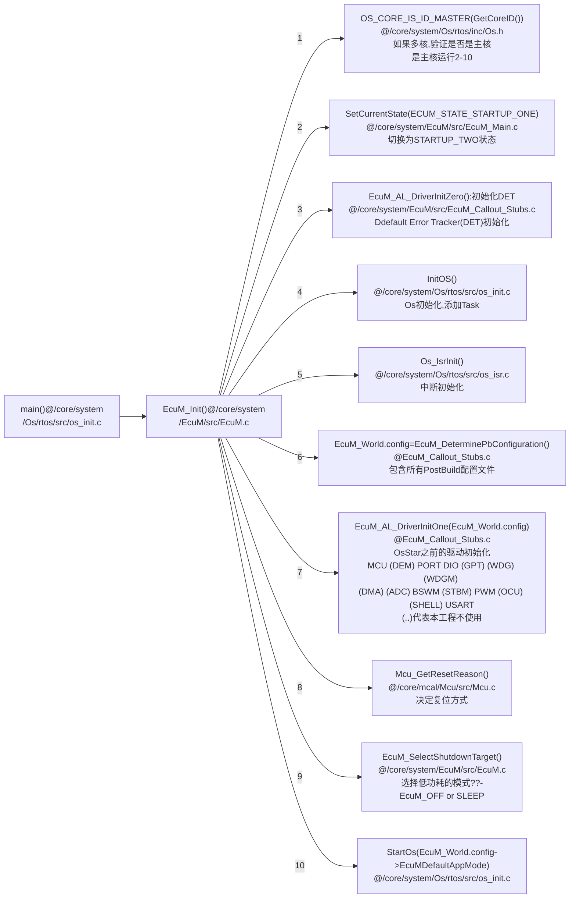


### 7.3.4 CAN调用过程

**说明1**：`Github`不支持`mermaid`请**将以下`mermaid`代码复制到**[在线`mermaid`查看器](<https://mermaidjs.github.io/mermaid-live-editor>)、`Typora`等软件查看具体流程图。

**说明2**：CAN需要的底层接口包括`Can_Init( const Can_ConfigType *Config )`和`Can_ReturnType Can_Write( Can_HwHandleType Hth, const Can_PduType *PduInfo )`

*注*：Can_Init(ConfigPtr->PostBuildConfig->CanConfigPtr)：CanConfigPtr参数在Can_PBcfg.c

* **两个重要的IPdu和`Signal`**

  **需要修改的内容**：一些名称，如`ComIPduGroupRefs`对应的数值等

  **`IPdu`、`Arc_IPud`和`Signal`区别**：`IPdu = &(ComConfig->ComIPdu[IPduId])`、`Signal = &(ComConfig->ComSignal[SignalId])`、`Arc_IPdu = &(Com_Arc_Config.ComIPdu[IPduId])`；`IPdu[IPduId]`类型`ComIPdu_type`（在examples中定义），`Arc_IPdu[IPduId]`类型`Com_Arc_IPdu_type`（在core中定义，由`COM_MAX_N_IPDUS`定义数组元素个数）；`IPdu`中定义了发送或者接收模式、IPdu大小（64字节），还指向了`Signal[SignalId]`等，`Signal[SignalId]`定义了大小端、对应的`Arc_IPdu`元素下标（数据发送或者接收都要经过此`Arc_IPdu`）、初始值等；

  

```c
// GET_IPdu(IPduId)
IPdu = &(ComConfig->ComIPdu[0]);
// GET_Signal(SignalId)
Signal = &(ComConfig->ComSignal[0]);
// @ /examples/CanCtrlPwm/CanCtrlPwm/config/stm32_stm3210c/Com_PbCfg.c
 SECTION_POSTBUILD_DATA const Com_ConfigType ComConfiguration = {
	.ComConfigurationId 			= 1,
	.ComNofIPdus					= 2,
	.ComNofSignals					= 2,
	.ComNofGroupSignals				= 0,
	.ComIPdu 						= ComIPdu,  //指向本文件的ComIPdu
	.ComIPduGroup 					= ComIPduGroup,
	.ComSignal						= ComSignal, //即Signal，指向ComSignal
	.ComGroupSignal					= ComGroupSignal,
	.ComGwMappingRef				= ComGwMapping,
	.ComGwSrcDesc					= ComGwSourceDescs,
	.ComGwDestnDesc					= ComGwDestinationDescs
};   
// @ /examples/CanCtrlPwm/CanCtrlPwm/config/stm32_stm3210c/Com_PbCfg.c
SECTION_POSTBUILD_DATA const ComIPdu_type ComIPdu[] = {	
	{ // DoorStatusPdu  CAN接收
		.ArcIPduOutgoingId			= PDUR_REVERSE_PDU_ID_PDURX,
		.ComRxIPduCallout			= COM_NO_FUNCTION_CALLOUT,
		.ComTxIPduCallout			= COM_NO_FUNCTION_CALLOUT,
		.ComTriggerTransmitIPduCallout = COM_NO_FUNCTION_CALLOUT,
		.ComIPduSignalProcessing 	= COM_DEFERRED,//指定为DEFERRED，IPdu需要先拷贝至Deferred_IPdu
		.ComIPduSize				= 64,  //定义了Arc_IPdu中数据的长度，IPdu：64；Shadow_Buff：64；Deferred_IPdu：64，共192——对应COM_MAX_BUFFER_SIZE
		.ComIPduDirection			= COM_RECEIVE,  //接收模式
		.ComIPduGroupRefs			= ComIpduGroupRefs_DoorStatusPdu,
		.ComTxIPdu = {
			.ComTxIPduMinimumDelayFactor	= 0,
			.ComTxIPduUnusedAreasDefault	= 0,
			.ComTxModeTrue = {
				.ComTxModeMode						= COM_NONE,
				.ComTxModeNumberOfRepetitions		= 0,
				.ComTxModeRepetitionPeriodFactor	= 0,
				.ComTxModeTimeOffsetFactor			= 0,
				.ComTxModeTimePeriodFactor			= 0,
			},
			.ComTxModeFalse = {
				.ComTxModeMode						= COM_NONE,
				.ComTxModeNumberOfRepetitions		= 0,
				.ComTxModeRepetitionPeriodFactor	= 0,
				.ComTxModeTimeOffsetFactor			= 0,
				.ComTxModeTimePeriodFactor			= 0,
			},
		},
		.ComIPduSignalRef			= ComIPduSignalRefs_DoorStatusPdu,  //指向Signal[n]，见下方ComIPduSignalRefs_DoorStatusPdu
		.ComIPduDynSignalRef		= NULL,
		.ComIpduCounterRef			= NULL,
		.ComIPduGwMapSigDescHandle	= NULL,
		.ComIPduGwRoutingReq		= FALSE,
		.Com_Arc_EOL				= 0
	},
	{ // LightStatusPdu  CAN发送
		.ArcIPduOutgoingId			= PDUR_PDU_ID_PDUTX,
		.ComRxIPduCallout			= COM_NO_FUNCTION_CALLOUT,
		.ComTxIPduCallout			= COM_NO_FUNCTION_CALLOUT,
		.ComTriggerTransmitIPduCallout = COM_NO_FUNCTION_CALLOUT,
		.ComIPduSignalProcessing 	= COM_DEFERRED,
		.ComIPduSize				= 64,
		.ComIPduDirection			= COM_SEND,
		.ComIPduGroupRefs			= ComIpduGroupRefs_LightStatusPdu,
		.ComTxIPdu = {
			.ComTxIPduMinimumDelayFactor	= 0,
			.ComTxIPduUnusedAreasDefault	= 0,
			.ComTxIPduClearUpdateBit		= TRANSMIT,
			.ComTxModeTrue = {
				.ComTxModeMode						= COM_PERIODIC,
				.ComTxModeNumberOfRepetitions		= 0,
				.ComTxModeRepetitionPeriodFactor	= 0,
				.ComTxModeTimeOffsetFactor			= 0,
				.ComTxModeTimePeriodFactor			= 10,
			},
			.ComTxModeFalse = {
				.ComTxModeMode						= COM_NONE,
				.ComTxModeNumberOfRepetitions		= 0,
				.ComTxModeRepetitionPeriodFactor	= 0,
				.ComTxModeTimeOffsetFactor			= 0,
				.ComTxModeTimePeriodFactor			= 0,
			},
		},
		.ComIPduSignalRef			= ComIPduSignalRefs_LightStatusPdu,
		.ComIPduDynSignalRef		= NULL,
		.ComIpduCounterRef			= NULL,
		.ComIPduGwMapSigDescHandle	= NULL,
		.ComIPduGwRoutingReq		= FALSE,
		.Com_Arc_EOL				= 0
	},
	{   //停止信号
        //void Com_Init(const Com_ConfigType *config )中for (uint16 i = 0; 0 == ComConfig->ComIPdu[i].Com_Arc_EOL; i++){}
		.Com_Arc_EOL				= 1
	}
};
SECTION_POSTBUILD_DATA const ComSignal_type * const ComIPduSignalRefs_DoorStatusPdu[] = {
	&ComSignal[ComConf_ComSignal_DoorStatus],
	NULL
};

// @ /examples/CanCtrlPwm/CanCtrlPwm/config/stm32_stm3210c/Com_PbCfg.c
SECTION_POSTBUILD_DATA const ComSignal_type ComSignal[] = {
    { // DoorStatus
        .ComHandleId                = ComConf_ComSignal_DoorStatus,
        .ComIPduHandleId            = ComConf_ComIPdu_DoorStatusPdu,
        // @req COM292          
        .ComFirstTimeoutFactor      = 0,
        .ComNotification            = COM_NO_FUNCTION_CALLOUT,        
        .ComTimeoutFactor           = 0,
        .ComTimeoutNotification     = COM_NO_FUNCTION_CALLOUT,
        .ComErrorNotification       = COM_NO_FUNCTION_CALLOUT,
        .ComTransferProperty        = COM_TRIGGERED_ON_CHANGE,
        .ComUpdateBitPosition       = 0,
        .ComSignalArcUseUpdateBit   = FALSE,
        .ComSignalInitValue         = &Com_SignalInitValue_DoorStatus,
        .ComBitPosition             = 0,
        .ComBitSize                 = 32,
        .ComSignalEndianess         = COM_LITTLE_ENDIAN,
        .ComSignalType              = COM_UINT32,
        .Com_Arc_IsSignalGroup      = FALSE,
        .ComGroupSignal             = NULL,
        .ComRxDataTimeoutAction     = COM_TIMEOUT_DATA_ACTION_NONE,
        .ComSigGwRoutingReq         = FALSE,
        .ComOsekNmNetId             = COM_OSEKNM_INVALID_NET_ID,
        .ComOsekNmNodeId            = 0,
        .Com_Arc_EOL                = 0
    },

    { // LightStatus
        .ComHandleId                = ComConf_ComSignal_LightStatus,
        .ComIPduHandleId            = ComConf_ComIPdu_LightStatusPdu,
        .ComFirstTimeoutFactor      = 0,      
        .ComNotification            = COM_NO_FUNCTION_CALLOUT,        
        .ComTimeoutFactor           = 0,
        .ComTimeoutNotification     = COM_NO_FUNCTION_CALLOUT,
        .ComErrorNotification       = COM_NO_FUNCTION_CALLOUT,
        .ComTransferProperty        = COM_PENDING,
        .ComUpdateBitPosition       = 0,
        .ComSignalArcUseUpdateBit   = FALSE,
        .ComSignalInitValue         = &Com_SignalInitValue_LightStatus,
        .ComBitPosition             = 0,
        .ComBitSize                 = 32,
        .ComSignalEndianess         = COM_LITTLE_ENDIAN,
        .ComSignalType              = COM_UINT32,
        .Com_Arc_IsSignalGroup      = FALSE,
        .ComGroupSignal             = NULL,
        .ComRxDataTimeoutAction     = COM_TIMEOUT_DATA_ACTION_NONE,
        .ComSigGwRoutingReq         = FALSE,
        .ComOsekNmNetId             = COM_OSEKNM_INVALID_NET_ID,
        .ComOsekNmNodeId            = 0,
        .Com_Arc_EOL                = 0
    },
	{
		.Com_Arc_EOL				= 1
	}
};
```


```c
// GET_ArcIPdu(IPduId)

Arc_IPdu = &(Com_Arc_Config.ComIPdu[0]);  //Com_Arc_Config见下方
    
const Com_Arc_Config_type Com_Arc_Config = {  // @/core/communication/Com/src/Com_Internal.h
    .ComIPdu            = Com_Arc_IPdu,     // 见下方
    .ComSignal          = Com_Arc_Signal,
#if (COM_MAX_N_GROUP_SIGNALS != 0)
    .ComGroupSignal     = Com_Arc_GroupSignal,
#else
    .ComGroupSignal     = NULL,
#endif
#if (COM_SIG_GATEWAY_ENABLE == STD_ON)
    .ComGwSrcDescSignal = Com_Arc_GwSrcDescSignals
#else
    .ComGwSrcDescSignal = NULL
#endif
};
//@/core/communication/Com/src/Com.c
static Com_Arc_IPdu_type Com_Arc_IPdu[COM_MAX_N_IPDUS]; //COM_MAX_N_IPDUS=2

typedef struct {  // @/core/communication/Com/src/Com_Arc_Types.h
    /** Reference to the actual pdu data storage */
    void *ComIPduDataPtr;  //指向Com_Arc_Buffer[0]，见下方
    void *ComIPduDeferredDataPtr;  //如果没有shadow_buffer，指向Com_Arc_Buffer[64]

    Com_Arc_TxIPduTimer_type Com_Arc_TxIPduTimers;
    uint32 Com_Arc_TxDeadlineCounter; 
    uint16 Com_Arc_DynSignalLength;
    boolean Com_Arc_IpduStarted;
    boolean Com_Arc_IpduRxDMControl;
    boolean Com_Arc_IpduTxMode;
} Com_Arc_IPdu_type;

//@/core/communication/Com/src/Com.c
static uint8 Com_Arc_Buffer[COM_MAX_BUFFER_SIZE]; // COM_MAX_BUFFER_SIZE = 192
```


* **CAN数据接收**

  1.CAN接收中断初始化、触发、数据写入到IPdu过程


2.OsBswTask将IPDU数据拷贝到DEFERRED_IPDU中

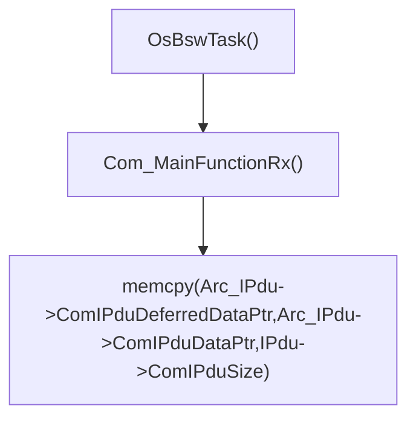

3.OsRteTask从DEFERRED_IPDU获取数据

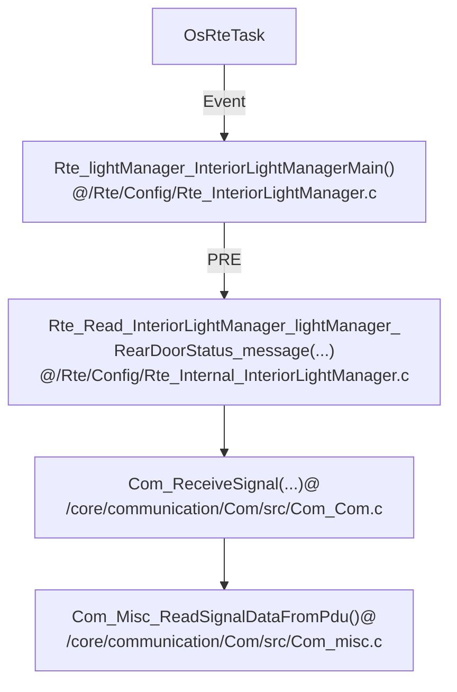

*相关数据结构*

1.PRE

```c
// @/Rte/Contract/Rte_InteriorLightManager.h
typedef struct {
    Rte_DE_DoorStatusImpl * const InteriorLightManagerMain_LeftDoorStatus_status;
    Rte_DE_IntImpl * const InteriorLightManagerMain_RearDoorStatus_message;
    Rte_DE_DoorStatusImpl * const InteriorLightManagerMain_RightDoorStatus_status;
    Rte_DE_LightStatusImpl * const InteriorLightManagerMain_FrontLightStatus_status;
    Rte_DE_IntImpl * const InteriorLightManagerMain_LightStatusOnCommMedia_message;
} Rte_CDS_InteriorLightManager;
typedef Rte_CDS_InteriorLightManager const * const Rte_Instance;
#define self (Rte_Inst_InteriorLightManager)  // 在.c中创建Rte_Inst_InteriorLightManager

// @ /Rte/Config/Rte_InteriorLightManager.c
Rte_DE_IntImpl ImplDE_lightManager_InteriorLightManagerMain_RearDoorStatus_message;//存放CAN发送过来的数据
const Rte_CDS_InteriorLightManager InteriorLightManager_lightManager = {
    .InteriorLightManagerMain_RearDoorStatus_message = &ImplDE_lightManager_InteriorLightManagerMain_RearDoorStatus_message,  //1.PRE指向存放CAN发送过来的空间
    .InteriorLightManagerMain_RightDoorStatus_status = &ImplDE_lightManager_InteriorLightManagerMain_RightDoorStatus_status,
    .InteriorLightManagerMain_LeftDoorStatus_status = &ImplDE_lightManager_InteriorLightManagerMain_LeftDoorStatus_status,
    .InteriorLightManagerMain_FrontLightStatus_status = &ImplDE_lightManager_InteriorLightManagerMain_FrontLightStatus_status, //2.MAIN处理1数据，结果写入到此处；3.POST写入到Rte_Buffer_frontLightActuator_InteriorLightStatus_status @ Rte_Buffers.c
    .InteriorLightManagerMain_LightStatusOnCommMedia_message = &ImplDE_lightManager_InteriorLightManagerMain_LightStatusOnCommMedia_message
};
const Rte_Instance Rte_Inst_InteriorLightManager = &InteriorLightManager_lightManager;
```

2.MAIN

获取`/Rte/Config/Rte_InteriorLightManager.c`中的数值，并进行处理，最终写入到`Rte_Inst_InteriorLightManager ->InteriorLightManagerMain_FrontLightStatus_status`。

3.POST

```c
// /Rte/Config/Rte_Buffers.c
LightStatusImpl Rte_Buffer_frontLightActuator_InteriorLightStatus_status; // 3.将MAIN处理结果拷贝到此处
```

**执行器根据上述结果执行相应操作**

*数据结构*

```c
// \Rte\Config\Rte_LightActuator.c
Rte_DE_LightStatusImpl ImplDE_frontLightActuator_LightActuatorMain_InteriorLightStatus_status;
const Rte_CDS_LightActuator LightActuator_frontLightActuator = {
    .LightActuatorMain_InteriorLightStatus_status = &ImplDE_frontLightActuator_LightActuatorMain_InteriorLightStatus_status,  // 将Rte_Buffer_frontLightActuator_InteriorLightStatus_status内保存的处理结果拷贝到此处
    .DigitalLight = {
        .Call_Write = Rte_Call_LightActuator_frontLightActuator_DigitalLight_Write  //需要执行的操作
    }
};
```

* **CAN数据发送**

  对于CanCtrlPwm工程而言，在OsRteTask任务中将数据放到IPDU中，在从OsBswTask通过CAN周期性发送出去

  1.OsRteTask任务中将数据放到IPDU中

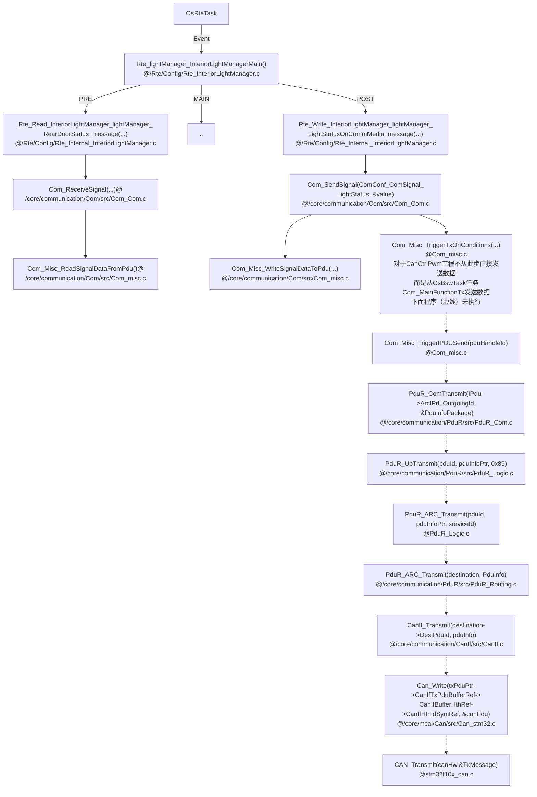

2.周期性从IPdu发送CAN数据

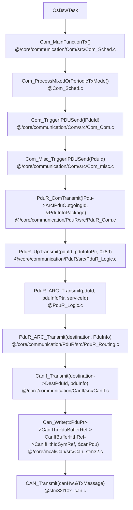

### 7.3.5 运行OsBswTask

*未完待续*

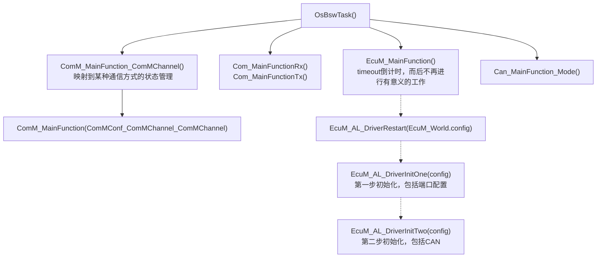

### 7.3.6 RTE设置PWM

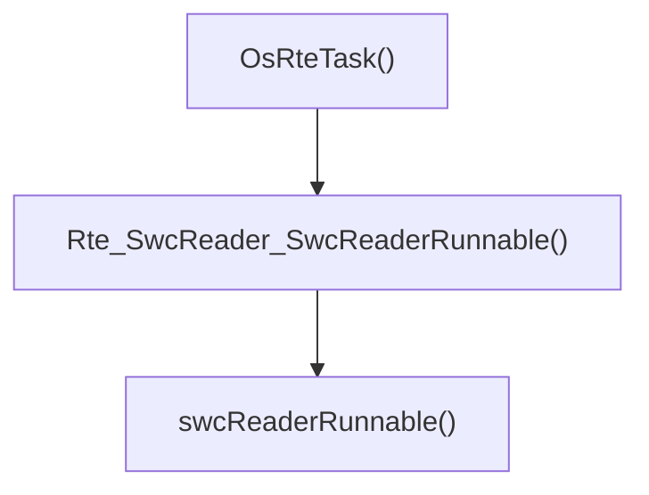

### 7.3.7 OsRteTask读取数据和设置灯PWM

* 流程图


*说明*：接收和发送的`IPdu`类型（下标分别为0和1）指向`Com_Arc_Buffer[COM_MAX_BUFFER_SIZE]`空间（接收发送空间均为`Com_Arc_Buffer`的一块连续区域），按照配置文件的配置顺序进行指向（`Can_Init`函数中一个`for`循环），每次初始化指向一块空间，`bufferIndex`就会`+空间大小`，为后面的指向做准备。

* 变量声明和定义


* Runnable调用的函数和定义

  （1）获取数据和处理数据

  实际系统处理数据后，会通过CAN发送函数`Rte_Write_InteriorPwmSetManager_pwmSetManager_PwmSetDutyOnCommMedia_message@Rte\Config\Rte_Internal_InteriorPwmSetManager.c（在Rte\Config\Rte_Internal.h声明）`发送至外部。

  

  （2）执行Pwm占空比设置

  

  **函数定义总结**

  `Rte_Internal_xxxx.c/Rte_Internal.h`（`Rte/Config`）：定义/声明内容包括从IPDU读取（通信接收到的）数据、将数据写入RteBuff、读取RteBuff、设置IO（Pwm）占空比、写入IPDU（准备发送），**总结下来就是，所有连接BSW的接口和缓存区的操作（不包括和SWC任务绑定的缓存区）**。

  `Rte_xxxx.c`（`Rte/Config`）：定义Runnables，在要使用的地方extern引入

  `Rte_xxxx.h`（`Rte/Contract`）：声明`xxxx.c`中定义的执行器函数；定义内联函数，直接和Runnables**绑定**的操作变量。

  `Rte_xxxx_Type.h`（`Rte/Config`）：结构体声明

  `xxxx.c`（`Rte/src`）：定义执行器函数，具体进行Pwm占空比设置、Bsw主任务、IO操作等。

### 7.3.8 OsStartUp任务

* 流程

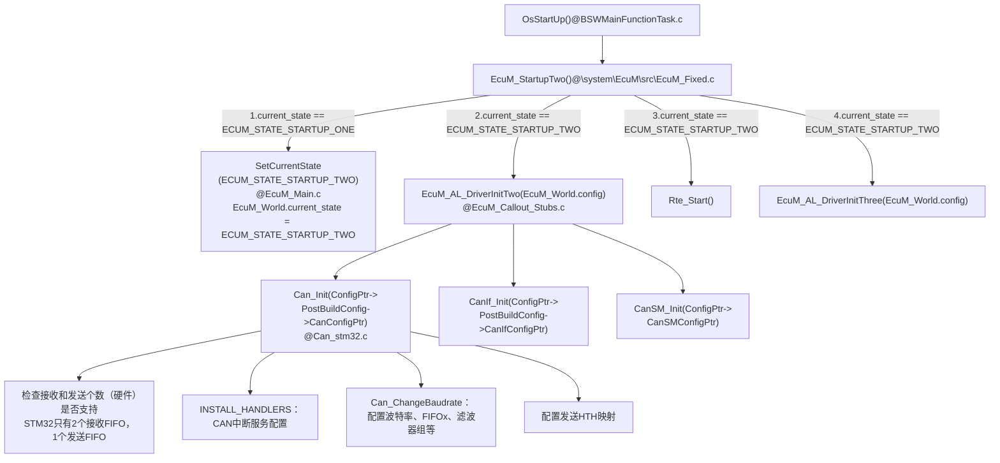

* 数据结构

  ```c
  // EcuM_World
  typedef struct
  {
      boolean                           initiated;
      EcuM_ConfigType                   *config;  // 在EcuM_Init()指向EcuMConfig @ EcuM_PBcfg.c，见下方
      EcuM_StateType                    shutdown_target;
      AppModeType                       app_mode;
      EcuM_StateType                    current_state;
      uint32                            run_requests;
      uint32                            postrun_requests;
      boolean                           killAllRequest;
      boolean                           killAllPostrunRequest;
  #if (defined(USE_ECUM_FLEXIBLE))
      EcuM_ShutdownCauseType            shutdown_cause;
  #endif
      uint8                             sleep_mode;
      /* Events set by EcuM_SetWakeupEvent */
      uint32                            wakeupEvents;
      uint32                            wakeupTimer;
      /* Events set by EcuM_ValidateWakeupEvent */
      uint32                            validEvents;
      uint32                            validationTimer;
  #if (ECUM_ARC_SAFETY_PLATFORM == STD_ON)
      EcuM_SP_SyncStatus                syncStatusMaster;
  #endif
  } EcuM_GlobalType;
  
  /*@req SWS_EcuM_00793*/ /*@req SWS_EcuMf_00046*/
  const EcuM_ConfigType EcuMConfig = {
      .EcuMPostBuildVariant = 1,
      .EcuMConfigConsistencyHashLow = PRE_COMPILED_DATA_HASH_LOW, 
      .EcuMConfigConsistencyHashHigh = PRE_COMPILED_DATA_HASH_HIGH,  /* @req SWS_EcuM_02795 */
      .EcuMDefaultShutdownTarget = ECUM_STATE_OFF,
      .EcuMDefaultSleepMode = ECUM_SLEEP_MODE_FIRST,
      .EcuMDefaultAppMode = OSDEFAULTAPPMODE,
      .EcuMNvramReadAllTimeout = ECUM_NVRAM_READALL_TIMEOUT,
      .EcuMNvramWriteAllTimeout = ECUM_NVRAM_WRITEALL_TIMEOUT,
      .EcuMRunMinimumDuration = ECUM_NVRAM_MIN_RUN_DURATION,
      .EcuMNormalMcuMode = McuConf_McuModeSettingConf_NORMAL,
      .EcuMSleepModeConfig = EcuM_SleepModeConfig,
      .EcuMWakeupSourceConfig = EcuM_WakeupSourceConfig,
  #if defined(USE_COMM)
      .EcuMComMConfig = EcuM_ComMConfig,
  #endif
  #if defined(USE_MCU)
      .McuConfigPtr = McuConfigData,
  #endif
  #if defined(USE_PORT)
      .PortConfigPtr = &PortConfigData,
  #endif
  #if defined(USE_DIO)
      .DioConfigPtr = &DioConfigData,
  #endif
  #if defined(USE_CANSM)
      .CanSMConfigPtr = &CanSM_Config,
  #endif
  #if defined(USE_ADC)
      #if defined(CFG_ZYNQ)
          .AdcConfigPtr = NULL,
      #else
          .AdcConfigPtr = AdcConfig,
      #endif
  #endif
  #if defined(USE_PWM)
      .PwmConfigPtr = &PwmConfig,
  #endif
  #if defined(USE_BSWM) || defined(USE_PDUR) || defined(USE_COM) || defined(USE_CANIF) ||\
      defined(USE_CANTP) || defined(USE_CANNM) || defined(USE_COMM) || defined (USE_CANTRCV) || defined (USE_CAN) || (defined(USE_FIM) && (FIM_POSTBUILD_MODE == STD_ON))
      .PostBuildConfig = &Postbuild_Config,  //指向一个包含以上模块配置信息的数据结构，见下方
  #endif
  // ...未完全展示
  };
  
  // \core\system\EcuM\src\EcuM_PBHeader.c
  SECTION_POSTBUILD_HEADER const PostbuildConfigType Postbuild_Config = {
      .startPattern = 0x5A5A5A5A,
      .postBuildVariant = 1,
      .preCompileHashLow = PRE_COMPILED_DATA_HASH_LOW,
      .preCompileHashHigh = PRE_COMPILED_DATA_HASH_HIGH,
  #if defined (USE_BSWM)
      .BswMConfigPtr = &BswM_Config,
  #endif
  #if defined (USE_CAN)
      .CanConfigPtr = &CanConfigData,  //指向CanConfigData@Can_PBcfg.c，见下方
  #endif
  #if defined(USE_CANIF)
      .CanIfConfigPtr = &CanIf_Config,
  #endif
  #if defined (USE_CANNM)
      .CanNmConfigPtr = &CanNm_Config,
  #endif
  #if defined(USE_COM)
      .ComConfigPtr = &ComConfiguration,
  #endif
  #if defined (USE_COMM)
      .ComMConfigPtr = &ComM_Config,
  #endif
  #if defined(USE_PDUR)
      .PduRConfigPtr = &PduR_Config,
  #endif
  // ...未完全展示
  };
  //@Can_PBcfg.c
  SECTION_POSTBUILD_DATA  const  Can_ConfigType CanConfigData = {
  	.CanConfigSetPtr =	&CanConfigSetData
  };
  ```

* 对`HTH MAP`的探究

  **问题**

  在`Can_Cfg.h`中定义了

  ```c
  #define CanConf_CanHardwareObject_CanHardwareObjectTx (Can_HwHandleType)0
  #define Can_CanHardwareObjectTx CanConf_CanHardwareObject_CanHardwareObjectTx
  #define NUM_OF_HTHS (Can_HwHandleType)1  // HTH(Transmit Handle) 个数 
  
  #define CanConf_CanHardwareObject_CanHardwareObjectRx (Can_HwHandleType)1
  #define Can_CanHardwareObjectRx CanConf_CanHardwareObject_CanHardwareObjectRx
  ```

  但是EB中必须定义Tx比Rx高。所以这里设置成`Tx 1`和`Rx 0`，但是单片机无法通过CAN发送和接收数据（CAN中断服务函数也无法进入）。

  **解释(我们的项目工程代码带注释)**

  `Can_Init()`初始化的时候，需要给`Can_Global.CanHTHMap`（Transmit Handle）设置

  ```c
  // @Can_Init()
  //     {  // Can_Arc_Hoh ptr to ...
  //         .CanObjectId	=	CanConf_CanHardwareObject_CanHardwareObjectTx,//CanHardwareObjectTx,
  //         .CanHandleType	=	CAN_ARC_HANDLE_TYPE_BASIC,
  //         .CanIdType		=	CAN_ID_TYPE_STANDARD,
  //         .CanObjectType	=	CAN_OBJECT_TYPE_TRANSMIT,
  //         .CanHwFilterMask =	0, // Not applicable for Transmit object
  //         .Can_Arc_EOL	= 	1  // [Chaochao Song] Stop while in Can_Init func , set the last enum's  Can_Arc_EOL = 1
  //     },
  hoh = canHwConfig->Can_Arc_Hoh;
  hoh--;
  do
  {
      hoh++;
  
      if (hoh->CanObjectType == CAN_OBJECT_TYPE_TRANSMIT)  // hoh ptr to 上面的元素
      {
          //设置哪个CAN，对于CanCtrlPwm Proj是CAN_CTRL_1
          // !!!!! 这里hoh->CanObjectId就是上面所说的发送和接收的数值（Tx比Rx高）
          // CanHTHMap只定义了1个（NUM_OF_HTHS），下标为0，Tx数值CanObjectId为1而造成溢出
          // 但是这里不能单纯的 -1，因为还会在发送的时候检查是否存在HTH，造成ID不对应，具体见下面的解释
          Can_Global.CanHTHMap[hoh->CanObjectId].CanControllerRef = canHwConfig->CanControllerId;
          // 设置HOH(Hardware Object Handle)
          Can_Global.CanHTHMap[hoh->CanObjectId].CanHOHRef = hoh;
      }
  } while (!hoh->Can_Arc_EOL);
  ```

  另外在发送的时候，也会检测（接上面的问题——“但是这里不能单纯的 -1，因为还会在发送的时候检查是否存在HTH，造成ID不对应，具体见下面的解释”）是否符合。见下图调用过程：

  ```mermaid
  graph TB;
  CanIf_Transmit["CanIf_Transmit()"] --> txPduPtr["txPduPtr = &CanIf_ConfigPtr->InitConfig->CanIfTxPduConfigPtr<br>定义见下方补充"]
  txPduPtr --> Can_Write["Can_Write(txPduPtr->CanIfTxPduBufferRef->CanIfBufferHthRef->CanIfHthIdSymRef, &canPdu)<br>CanIfHthIdSymRef = CanConf_CanHardwareObject_CanHardwareObjectTx<br>定义见下方补充"]
  Can_Write --> Can_FindHoh["Can_FindHoh(Hth, &controller)<br>判断输入的hth是否和HTHmap中的一样"]
   
  ```

  ```c
  SECTION_POSTBUILD_DATA const CanIf_TxPduConfigType CanIfTxPduConfigData[] = {//下面的hth指向
      {
          .CanIfTxPduId               = PDUR_REVERSE_PDU_ID_PDUTX,
          .CanIfCanTxPduIdCanId       = 2,
          .CanIfCanTxPduIdDlc         = 8,
          .CanIfCanTxPduType          = CANIF_PDU_TYPE_STATIC,
          .CanIfTxPduPnFilterEnable   = STD_OFF,
  #if ( CANIF_PUBLIC_READTXPDU_NOTIFY_STATUS_API == STD_ON )
          .CanIfReadTxPduNotifyStatus = FALSE,
  #endif
          .CanIfTxPduIdCanIdType      = CANIF_CAN_ID_TYPE_11,
          .CanIfUserTxConfirmation    = PDUR_CALLOUT,
          /* [CanIfBufferCfg] */
          .CanIfTxPduBufferRef        = &CanIfBufferCfgData[0],//指向下面的CanIfBufferCfgData
      },
  };
  SECTION_POSTBUILD_DATA const CanIf_TxBufferConfigType CanIfBufferCfgData[] = {
  	{
  		.CanIfBufferSize = 0,
  		.CanIfBufferHthRef = &CanIfHthConfigData_CanIfInitHohCfg[0],//指向下面的CanIfHthConfigData_CanIfInitHohCfg
  		.CanIf_Arc_BufferId = 0
  	},
  };
  SECTION_POSTBUILD_DATA const CanIf_HthConfigType CanIfHthConfigData_CanIfInitHohCfg[] =
  {
  	{ 
      	.CanIfHthType 				= CANIF_HANDLE_TYPE_BASIC,
      	.CanIfCanControllerIdRef 	= CanIfConf_CanIfCtrlCfg_CanIfCtrlCfg,
      	.CanIfHthIdSymRef 			= CanConf_CanHardwareObject_CanHardwareObjectTx,//出现了!!!!!即为上面所定义的CanConf_CanHardwareObject_CanHardwareObjectTx
  	},
  };
  ```

  **解决方案**

  ```c
  #define NUM_OF_HTHS 2 //定义两个HTH，只用第二个
  ```

  *不能在Can_Init的时候，单纯将CanConf_CanHardwareObject_CanHardwareObjectTx -1 输入到HTHmap下标，解释是发送的时候会检测是否对应，具体见上面**解释***

### 7.3.9 RTE任务和BSW任务的通信模式如何联系

**1.Rte任务初始化通信模式**

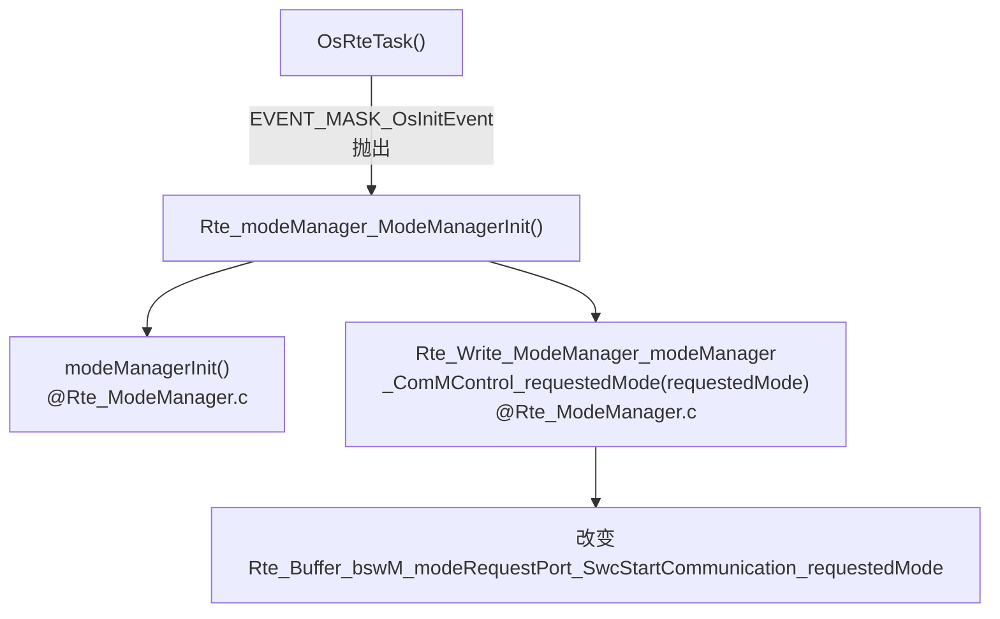

**2.Bsw获取开始的通信模式**

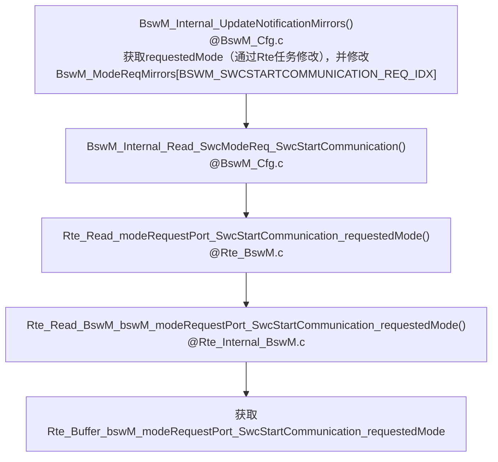

**3.BswM修改通信模式**

根据`BswM_ModeReqMirrors[BSWM_SWCSTARTCOMMUNICATION_REQ_IDX]`修改`BswM_ModeReqMirrors[BSWM_BSWCOMMINDICATION_REQ_IDX]`。

**4.Com发送数据**

通信模块根据`Com_Arc_IpduStarted`是否是`TRUE`来发送数据

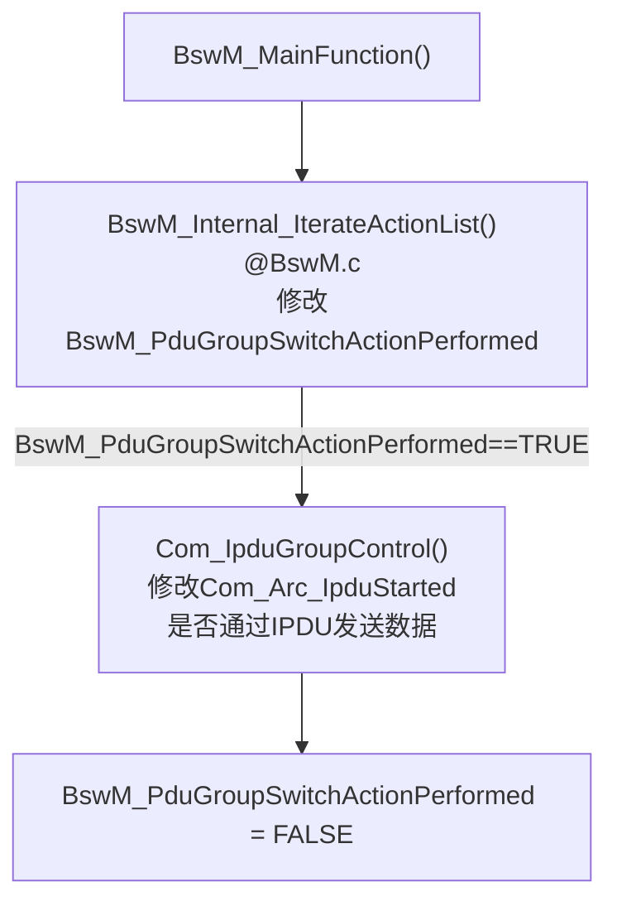

## 7.4 顶层移植、配置和应用

路径：`\examples\CanCtrlPwm\CanCtrlPwm\config\stm32_stm3210c`

### 7.4.1 Os

配置文件主要包括：`Os_Cfg.c`和`Os_Cfg.h`

* `Os_Cfg.c`

  **（1）外部参考——EXTERNAL REFERENCES**

  *Application externals*

  *Interrupt externals*：设置Os Tick频率

  **（2）DEBUG输出——DEBUG OUTPUT**

  变量`os_dbg_mask`来控制OS_DEBUG的日志输出等级。

  **（3）应用——APPLICATIONS**

  每个应用下由多个任务TASK组成。

  **需要修改的内容**：`.appId`和`.name`

  ```c
  const OsAppConstType Os_AppConst[OS_APPLICATION_CNT]  = {			
  	{
      .appId = APPLICATION_ID_OsApplicationInteriorLight,  // 应用ID：0,1,2...
      .name = "OsApplicationInteriorLight",  //应用名称
      .core = 0,     //运行该应用的内核
      .trusted = true,    //是否信任
  	}
  };
  ```

  **（4）计数器——COUNTERS**

  主要用于定时给任务ALARM，周期性运行

  **需要修改的内容**：无

  **隐含变量**：`OS_COUNTER_CNT`  （`@Os_Cfg.h`）计数器个数，对应`GEN_COUNTER_HEAD`元素个数；

  ```c
  GEN_COUNTER_HEAD = {
  	GEN_COUNTER(
          /* id          */		COUNTER_ID_OsRteCounter,  //唯一ID标识，指示计数器下标，从0开始，GEN_COUNTER函数中未用到_id变量，主要给下面Os_Arc_OsTickCounter指示
          /* name        */		"OsRteCounter",           //counter名称
          /* counterType */		COUNTER_TYPE_HARD,        // @/Os/rtos/src/os_counter_i.h
          /* counterUnit */		COUNTER_UNIT_NANO,        // @/Os/rtos/src/os_counter_i.h
          /* maxAllowed  */		OSMAXALLOWEDVALUE,        // 计数器最大值
          /*             */		1,
          /* minCycle    */		1,                       //最小周期
          /*             */		0,
          /* owningApp   */		APPLICATION_ID_OsApplicationInteriorLight,  //使用该计数器的应用，上方Os_AppConst定义应用
          /* accAppMask..*/       ((1u << APPLICATION_ID_OsApplicationInteriorLight))
      ) 
  };
  //定义Os的tick下标，所以上面的定义中id必须从0
  CounterType Os_Arc_OsTickCounter = COUNTER_ID_OsRteCounter;
  ```

  **（5）ALARMS**

  两个功能：1、周期性唤醒任务执行（通过`GEN_ALARM_AUTOSTART`设置）；2、周期性抛出事件ALARM（通过`GEN_ALARM_HEAD`设置），在任务内判断是否有相应事件出现。

  **需要修改的内容**：无

  ```c
  GEN_ALARM_AUTOSTART(  // 命名方式  Os_AlarmAutoStart_ ## _id，可以通过GEN_ALARM_AUTOSTART_NAME获取
  				ALARM_ID_OsRteAlarm100ms,  // _id，0,1,...
  				ALARM_AUTOSTART_RELATIVE,
  				100,                      //ALARM周期
  				100,                      //循环周期
  				OSDEFAULTAPPMODE );
  
  GEN_ALARM_AUTOSTART(
  				ALARM_ID_OsAlarmBswServices,
  				ALARM_AUTOSTART_RELATIVE,
  				5,
  				5,
  				OSDEFAULTAPPMODE );
  
  GEN_ALARM_HEAD = {
  	GEN_ALARM(	ALARM_ID_OsRteAlarm100ms,  //对应于上面生成的ALARM
  				"OsRteAlarm100ms",
  				COUNTER_ID_OsRteCounter,  //对应生成的计数器的id
  				GEN_ALARM_AUTOSTART_NAME(ALARM_ID_OsRteAlarm100ms), //指向ALARM_AUTOSTART变量
  				ALARM_ACTION_SETEVENT,    //设置事件
  				TASK_ID_OsRteTask,     //任务ID @ Os_Cfg.h
  				EVENT_MASK_OsMainEvent,
  				0,
  				APPLICATION_ID_OsApplicationInteriorLight, /* Application owner */
  				(( 1u << APPLICATION_ID_OsApplicationInteriorLight ) 
  				) /* Accessing application mask */
  			)
  ,
  	GEN_ALARM(	ALARM_ID_OsAlarmBswServices,
  				"OsAlarmBswServic",
  				COUNTER_ID_OsRteCounter,
  				GEN_ALARM_AUTOSTART_NAME(ALARM_ID_OsAlarmBswServices),
  				ALARM_ACTION_ACTIVATETASK,//激活任务
  				TASK_ID_OsBswTask,
  				0,
  				0,
  				APPLICATION_ID_OsApplicationInteriorLight, /* Application owner */
  				(( 1u << APPLICATION_ID_OsApplicationInteriorLight ) 
  				) /* Accessing application mask */
  			)
  };
  ```

  **（6）资源——RESOURSES**

  

  **（7）任务栈空间——STACKS(TASKS)**

  **需要修改的内容**：无

  ```c
  //DECLARE_STACK(_name,_size)  ->  stack__
  DECLARE_STACK(OsIdle, OS_OSIDLE_STACK_SIZE);  //定义空闲任务的栈空间，栈空间名称stack_OsIdle
  DECLARE_STACK(OsBswTask,  2048);             // 栈空间stack_OsBswTask
  DECLARE_STACK(OsRteTask,  2048);
  DECLARE_STACK(OsStartupTask,  2048);
  ```

  **（8）任务——TASKS**

  **需要修改的内容**：无

  **EVENT_MASK_OsInitEvent说明**：`SetCurrentState() -> Rte_Switch_currentMode_currentMode(currentMode) -> Rte_Switch_EcuM_ecuM_currentMode_currentMode(currentMode) ->SYS_CALL_SetEvent(TASK_ID_OsRteTask, EVENT_MASK_OsInitEvent)`，将事件`EVENT_MASK_OsInitEvent`产生，由`OsRteTask`任务（ID为TASK_ID_OsRteTask）处理。

  ```c
  GEN_TASK_HEAD = {
  	{
  	.pid = TASK_ID_OsIdle,
  	.name = "OsIdle",
  	.entry = OsIdle,     //任务函数入口
  	.prio = 0,           //优先级
  	.scheduling = FULL,   // ??
  	.autostart = TRUE,    // ??
  	.proc_type = PROC_BASIC,
  	.stack = {
  		.size = sizeof stack_OsIdle,   //由上方的栈空间定义 
  		.top = stack_OsIdle,
  	},
  	.resourceIntPtr = NULL_PTR, 
  	.resourceAccess = 0,
  	.activationLimit = 1,
      .applOwnerId = OS_CORE_0_MAIN_APPLICATION,  //使用该任务的应用  定义为APPLICATION_ID_OsApplicationInteriorLight
      .accessingApplMask = (1u << OS_CORE_0_MAIN_APPLICATION),
  	},
  	
  {
  	.pid = TASK_ID_OsBswTask,
  	.name = "OsBswTask",
  	.entry = OsBswTask,
  	.prio = 2,
  	.scheduling = FULL,
  	.proc_type = PROC_BASIC,
  	.stack = {
  		.size = sizeof stack_OsBswTask,
  		.top = stack_OsBswTask,
  	},
  	.autostart = TRUE,
  	.resourceIntPtr = NULL_PTR, 
  	.resourceAccess = 0 , 
  	.activationLimit = 1,
  	.eventMask = 0 ,
  	.applOwnerId = APPLICATION_ID_OsApplicationInteriorLight,
  	.accessingApplMask = (1u <<APPLICATION_ID_OsApplicationInteriorLight)
  ,
  },
  {
  	.pid = TASK_ID_OsRteTask,
  	.name = "OsRteTask",
  	.entry = OsRteTask,
  	.prio = 1,
  	.scheduling = FULL,
  	.proc_type = PROC_EXTENDED,
  	.stack = {
  		.size = sizeof stack_OsRteTask,
  		.top = stack_OsRteTask,
  	},
  	.autostart = TRUE,
  	.resourceIntPtr = NULL_PTR, 
  	.resourceAccess = 0 , 
  	.activationLimit = 1,
  	.eventMask = 0 | EVENT_MASK_OsMainEvent | EVENT_MASK_OsInitEvent ,  //两个时间在OsRteTask任务中判断。EVENT_MASK_OsInitEvent在Rte_Internal_EcuM.c中（每次模式转换都会）生成该事件
  	
  	.applOwnerId = APPLICATION_ID_OsApplicationInteriorLight,
  	.accessingApplMask = (1u <<APPLICATION_ID_OsApplicationInteriorLight)
  ,
  },
  {
  	.pid = TASK_ID_OsStartupTask,
  	.name = "OsStartupTask",
  	.entry = OsStartupTask,
  	.prio = 1,
  	.scheduling = FULL,
  	.proc_type = PROC_BASIC,
  	.stack = {
  		.size = sizeof stack_OsStartupTask,
  		.top = stack_OsStartupTask,
  	},
  	.autostart = TRUE,
  	.resourceIntPtr = NULL_PTR, 
  	.resourceAccess = 0 , 
  	.activationLimit = 1,
  	.eventMask = 0 ,
  	.applOwnerId = APPLICATION_ID_OsApplicationInteriorLight,
  	.accessingApplMask = (1u <<APPLICATION_ID_OsApplicationInteriorLight)
  ,
  },
  };
  ```

  **（9）勾子函数——HOOKS**

  ```c
  GEN_HOOKS( 
  NULL,
  NULL,
  NULL,
  NULL,
  NULL,
  NULL
  );
  ```

  **（10）中断——ISRS**

  ```c
  #if (!defined(CFG_TC2XX) && !defined(CFG_TC3XX)) // Table Os_VectorToIsr is not used for Aurix architecture.
  GEN_ISR_MAP = {
    0
  };
  #endif
  ```

  **（11）调度表——SCHEDULE TABLES**

  **（12）自旋锁——SPINLOCKS**

* `Os_Cfg.h`

  **OS_NUM_CORES**：核个数 

  具体见代码注释。

### 7.4.2 Com

* `Com_Cfg.c`

  **需要修改的内容**：无

  定义`callout`函数，例子：

  ```c
  const ComNotificationCalloutType ComNotificationCallouts [] = { // Notifications
  	NULL};
  const ComRxIPduCalloutType ComRxIPduCallouts[] = {// Rx callouts
  	NULL};
  const ComTxIPduCalloutType ComTxIPduCallouts[] = {// Tx callouts
  	NULL};
  const ComTxIPduCalloutType ComTriggerTransmitIPduCallouts[] = {// Trigger transmit callouts
  	NULL};
  ```

* `Com_Cfg.h`

  **需要修改的内容**：`信号ID`，及关联文件

  通信相关配置，例如：

  `COM_MAX_BUFFER_SIZE`：通信缓存192字节，见**7.3.7 OsRteTask读取数据和设置灯PWM**

  `COM_MAX_N_IPDUS`：通信`IPdu`（类型为`Com_Arc_IPdu_type`）最多个数2个——发送和接收，结合上面`COM_MAX_BUFFER_SIZE`，共2个192字节通信缓存。

  `COM_MAX_N_SIGNALS`：信号Signal（类型为`Com_Arc_Signal_type`）个数，如果大于0，则会开启`IPDU`计数

  `COM_MAX_N_GROUP_SIGNALS`：信号组（类型为`Com_Arc_GroupSignal_type`）个数

  `一些通错误编号`：`COM_INVALID_PDU_ID(104)`、`COM_INVALID_SIGNAL_ID(109)`等

  **`信号ID`**：如

  ```c
  // COM SIGNAL GROUPS and SIGNAL IDs
  #define ComConf_ComSignal_DoorStatus          0
  #define ComConf_ComSignal_LightStatus          1
  ```

  **关联文件**：

  1.`Com_PbCfg.c`的`ComSignal[n]->ComHandleId`

  2.调用`Com_ReceiveSignal`或者`Com_SendSignal`时候，如`Rte_Internal_PwmSetManager.c`的`retVal |= Com_ReceiveSignal(信号ID, value)`，函数体内通过`GET_Signal(信号ID)`获取`ComSignal_type * Signal`，通过`GET_ArcIPdu(Signal->ComIPduHandleId)`获取`Com_Arc_IPdu_type *Arc_IPdu`。

  3.`Com_PbCfg.c`的`IPdu signal`，如

  ```c
  SECTION_POSTBUILD_DATA const ComSignal_type * const ComIPduSignalRefs_DoorStatusPdu[] = {
  	&ComSignal[信号ID],
  	NULL
  };
  ```

* `Com_PbCfg.c`

  **需要修改的内容**：`ComSignal[n].ComIPduHandleId`对应`Com_PbCfg.h`中的某一个ID

  定义通信需要的数据结构——`ComConfiguration`，即`Signal`（非`Arc_IPdu`）。

  *注*：`Arc_IPud`在`/core/communication/Com/src/Com_Internal.h`中定义，不需要自行定义。见**7.3.4 CAN调用过程**中的IPDU说明。

* `Com_PbCfg.h`

  **需要修改的内容**：`IPDU ID`号，并修改关联文件

  定义`IPDU ID`号，指定数据对应对应不同`IPDU`。如

  ```c
  // COM IPDU IDs 
  #define ComConf_ComIPdu_DoorStatusPdu               0
  #define ComConf_ComIPdu_LightStatusPdu               1
  ```

  定义了门状态信息为`IPDU[0]`。

  **关联文件**：

  1.`Com_PbCfg.c`的`ComSignal[n].ComIPduHandleId`

  2.`PduR_PbCfg.c`的`PduRDestination_PduRRoutingPathRx_PduRDestPdu->DestPduId`（接收）或者`PduRRoutingPath_PduRRoutingPathTx->SrcPduId`（发送）

**关于信号ID的总结**：`Com_Cfg.h`和`Com_PbCfg.h`中定义了`SignalId`(命名为`ComConf_ComSignal_xxx`)和`IPduId`(命名为`ComConf_ComIPdu_xxx`)，分别制定了`IPdu`、`Arc_IPdu`和`Signal`获取地址——通过`GET_Signal(SignalId)`获取`ComSignal_type * Signal`，通过`GET_ArcIPdu(Signal->ComIPduHandleId)`获取`Com_Arc_IPdu_type *Arc_IPdu`，通过`GET_IPdu(Signal->ComIPduHandleId)`获取`ComIPdu_type *IPdu `；信号ID需要修改三个地方：`PDUR(Arc_IPdu)`、`Signal(IPdu)`和具体函数调用的信号ID参数。

**`IPdu`、`Arc_IPdu`和`Signal`的区别**：见**7.3.4 CAN调用过程**

### 7.4.3 ComM

* `ComM_Cfg.c`
* `ComM_Cfg.h`
* `ComM_PbCfg.c`
* `ComM_PbCfg.h`

### 7.4.4 BswM

* `BswM_Cfg.c`

  **需要修改的内容**：无

  根据`USE`来包含特定`.h`文件。

* `BswM_Cfg.h`

  **需要修改的内容**：针对使用了不同的模块，使能相应内容

  使能BswM具体功能，如`BSWM_CANSM_ENABLED   STD_ON`、`BSWM_COMM_ENABLED     STD_ON`等

  宏定义数值

* `BswM_PBcfg.c`

  **需要修改的内容**：无

  定义BswM需要用到的数据结构。

### 7.4.5 EcuM

- `EcuM_PBcfg.c`

  **需要修改的内容**：无

  定义EcuM需要用到的数据结构。

- `EcuM_GeneratedCallouts.c`

  **需要修改的内容**：无

  无

- `EcuM_Cfg.h`

  **需要修改的内容**：无

  宏定义唤醒源对应数值、复位方式对应数值

### 7.4.6 RTE

#### 7.4.6.1 Config

* `Rte`

  **需要修改的内容**：RTE任务具体执行的运行实体Runnable

  (1)`Rte.c`

  Rte任务，等待事件（包括系统满足条件后抛出的事件和定时抛出的事件）；调用EcuM状态机转化函数；调用运行实体（RE, Runnable Entity）。

  (2)`Rte.h`

  定义RTE相关的宏定义，如错误码、RTE版本等。

* `Rte_BswM`

  **需要修改的内容**：无

  (1)`Rte_BswM.c`

  定义ComM三种模式，NO、SILENT和FULL，为什么在这里定义？？`Rte_ComM_Type.h`中也有定义。

  (2)`Rte_BswM_Type.h`

  BswM运行实体`Rte_bswM_BswMRunnable`，实际未被调用。**思考**：BswM是否可作为RTE任务的一个运行实体，循环调用？实际上Bsw任务直接调用了`Rte_bswM_BswMRunnable`中的MAIN功能函数`BswM_MainFunction`。

* `Rte_ComM`

  (1)`Rte_ComM.c`

  定义函数：获取当前通信模式（状态）、获取请求的通信模式（模式）、请求通信模式（状态）等。

  (2)`Rte_ComM_Type.h`

  定义ComM三种模式，NO、SILENT和FULL。

  **问题**：为什么`RTE_MODE_ComMMode_COMM_FULL_COMMUNICATION`和`COMM_FULL_COMMUNICATION`定义的值不同？用处是？

* `Rte_EcuM`

  (1)`Rte_EcuM.c`

  `Rte_ecuM_GetBootTarget()`、`Rte_ecuM_GetLastShutdownTarget()`等。

  (2)`Rte_EcuM_Type.h`

  定义ECUM状态，如`ECUM_STATE_OFF`、`ECUM_STATE_SLEEP`等，`ECUM_BOOT_TARGET_APP`、`ECUM_BOOT_TARGET_OEM_BOOTLOADER`等。

* `Rte_ModeManager`

  (1)`Rte_ModeManager.c`

  模式管理初始化

  (2)`Rte_ModeManager_Type.h`

  如果`Rte_EcuM_Type.h`和`Rte_ComM_Type.h`未定义，在此处定义。

* `Rte_Internal`

  **需要修改的内容**：函数声明

  (1)`Rte_Internal.c`

  `RteInitialized`：初始化为`FALSE`，并`include <Rte_MemMap.h>`

  (2)`Rte_Internal.h`

  *状态机定义*：EcuM和ComM状态机类型声明。

  *状态机取值定义*：EcuM的运行、停止、睡眠、启动等；ComM的`FULL_COMMUNICATION`（接收发送均使能）、`NO_COMMUNICATION`（不使能通信）和`SILENT_COMMUNICATION`（只接受，不发送）。

  *函数声明*：BswM、ComM、EcuM、PwmSetManager（主要通过RTE进行数据的读写，见**7.3.7 OsRteTask读取数据和设置灯PWM-函数定义总结**）、IO操作

* `Rte_Internal_xxx.c`

  `Rte_Internal_BswM.c`：获取请求的模式（状态）

  `Rte_Internal_ComM.c`：获取当前通信模式（状态）、获取请求的通信模式（模式）、请求通信模式（状态）等，封装了`Rte_ComM.c`中的函数。

  `Rte_Internal_EcuM.c`：封装了`Rte_EcuM.c`中的函数。

  `Rte_Internal_IoHwAb.c`：操作IO端口的接口。

  `Rte_Internal_ModeManager.c`：模式管理——通信控制、运行控制等，其实是获取状态。

  `Rte_Internal_PwmSetActuator.c`：面向执行器（运行实体），将RteBuff中数据拷贝到执行器数据结构或者给出BSW的接口。

  `Rte_Internal_PwmSetManager.c`：面向数据管理/获取（运行实体），将数据拷贝到数据获取实体的数据结构，或者拷贝到RteBuff，或者给出BSW的接口。

* `Rte_Main`

  RTE启动、关闭，一块初始化 Ioc。

* `Rte_Buffers`

  **需要修改的内容**：RTE缓存区

  (1)`Rte_Buffers.c`

  定义RTE缓存区，作为Runnable之间信息交换的桥梁。

  (2)`Rte_Buffers.h`

  EcurM、ComM函数、RTE缓存区（桥梁）变量的extern声明。

* `Rte_Type.h`

  **需要修改的内容**：用到的基础变量

  声明基础变量，如

  ```c
  /* Redefinition type DigitalLevel */
  typedef uint8 DigitalLevel;
  /* Redefinition type DutyCycle */
  typedef uint32 DutyCycle;
  /* Redefinition type Frequency */
  typedef uint32 Frequency;
  //.....
  ```

* `Rte_DataHandleType.h`

  **需要修改的内容**：用到的数据结构

  对`Rte_Type.h`内基础变量进一步封装成数据结构（结构体），如

  ```c
  typedef struct {
      PwmSetDutyImpl value;
  } Rte_DE_PwmSetDutyImpl;
  ```

* `Rte_Cbk`

  **需要修改的内容**：添加需要使用的回调函数。

  定义回调函数，如，

  ```c
  void Rte_COMCbk_PwmSetDuty(void) {
      //unused
  }
  ```

  *补充*：什么是回调函数？回调函数，顾名思义，就是使用者自己定义一个函数，使用者自己实现这个函数的程序内容，然后把这个函数作为参数传入别人（或系统）的函数中，由别人（或系统）的函数在运行时来调用的函数。

* `Rte_Hook.h`

  钩子函数。

  *补充*：什么是钩子函数？ 钩子实际上是一个处理消息的程序段，通过系统调用，把它挂入系统。每当特定的消息发出，在没有到达目的窗口前，钩子程序就先捕获该消息，亦即钩子函数先得到控制权。这时钩子函数即可以加工处理（改变）该消息，也可以不作处理而继续传递该消息，还可以强制结束消息的传递。

* `Rte_Utils.h`

  **需要修改的内容**：无

  封装工具，如`memcpy`。

* `Rte_Fifo`

  **需要修改的内容**：无

  初始化和使用Fifo。**很好用的一个数据结构。**

* `Ioc（Inter OsApplication Communication）`

  **需要修改的内容**：无

  核间通信。

* `Rte_Assert.h`

  **需要修改的内容**：无

  DET错误追踪分类，见《AUTOSAR_SWS_RTE》的DET Error Classification。

* `Rte_Calprms`

  **需要修改的内容**：无

  校验功能。

#### 7.4.6.2 Contract

* `Rte_xxxx.h`

  声明`xxxx.c`内的函数

#### 7.4.6.3 MemMap

* `xxxx_MemMap.h`

  实现内存映射


