# 1、AUTOSAR介绍

AUTOSAR 是针对特定的汽车电子这一领域，提出的一套开放式软件结构。其主体思想是使得软件设计开发更易于管理，软件系统更易于移植、裁剪，以及更好的维护性和质量保证。

## 1.1 AUTOSAR目的

| 挑战                                                         | 解决方法                                 | 好处                                                         |
| ------------------------------------------------------------ | ---------------------------------------- | ------------------------------------------------------------ |
| 不成熟的过程，因为 ad-hoc 模式/缺少对功能需要的追踪能力。缺少兼容的工具（供应商、OEM） | 标准化的规范交换格式                     | 对规范的改进（格式、内容）提供无缝的工具链。                 |
| 浪费在实现和优化组件上的努力，而顾客并不承认这些努力的价值。 | 基础软件核（BSW, Basic Software）        | 软件质量的加强。将工作集中在有价值的功能上。                 |
| 微控制器模型缺乏可用性，很难适应现有软件。（由新功能引起的）微控制器性能的扩展需求所导致的升级需要（如重新设计）。 | 微控制器抽象（MCAL）                     | 微控制器能在不需要改变更高软件层的情况下调换。               |
| 重定位 ECU 之间的功能时需要做大量的工作。功能重用时也需要做大量的工作。 | 运 行 时 环 境(RTE, RunTime Environment) | 功能封装导致的通信技术的独立性。通过标准化机制，使得通信更加简单。使功能分区和功能重定位变得可能。 |
| 非竞争性功能必须适应OEM的特定环境。因为需要从其它组件供应接口需要很多功夫，所以哪怕是很微小的革新，也需要做很多工作。基础软件和模型生成的代码间缺少清晰的接口。 | 接口标准化                               | 减少/避免 OEM 和供应商之间的接口。通过使用通用接口目录，使独立于软件功能的硬件实现所耗费的工作量。简化模型驱动的开发，允许使用标准化的AUTOSAR代码生成工具。OEM 间的模型的可重用性。不同供应商之间模块的可交换性。 |

## 1.2 AUTOSAR架构

* **精简版**


BSW可分为：

*I/O*：访问传感器、执行器、ECU板载总线

*Memery*：访问内部/外部存储器（**非易失性存储器**）

*Crypto*：访问加密原语（基本密码概念，如加密、签名、Hash等算法）

*Communication*：访问汽车网络系统、ECU板载通信系统、ECU内部软件（SW）

*Off-board Communication*：访问汽车-X通信、汽车内无线通信系统、ECU板外通信系统

*System*：提供标准化（操作系统、时钟、error memory错误存储）和ECU特定服务（状态管理、看门狗）和库函数

* **细化版**


* **完整版**


## 1.3 AUTOSAR方法


1.定义 System Configuration Input，选择软、硬件组件，标识系统总体限制

2.活动 Configure System 主要是将软件组件映射到关于资源和计时要求的 ECU 上

3.Configure System 的输出是 System Configuration Description：系统信息（如总线映射、拓扑等）和关于软件组件定位到哪个 ECU 的映射

4.活动 Extract ECU-Specific Information 从 System Configuration Description 中提取特定 ECU 所需的信息。

5.提取的信息输出到 ECU Extract of System Configuration

6.活动 Configure ECU 为实现添加了所有必需的信息，如任务调度、必需的 BSW（基础软件）模块、BSW 的配置、任务中可运行实体的赋值等。

7.活动 Configure ECU 的结果将输出给 ECU Configuration Description，它负责收集所有关于特定 ECU 的局部信息。通过这些信息可以构建该特定 ECU 的可执行软件。

8.在最后一步中，活动 Generate Executable 根据从 ECU Configuration Description中得到的信息生成可执行软件。这一步通常涉及生成代码（如为 RTE 和 BSW 生成代码）、编译代码（编译生长的代码或编译软件组件的源代码）、将所有编译后的代码连接成为可执行软件。

9.得到可执行 ECU 软件。

> 以上来自《AUTOSAR技术分析报告》

**流程分为四个步骤**（来自硕士论文《基于AUTOSAR标准的VFB仿真工具》）

**（1）系统配置**

先编写系统配置的输入文件——XML格式（软件组件描述文件），可手写，可通过软件组件开发工具生成。

**系统配置定义ECU资源和系统约束，然后把软件组件分配到ECU，并进行总线信号映射。**

**（2）ECU抽取**

从系统配置描述中抽取单个ECU需要的所有信息，包括组件信息，ECU信息，信号信息等，构成一个完整系统。

**（3）ECU配置**

ECU配置主要进行与代码实现相关的配置，包括基础服务模块的配置和RTE代码生成所需要的配置。

**（4）可执行代码生成**

生成OS配置代码、RTE通信代码等粘合代码，最后与软件组件实现代码和基础服务一起编译运行。

综上所述，需要四个开发工具支持：**软件组件设计工具**、**系统配置工具**、**ECU配置工具**、**RTE代码生成工具**。

## 1.4 缩写词

* CANSM = CAN State Manager

## 1.5 AUTOSAR 元模型和XML序列化

### 1.5.1 AUTOSAR元模型

AUTOSAR元模型是一种基于Oracle Java和Eclipse的EMF（Eclipse Modeling Framework）的模型驱动开发技术（MDD, Model-Driven Development），表达AUTSOAR工程信息，比如系统描述、通信矩阵、基础软件定义、ECU参数配置，可以通过Java/EMF的API进行操作（get、set、add、remove）。

**Java的作用 **

AUTOSRA的元模型基于Java，可以简单地通过Eclipse的Plug-ins或者丰富的客户端应用。

**EMF的作用**

EMF帮助AUTOSAR工具实现模型驱动开发技术（MDD），使得AUTOSAR元模型应用具备一些能力（改变后通知、验证、事务操作、reflective access），并且简化Eclipse Plug-ins和客户端应用。

### 1.5.2 XML序列化

AUTOSAR XML序列化为AUTOSAR模型提供基于文件的持久化（persistence）。在内存中的AUTOSAR模型序列化存放在XML文件中，并符合AUTOSAR的XSD规范。

*补充：*持久化是将数据存放在数据库/文件系统中，不会因为掉电而消失。

**AUTOSAR规范验证**

```xml
 <AUTOSAR xmlns:xsi="http://www.w3.org/2001/XMLSchema-instance" xsi:schemaLocation="(AUTOSAR namespace) (SYSTEM-Identifier)" xmlns="(AUTOSAR namespace)">
```

**使用二进制资源**

XML相比于其他格式，非常冗长，导致AUTOSAR XML解析复杂和缓慢。Artop通过二进制格式解决该问题，空间占用降低至11.%。该方法通过`IAutosarPrefenceConstants.PREF_USE_BINARY_RESOURCE`使能或者失能。

### 1.5.3 拓展AUTOSAR模型

Extending AUTOSAR models，通过SGD（Special Data Groups）来存储拓展数据（Externded Data）。`org.artop.aal.extender`实现了该功能。

```xml
  <ADMIN-DATA>
     <LANGUAGE>FOR-ALL</LANGUAGE>
     <SDGS>
        <SDG GID="Properties"><!-- 1 创建一个对象，名称为Properties -->;
           <SD GID="_mdlFile">ECLAIRER_EXTERIEUR_SWC_ExpDT.mdl</SD><!-- 2添字符串属性，名称为_mdlFile，数值是"ECLAIRER_EXTERIEUR_SWC_ExpDT.mdl" -->
           <SD GID="_topLevelRef">/AR_ECLAIRER_EXT_SWC/ECLAIRER_EXT</SD><!-- 3定义字符串属性，名称为"_topLevelRef"，数值为"/AR_ECLAIRER_EXT_SWC/ECLAIRER_EXT" -->
        </SDG>
     </SDGS>
  </ADMIN-DATA>
```


# 2、BSW-MCAL

MicroController Abstraction Layer，BSW最底层，直接和芯片接触，对应AUTOSAR架构的红色部分。

## 2.1 微控制器驱动

Microcontroller Drivers


## 2.2 存储器驱动

Memory Drivers


## 2.3 加密驱动

Crypto Drivers


## 2.4 无线通信驱动

Wireless Communication Drivers


## 2.5 通信驱动

Communication Drivers


## 2.6 IO驱动

I/O Drivers

# 3、BSW-ECU抽象层

ECU Abstraction Layer，这一层与微控制器抽象层进行对接。它也包含了外部设备的驱动，不需要管外设位置、同芯片连接情况（端口、针脚、接口类型）。

**任务**：让更高层的软件层和ECU硬件独立。

## 3.1 板载设备抽象

Onboard Device Abstraction


## 3.2 存储硬件抽象

Memory Hardware Abstraction


## 3.3 加密硬件抽象

Crypto Hardware Abstraction


## 3.4 无线通信硬件抽象

Wireless Communication Hardware Abstraction


## 3.5 通信硬件抽象

**Communication Hardware**

### 3.5.1 CAN Interface

名词解释在`SWS_CANInterface`文件的P14.

数据接收和发送的函数调用过程见`SWS_CANInterface`文件的P68和P70

流程图`SWS_CANInterface`文件的P129

#### 3.5.1.1 CAN通信的依赖


#### 3.5.1.2 HOH

定义在`Can_PBcfg.c`中。

HOH = Hardware object handles，用于发送（HTH）和接收（HRH），是CAN邮箱结构的抽象引用。CAN邮箱结构包含了CAN相关的参数，比如CanId，DLC和data。HOH用于作为调用CanDrv接口服务时的参数，用于CAN邮箱通信缓存区的标识。CanIf是HOH的用户，但是独立于硬件（？*原文*：The HOH is used as a parameter in the calls of CanDrv’s interface services and is provided by CanDrv’s configuration and used by CanDrv as identifier for communication buffers of the CAN mailbox.）。CanIf通过HOH的参数来调用CanDrv接口服务，和硬件抽象层保持了独立性。

如果使用多个HRH，则每个HRH都要属于至少一个或者一组（fixed group）接收的`L-SDU`（CanRxPduIds）。一个HRH可以配置成：1.接收单个CanId数据（FullCAN）；2.接收一组单个CanIds（BasicCan），列表模式？；3.接收一个范围内Id的数据；4.接收所有数据。具体见下图。CanIf用户定义了多个PUD（3个接收，2个发送），分别交给CanIf使用。CanIf将PDU分成了3个通道，并和Can Driver的配置文件（在工程MultiCan中的Can_PBcfg.c）的HOH（HRH和HTH，`CanHardwareObjectConfig_CanController`结构体）关联。


> HRH：Hardware Receive Handle，由Can Driver定义，每个HRH对应一个硬件对象（Hardware Object）。
>
> HTH：Hardware Transmit Handle，由Can Driver定义，每个HTH代表1个或者多个CAN硬件对象。

#### 3.5.1.3 L-PDU和L-SDU


> CAN L-PDU：CAN Protocol Data Unit，包括ID、数据长度、数据（SDU），应该是CAN总线上完整的一帧数据（包括帧头和数据），在MultiCan工程中是`RxMessage`。
>
> CAN L-SDU：CAN Service Data Unit，表示CAN L-PDU传输的数据。

### 3.5.2 CAN Transceiver Driver


### 3.5.3 Driver for ext. CAN ASIC


## 3.6 IO硬件抽象

I/O Hardware Abstraction，目标是使数据通过RTE来传输，而不完全依赖于ECU硬件。

# 4、BSW-服务层

## 4.1 介绍

Services Layer，BSW最高层，**（任务）为应用、RTE和BSW提供基础服务**。

服务层和应用软件有关联，当对IO信号访问ECU抽象层时，提供：

* 操作系统功能
* 车辆网络通信及管理服务
* 存储管理（NVRAM 管理）
* 诊断服务（包括 UDS 通信及错误内存）
* ECU 状态管理

## 4.2 通信服务

Communication Services


### 4.2.1 DCM

Diagnostic Com. Manager，在开发过程中，可用外部的诊断工具使用（通过通信调用和返回？）该模块进行调试。


### 4.2.2 CAN TP

TP = TransPort，CAN TP是PDUR和CanIf模块之间，主要用于对超过8字节的IPDU的分段和重组。CAN TP只由事件触发模式下运行。


> `I-`：和AUTOSAR的交互层相关；`N-`：CanTp层相关，等同于OSI的网络层（加上IP）；`L-`：CanIf模块相关，等同于逻辑链路控制LLC（数据链路层MAC的上一层）。
>
> CAN N-PDU：CAN Transport layer的PDU，包括唯一的ID、数据长度和数据（协议控制信息、N-SDU或者一部分N-SDU）

### 4.2.3 PDU Router

PDUR流程图在`SWS_PDURouter.pdf`文件P87

PDUR配置内容在`SWS_PDURouter.pdf`文件P108

PDUR = Protocal Data Unit Router。PDUR通过识别IPDU的ID，将AUTOSAR COM和DCM IPDU部署为不同的通信协议（CAN、LIN、FlexRay等）。PDUR也用于确定一个传输协议是否已经被使用。当没有速率转换时，作为网关。PDUR是AUTOSAR通信结构的中心，见下图。


PDUR模块包含两个部分：

* **PDUR routing tables**

  静态路由表描述了每个IPDU打包成某一中通信协议（CAN、LIN等）。路由表可以在Post-build后更新（在运行时更新？）或者选择初始化PDU的时候选择。

* **PDUR引擎**

  * **实现IPDU的打包到目的地**，如上层（Upper Layer）COM、DCM、LDCOM等、接口模块（IF Module）CANIF、LINIF、FRIF等、传输协议层（TP）CANTP、LINTP等，具体见`ARC_PduR_ModuleType`的具体定义。具体分发位置（接收）`PduR_ARC_RxIndication`和（发送）**后续补充**
  * 将IPDU的ID打包到目标空间（比如`PduR_Transmit`函数到`CanIf_Transmit`函数，`PduR_CanIfTxConfirmation`函数到`Com_TxConfirmation`函数）
  * **提供最小路由能力，即使PDUR路由表损坏或者没有编程也可以通过DCM来激活ECU的Bootloader**。

PDUR模块可以实现多种传输方式：


> SF：Single Frame，单帧，传输协议术语（Transport Protocol term）
>
> FF：First Frame, 首帧，传输协议术语
>
> CF：Consecutive Frame, 连续帧，传输协议术语

## 4.3 系统服务

System Services


### 4.3.1 BswM


### 4.3.2 EcuM

以EcuM为中心，系统启动分为3大步：OS启动前配置（StartPreOS Sequence）、OS启动后的配置（StartPostOS Sequence）、任务正式运行。


* PreOS

  

  操作说明见下图，

  

  PreOs阶段初始化了两类，

  

* PostOS

  `OsStartupTask`任务调用（运行1次）`EcuM_StartupTwo`函数

  

  

# 5、BSW-复杂驱动层

Complex Drivers Layer，涉及到从硬件到RTE，**任务**：

* 在AUTOSAR中没有定义的芯片特殊驱动
* 高实时限制

# 6、RTE

Runtime Environment，是 AUTOSAR 虚拟功能总线（Virtual Function Bus，VFB）的接口（针对某个特定 ECU）的实现，为应用程序（软件组件）之间的通信提供了基本的服务，同时也便于访问包含 OS 的基本软件组件。

为了满足系统设计者所做的一些限制，应用程序组件能够在系统配置期间被映射到任何有效的 ECU 上。**RTE 负责确保这些（应用程序）组件能够通信，提供了在 AUTOSAR 软件组件间通信的基础服务。**

# 7、App

顶层应用层包括软件组件SWC和端口Ports两部分。


# 8、面向功能

## 8.1 CAN

几个重点函数和文件：`EcuM_AL_DriverInitTwo@EcuM_Callout_Stubs.c`（初始化CAN、CanIf、CanSM等）、`EcuMConfig@EcuM_PBcfg.c`（`EcuM_World.config`指向的参数）

### 8.1.1 CAN通信架构 

**CAN通信栈**


* **属性**
  * 通用网络管理接口（Generic NM Interface）只包含一个dispatcher（？）。可以实现同步（？）同一种或者不同类型的网络
  * CAN网络管理（CAN NM）专门用于CAN网络
  * CAN状态管理（CAN State Manager）处理通信系统的开启和关闭。控制COM的不同选项，来发送PDU并管理信号超时。

**J1939通信栈**

J1939协议栈拓展了CAN协议，用于重型车辆。


**在CAN通信栈中，有两个传输一些模型——CanTp和J1939Tp，可以单独选择一个使用或者在不同的通道使用。**CanTp：ISO Diagnostics（DCM），PDU在标准CAN总线传输。J1939Tp：J1939 Diagnostics，PDU在J1939驱动的CAN总线传输。

* **属性**
  * 支持动态帧ID
  * J1939 NM可以为每个ECU分配唯一的地址，但是不支持睡眠/唤醒操作和partial networking（？）的概念
  * 提供 J1939诊断和对应操作。

### 8.1.2 CAN通信流程

下面流程只关注CAN相关内容，其他内容略过。详细内容见BswM小节。

* **第一阶段：OS启动前配置**

  整个系统从`int main(void)@os_init.c`开始，调用`EcuM_Init`。`EcuM_Init`函数会给`EcuM_World.config` 赋值（`EcuM_World.config = EcuM_DeterminePbConfiguration()`），指向了后期`OsStartupTask`任务需要使用的所有配置参数（一个结构体`EcuMConfig@EcuM_PBcfg.c`）。

  

* **第二阶段：Os启动后配置**

  `OsStartupTask`任务调用（运行1次）`EcuM_StartupTwo`函数，进而调用`EcuM_AL_DriverInitTwo(EcuM_World.config)`来初始化COM、CanIf等软件模块（*注*：`EcuM_AL_DriverInitOne`在第一阶段完成，初始化PORT、USART等硬件相关内容）。CanCtrlPwm工程使用到的模块包括：`BSWM CAN CANIF CANSM COM COMM CRC DET DIO ECUM_FIXED IOHWAB KERNEL MCU OS_DEBUG PDUR PORT PWM RAMLOG RTE USART`

  以下是`EcuM_AL_DriverInitTwo(const EcuM_ConfigType* ConfigPtr)`中的CAN通信相关内容：

  * `CanTrcv_Init`函数 - `USE_CANTRCV`

    CAN收发器，目前没有用到

  * `Can_Init`函数 - `USE_CAN`

    `Can_Init(ConfigPtr->PostBuildConfig->CanConfigPtr)`初始化CAN（`PostBuildConfig@EcuM_PBHeader.c`中定义了BSWM、CAN、CANIF、CANNM、CANTP、COM、COMM、PDUR、CANTRCV、FIM信息，其中`CanConfigPtr`指向`CanConfigData@Can_PBcfg.c`）

  * `CanIf_Init` - `USE_CANIF`

    `CanIf_Init(ConfigPtr->PostBuildConfig->CanIfConfigPtr)@CanIf.c`初始化CanIf（`PostBuildConfig@EcuM_PBHeader.c`的`CanIfConfigPtr`指向`CanIf_Config@CanIf_PBcfg.c`）

* **第三阶段：任务周期运行**

  **CAN数据接收**
  
  数据接收内容，具体见[20191202（实际开会日期20191201）组会PPT]( https://pan.baidu.com/s/1md7710WDP5BE_jhbBgvvCw)，提取码: gjbb。
  
  数据接受内容补充，具体见[20191209（实际开会日期20191208）组会PPT](https://pan.baidu.com/s/1zjRfCDSHshnJWYLAdtZgKQ)（含动图），提取码：3kz0 
  
  **CAN数据发送**
  
  以PWM控制为例。
  
  （1）RTE任务阶段
  
  * RTE任务调用PWM设置管理任务，实现数据获取、处理和CAN发送
  
    具体分为PRE、MAIN和POST三部分，PRE主要实现将CAN数据从COM的数据缓存区获取PWM信息（`Com_ReceiveSignal @ Rte_Internal_PwmSetManager.c`）；MAIN实现接受到的数据处理，并保存到相关数据结构中；POST实现将处理后的数据放到BUFF中，供其他的SWC使用，并且将该数值发送到CAN总线（`Com_SendSignal(ComConf_ComSignal_PwmDutyOut, &value) @ Rte_Internal_PwmSetManager.c`），以反馈给其他ECU。
  
  * `Com_SendSignal @ Com_Com.c`
  
    `Com_SendSignal`有两个参数，第一个是信号ID（用于找到具体的PDU），第二个是要发送的数据指针，主要实现的是将数据放到PDU中，共后期BSW任务发送。在数据放到PDU之前，还会判断PDUBuffer是否正在被使用，如果是，则返回BUSY。
  
    * `Com_Misc_WriteSignalDataToPdu`
  
      将数据放到PDU Buffer中。参数包括`SignalDataPtr`（数据源）、`signalType`（信号数据类型，对应`ComSignalType @ ConSignal` ，比如32位数据`COM_UINT32`、N个字节数据`COM_UINT8_N`等，我们真正使用的时候，CAN数据帧中有多中数据，所以采用`COM_UINT8_N`）、`comIPduDataPtr`（IPDU Buffer起始地址，即`Arc_IPdu->ComIPduDataPtr`）、`bitPosition`（对应`ComBitPosition @ Com_PbCfg.c`，实现将数据放到相对于IPDU Buffer起始位置增加OFFSET的位置）、`bitSize`（对应`ComBitSize @ Com_PbCfg.c `，表示存多少bits的数据，一般对于CAN而言就是64bits，共8bytes）、`endian`（大小端）、`dataChanged`（表示数据最后有没有存放进去）。
  
    * `Com_Misc_TriggerTxOnConditions`
  
      实现条件触发，可以在内部直接发送或者其他任务周期性发送。参数包括`ComIPduHandleId`（对应IPDU的ID，进而可以找到特定的IPDU位置）、`dataChanged`（上一步传下来的数据，要发送的数据是否存进去了）、`ComTransferProperty`（对应`ComTransferProperty @ Com_PbCfg.c`，指定TX条件触发类型）。
  
      *如何实现数据的直接发送和周期性发送？*见`ComTransferProperty`
  
  （2）BSW任务阶段
  
  * `Com_MainFunctionTx @ Com_Sched.c`
  
    本函数会遍历所有IPDU，依次将数据发送出去。对于`ComTxModeMode @ Com_PbCfg.c = COM_DIRECT`的配置直接发送，。对于`ComTxModeMode @ Com_PbCfg.c = COM_PERIODIC||COM_MIXED`的配置需要周期性发送，也就是BSW任务周期的倍数（通过`ComTxModeTimePeriodFactor @ Com_PbCfg.c`配置）。
  
  * `PduR_ARC_Transmit @ PduR_Logic.c`
  
    本函数内部可以找到路径`RoutingPaths[PduId] @ PduR_PbCfg.c`，然后通过for循环来对这条路径配置的多个目的地来进行分发。
  
    ```c
    for (uint8 i = 0; route->PduRDestPdus[i] != NULL; i++){
        const PduRDestPdu_type * destination = route->PduRDestPdus[i];
        status = PduR_ARC_RouteTransmit(destination, PduInfo);// 数据发送
        if( (PDUR_E_REJECTED == totalStatus) || (PDUR_E_REJECTED == status)) {
        totalStatus = PDUR_E_REJECTED;
        } else if(PDUR_E_OK == status) {
        totalStatus = PDUR_E_OK;
        } else {
        /* Rejected */
        }
    }
    ```
  
    

### 8.1.3 CAN关键配置参数

我使用了`[MULTI CAN NEED CHANGE]`标记来注明需要修改的地方。

于此同时，在修改代码的时候，使用`[MULTI CAN CHANGE]`来标注代码修改了哪些地方。

* **通用配置**

  `EcuM_AL_DriverInitOne`调用`Mcu_Init@Mcu_stm32.c`实现时钟初始化（`参数@Mcu_PBcfg.c`），调用`Port_Init@Port_stm32.c`实现引脚配置如remap、pin、port（`参数@Port_PBcfg.c`）

* **CAN硬件配置**（**`Can_stm32`和英飞凌结构不同，直接使用EB生成的**）

  CAN相关配置（`Can_Init @ Can_stm32.c`），检查CAN个数是否匹配、CAN中断、波特率、HTH，会用到`Can_cfg.h`和`Can_PBcfg.c`中的参数。下面列出一些重要的配置参数和说明：

  * `CAN_ARC_CTRL_CONFIG_CNT @ Can_Cfg.h`

    CAN配置个数，配2个就要设置为2，进而遍历下面的`CanControllerConfigData`来配置每个CAN。

  * `Can_ControllerConfigType CanControllerConfigData[] @ Can_PBcfg.c`

    每个CAN都要配置一个`Can_ControllerConfigType`类型的结构体，包括：

    1. 两个CAN的哪一个`CanControllerId`

    2. HOH配置信息`Can_Arc_Hoh`

    3. 使用的哪个FIFO `Can_Arc_Fifo`

    4. 默认的波特率`CanControllerDefaultBaudrate`，默认波特率必须在后面的`CanControllerSupportedBaudrates`中存在，`Can_ChangeBaudrate`设置波特率的时候会在`Can_CheckBaudrate`中校验，并通过`CanControllerDefaultBaudrate`找到`CanControllerSupportedBaudrates`中所有支持的波特率配置信息中的一个来进行CAN的波特率改变，**CAN运行时候也可以通过`Can_ChangeBaudrate`实现波特率的修改**

    5. 多个波特率的配置信息（进而可以计算出bs1、bs2、sjw、`CAN_Prescaler`等）`CanControllerSupportedBaudrates`

    6. 支持多少种波特率`CanControllerSupportedBaudratesCount`，和上面的`CanControllerSupportedBaudrates`波特率及其配置信息数目相同。

    *注：CAN默认使用掩码模式，可以通过软件ID滤波*
    
  * `Can_SupportedBaudrates_CanController @ Can_PBcfg.c`

    支持的波特率，每个波特率为一个结构体，包括波特率`CanControllerBaudRate`和其他信息（进而可以计算出bs1、bs2、sjw、`CAN_Prescaler`等）。`Can_ChangeBaudrate`设置波特率的时候会通过对比设置的波特率和`CanControllerBaudRate`来查找对应的波特率设置结构体。

  * `CanHardwareObjectConfig_CanController @ Can_PBcfg.c`

    定义接收和发送的HOH（HRH和HTH）。在EB配置中，TX的CanObjectId必须高于RX。
    
    * `CanObjectId`
    
      HOH的ID号，用于后期索引CanIf的配置信息。比如，在MultiCan这个工程中，第一个hrh的配置为，
    
      ```c
      	{
      		.CanObjectId	=	CanConf_CanHardwareObject_CanHardwareObjectRx,//CanHardwareObjectRx,
      		.CanHandleType	=	CAN_ARC_HANDLE_TYPE_BASIC,  //[scc] 分为Basic和Full，Basic：接收一组单个Can Id数据，应该是列表模式；Full：接收单个Can Id数据
      		.CanIdType		=	CAN_ID_TYPE_STANDARD,
      		.CanObjectType	=	CAN_OBJECT_TYPE_RECEIVE,
      		.CanHwFilterCode =  0x0,
      		.CanHwFilterMask =	0x0,
      		
      		.Can_Arc_EOL	= 	0   // [scc] 此处表示配置没有结束，在Can_Init中根据Can_Arc_EOL是否等于1来判断一个CAN是否配置完毕
      		
      	},
      ```
    
      在中断到来时，调用CanIf的接口`CanIf_RxIndication(Can_HwHandleType hrh, Can_IdType canId, uint8 canDlc,const uint8 *canSduPtr)`，其中hrh参数为`CanObjectId`。`CanIf_RxIndication @ CanIf.c`会先通过`CanIfHohConfigData->CanHohToCanIfHrhMap`来找到要使用的HOH的配置信息的索引，在通过该索引找到HOH的配置信息。

* **CAN IF配置**

  CANIF相关配置（`CanIf_Init @ CanIf.c`），包括后期运行使用到的参数。在`CanIf_Init @ CanIf.c`中初始化了非常少量的内容，因为`CANIF_PUBLIC_PN_SUPPORT`、`CANIF_PUBLIC_WAKEUP_CHECK_VALIDATION_SUPPORT`、`CANIF_PUBLIC_TX_BUFFERING`、`CANIF_ARC_TRANSCEIVER_API`等都没开。*收发器目前搁置，需要对应特定的芯片。*

  * `CanIf_Config @ CanIf_PBCfg.c`

    总体的CanIf配置信息

    * `InitCofig`
    * `CanIfTransceiverConfig`
    * `Arc_ChannelConfig`

  * `CANIF_PUBLIC_TX_BUFFERING @ CanIf_Cfg.h`

    开启发送L-PDU缓存区，每次`CanIf_Init()`需要初始化每个分配到CANIF的Transmit L-PDU Buffer（`req SWS_CANIF_00387`）。目前可设置为`STD_OFF`。
    
  * `HrRxPdu_CanIfHrhCfg @ CanIf_Cfg.h `

    `[MULTI CAN NEED CHANGE]`

    `CanIf_RxPduConfigType`数据类型的数组变量`HrhRxPdu_CanIfHrhCfg`连接了下面的MCAL和上层服务层模块，比如PDUR、CANTP、J1939TP、XCP等。具体见下面的成员变量，

    ```c
    SECTION_POSTBUILD_DATA const CanIf_RxPduConfigType HrhRxPdu_CanIfHrhCfg[] = {
    	{
    		.CanIfCanRxPduId 			= PDUR_PDU_ID_PDURX,  // 指定下一个模块的PDU编号，在对应模块中定义，如果下一个是PDUR，可以用来决定RoutingPath
        	.CanIfCanRxPduLowerCanId 	= 1,   // [scc] CAN ID下界
        	.CanIfCanRxPduUpperCanId 	= 1,   // [scc] CAN ID上界
        	.CanIfCanRxPduDlc 			= 8,   // [scc] 字节长度，在中断到来后会调用canDlc < rxPduCfgPtr->CanIfCanRxPduDlc来判断是否出错
        	.CanIdIsExtended	 		= false, // [scc] 标准帧或者拓展帧
        	.CanIfUserRxIndication 		= PDUR_CALLOUT,  // [scc] 指定CanIf向上输出到PDUR，还有其他的CANNM、CANTP、J1939TP
    	},
    };
    ```

    **具体的CANIF分发流程（`CanIf_RxIndication @ CanIf.c`）：**

    1. 寻找CAN数据ID对应的配置信息，即`HrhRxPdu_CanIfHrhCfg`数组中的一个

       具体实现方式见下方`CANIF过滤方式 @ CanIf_Cfg.h`。

    2. 根据配置信息的`CanIfUserRxIndication`成员找到对应的下一个模块

       `CanIfUserRxIndications[rxPduCfgPtr->CanIfUserRxIndication](rxPduCfgPtr->CanIfCanRxPduId, &pduInfo);`其中`CanIfUserRxIndications`是一个包含了很多模块调用函数指针结构体，见下面代码

       ```c
       const CanIfUserRxIndicationType CanIfUserRxIndications[] = {
       #if defined(USE_CANNM)	
       	CanNm_RxIndication,
       #else
       	NULL,
       #endif	
       #if defined(USE_CANTP)	
       	CanTp_RxIndication,
       #else
       	NULL,
       #endif
       #if defined(USE_J1939TP)
       	J1939Tp_RxIndication,
       #else
       	NULL,
       #endif
       #if defined(USE_PDUR)	
       	PduR_CanIfRxIndication,
       #else
       	NULL,
       #endif
       #if defined(USE_XCP)	
       	Xcp_CanIfRxIndication,
       #else
       	NULL,
       #endif	
       	Arc_T1_Rx_Cbk,
       
       };
       ```

       举例而言，我们这边配置了`PDUR_CALLOUT`，调用了PDUR模块。具体实现见`XXX_CALLOUT @ CanIf_Cfg.h`。
       
    3. 输入PduId来实现下一步分发（具体见**PDUR配置**）

       以CanIf发送到PDUR为例，CanIf调用`PduR_CanIfRxIndication(PduIdType PduId, NotifResultType Result, uint8 serviceId) @ PduR_Logic.c`，并会输入参数`CanIfCanRxPduId`（见上方）作为PduId，从而可以找到PduR配置的分发路径。实现的代码如下：

       ```c
       PduRConfig->RoutingPaths[PduId]->PduRDestPdus[i]
       ...
       ```

  * `CANIF过滤方式 @ CanIf_Cfg.h`

    CANIF可以针对CAN数据的ID来搜索对应的配置信息（即`HrhRxPdu_CanIfHrhCfg`数组中的一个

    ），进而找到下一个要分发的模块（详细过程见`HrhRxPdu_CanIfHrhCfg @ CanIf_Cfg.h` ）。具体的查询模式包括两种，线性查找模式

    `CANIF_PRIVATE_SOFTWARE_FILTER_TYPE_LINEAR`和二分查找模式`CANIF_PRIVATE_SOFTWARE_FILTER_TYPE_BINARY`，在二分查找模式中需要将`HrhRxPdu_CanIfHrhCfg`数组的成员按照CAN ID上下界大小来排序，进而可以使用二分查找配置信息。

    具体如何配置：`#define CANIF_PRIVATE_SOFTWARE_FILTER_TYPE_LINEAR`或者`#define CANIF_PRIVATE_SOFTWARE_FILTER_TYPE_BINARY`即可。

  * `XXX_CALLOUT @ CanIf_Cfg.h`

    `CANNM_CALLOUT`、`CANTP_CALLOUT`、`J1939TP_CALLOUT`、`PDUR_CALLOUT`、`XCP_CALLOUT`等定义了CANIF传输信息到下一个模块所对应的编号（详细过程见`HrhRxPdu_CanIfHrhCfg @ CanIf_Cfg.h `）。`CanIfUserRxIndications`这个函数指针结构体中包含了很多模块的调用函数，顺序分别是CanNm、CanTp、J1939Tp、PduR、Xcp，所以`CANNM_CALLOUT`、`CANTP_CALLOUT`、`J1939TP_CALLOUT`、`PDUR_CALLOUT`、`XCP_CALLOUT`分别定义为0、1、2、3、4，进而可以搜索到对应模块。

  * `CanIfInitConfig @ CanIf_PBCfg.c`

    在`CanIf_RxIndication @ CanIf.c`中用`CanIfInitConfig`找到特定的HRH。比如，`CanIfInitConfig`中的一条语句：

    ```c
    CanIf_ConfigPtr->InitConfig->CanIfHohConfigPtr->CanIfHrhConfig[CanIf_ConfigPtr->InitConfig->CanIfHohConfigPtr->CanHohToCanIfHrhMap[hrh]]
    ```
    
    这里的`InitConfig`指向`CanIfInitConfig`，而hrh参数是CAN中断调用了`CanIfInitConfig`后输入的hrh编号。
    
    ```c
    SECTION_POSTBUILD_DATA const CanIf_InitConfigType CanIfInitConfig =
    {
    	.CanIfConfigSet 					= 0, // Not used  
    	.CanIfNumberOfCanRxPduIds 			= 1, // [scc] CAN 接收PDU个数
    	.CanIfNumberOfCanTXPduIds 			= 1, // [scc] CAN 发送PDU个数
    	.CanIfNumberOfDynamicCanTXPduIds	= 0, // Not used
    	.CanIfNumberOfTxBuffers				= 1,
    
  	// Containers
    	.CanIfBufferCfgPtr					= CanIfBufferCfgData,
    	.CanIfHohConfigPtr 					= CanIfHohConfigData,
    	.CanIfTxPduConfigPtr 				= CanIfTxPduConfigData, // 发送PDU配置信息
    };
    ```
    
    具体而言，在中断到来时，Can中断服务函数调用CanIf的接口`CanIf_RxIndication(Can_HwHandleType hrh, Can_IdType canId, uint8 canDlc,const uint8 *canSduPtr)`，其中hrh参数为`CanObjectId`。`CanIf_RxIndication @ CanIf.c`会先通过`CanIfHohConfigData->CanHohToCanIfHrhMap`来找到要使用的HOH的配置信息的索引，在通过该索引找到HOH的配置信息。
    
    * `CanIfTxPduConfigPtr`指向`CanIfTxPduConfigData`
    
      `[MULTI CAN NEED CHANGE]`
    
      1. *`CanIfTxPduId`*：如果CANIF无法发送，比如设置为`CANIF_GET_OFFLINE_ACTIVE`或者`CANIF_GET_OFFLINE_ACTIVE_RX_ONLINE`，则通过这个`CanIfTxPduId`来将信息反馈给`PDUR->COM`
      2. *`CanIfCanTxPduIdCanId`*：发送CAN的数据帧ID
      3. *`CanIfCanTxPduIdDlc`*：CAN数据帧长度
      4. *`CanIfTxPduIdCanIdType`*：CAN数据帧ID的类型，包括`CANIF_CAN_ID_TYPE_29`、`CANIF_CAN_FD_ID_TYPE_29`、`CANIF_CAN_ID_TYPE_11`、`CANIF_CAN_FD_ID_TYPE_11`。
      5. *`CanIfUserTxConfirmation`*：PDUR调用了`CanIf_Transmit`后，（如果无法发送，比如设置为`CANIF_GET_OFFLINE_ACTIVE`或者`CANIF_GET_OFFLINE_ACTIVE_RX_ONLINE`）会反馈信息给PDUR

* **PDUR配置**

  * `PduR_Config @ PduR_PbCfg.c`

    * `PduRConfigurationId`

    * `RoutingPaths`

      `RoutingPaths`包含了PDUR的分发多个条分发路径，可以通过`PduR_ARC_RxIndication`输入的PduId来确定具体的路径。

      举例来说，CanIf调用`PduR_CanIfRxIndication(PduIdType PduId, NotifResultType Result, uint8 serviceId) @ PduR_Logic.c`，并会输入参数`CanIfCanRxPduId`（见上方）作为PduId，从而可以找到PduR配置的分发路径。

* **COM配置**

  `Com_Init @ Com.c`对COM模块进行初始化。在`Com_Init`函数中会对每个COM模块的IPDU进行配置（具体配配置信息为`ComIPdu @ Com_PbCfg.c`，**和`ArcIPud`是一一对应的**，所以在配置的时候通过`GET_IPdu(i)`和`GET_ArcIPdu(i)`分别得到IPDU配置信息、包含`ComSignal`和`ComIPdu`的`Arc_IPdu`）。

  * `ComIPdu @ Com_PbCfg.c`

    * `ArcIPduOutgoingId`

    * `ComRxIPduCallout`

    * `ComTxIPduCallout`

    * `ComTriggerTransmitIPduCallout`

    * `ComIPduSignalProcessing`

      枚举类型`Com_IPduSignalProcessingMode`，包括`COM_IMMEDIATE`和`COM_DEFERRED`。`COM_IMMEDIATE`表示将数据立即处理，而不拷贝到Deferred Buffer，`COM_DEFERRED`表示需要先将数据拷贝到Deferred Buffer，再进行相应的处理。

      

    * `ComIPduSize`

      存储通信数据的单个IPDU存储空间大小。`Com_Init @ Com.c` 函数会根据`ComIPduSize`来分配每个IPDU的大小。比如，下图

      

      `ComIPduSize`配置为64bytes，那么单个IPDU会配置专门用于数据刚接收时存放的空间`IPdu_Rx`、开启信号组后（在Arcore中，未开启）需要配置的`Shadow_Buff_Rx`和`Deferred_IPdu`。

      **其实对于CAN而言只需要8bytes即可**。

    * `ComIPduDirection`

      枚举类型`Com_IPduDirection`，包括`COM_RECEIVE`（IPDU用于接收数据）和`COM_SEND`（IPDU用于发送数据）。

    * `ComIPduSignalRef`

      指向Signal结构体数组（可以包含多个Signal）。

    * `ComIPduGroupRefs`

      **具体作用待进一步确认。**指向一个`ComIPduGroup_type`类型数组，只包含一个`ComIPduGroupHandleId`。

    * `ComTxIPdu`

      1. `ComTxIPduMinimumDelayFactor`：

      2. `ComTxIPduUnusedAreasDefault`：发送的IPDU赋初始，一般配置为0

      3. `ComTxIPduClearUpdateBit`：定义什么时候IPDU更新update标志位（接收的IPDU不需要配置），使用枚举类型`ComTxIPduClearUpdateBitType`

      4. `ComTxModeTrue`：

         `[MULTI CAN NEED CHANGE]`

         1. `ComTxModeMode`：发送模式配置，枚举类型`ComTxModeModeType`，包括`COM_DIRECT`、`COM_MIXED`、`COM_NONE`、`COM_PERIODIC`。接收的IPDU配置为`COM_NONE`。

            `COM_PERIODIC`：周期性发送，其他任务调用`Com_MainFunctionTx`

            `COM_DIRECT`和`COM_MIXED`：在`Com_Misc_TriggerTxOnConditions`中会判断`COM_DIRECT`和`COM_MIXED`，貌似会直接发出去，而`COM_PERIODIC`是周期性发送的，由其他任务实现

         2. `ComTxModeNumberOfRepetitions`

            一个数据重复发送的次数，一般配置为0。

         3. `ComTxModeRepetitionPeriodFactor`

         4. `ComTxModeTimeOffsetFactor`

         5. `ComTxModeTimePeriodFactor`

    * 其他省略

  * `Com_Signal @ Com_PbCfg.c`

    `Com_Signal`中包含所有signal，每个signal是一个结构体数组中的结构体，下面是每个结构体中的成员信息：

    * `ComHandleId`

      所在结构体在`Com_Signal`中的索引，比如第0个是等于0，第1个等于1。该成员在`Com_Init @ Com.c`中用于查找对应的`ArcSignal`（`GET_ArcSignal(Signal->ComHandleId)`获取）。

    * `ComIPduHandleId`

      可以找到COM中对应的IPDU

    * `ComFirstTimeoutFactor`

      **待进一步确定作用**。在`Com_Init`中判断`ComTimeoutFactor`大于0而且该IPDU是`COM_RECEIVE`，用`ComFirstTimeoutFactor`给`Arc_Signal->Com_Arc_DeadlineCounter`赋值。如果是`COM_SEND`，则需要用下面的`ComTimeoutFactor`赋值。

    * `ComNotification`

    * `ComTimeoutFactor`

      **待进一步确定作用**。在`Com_Init`中判断`ComTimeoutFactor`大于0而且该IPDU是`COM_SEND`，用`ComTimeoutFactor`给`Arc_IPdu->Com_Arc_TxDeadlineCounter`赋值。

    * `ComTimeoutNotification`

    * `ComErrorNotification`

    * `ComTransferProperty`

      包括`COM_PENDING`、`COM_TRIGGERED`、`COM_TRIGGERED_WITHOUT_REPETITION`、`COM_TRIGGERED_ON_CHANGE_WITHOUT_REPETITION`、`COM_TRIGGERED_ON_CHANGE`等枚举类型。

      触发发送条件的时候，调用`Com_Misc_TriggerTxOnConditions(uint16 pduHandleId, boolean dataChanged, ComTransferPropertyType transferProperty) @ Com_misc.c`，`ComTransferProperty`作为该参数来实现触发TX，如果`transferProperty`是`COM_TRIGGERED`、`COM_TRIGGERED_WITHOUT_REPETITION`、`COM_TRIGGERED_ON_CHANGE_WITHOUT_REPETITION`、`COM_TRIGGERED_ON_CHANGE`其中一个，而且`ComTxModeMode @ Com_PbCfg.c`是`COM_DIRECT`或者`COM_MIXED`，可以直接发送（所谓直接发送指的是，`Com_SendSignal`函数调用了`Com_Misc_TriggerTxOnConditions`直接发送数据），而不需要经过其他的任务。

      如果是`COM_PENDING`则要通过其他的任务来发送，比如`ComTxModeMode @ Com_PbCfg.c`配置成`COM_PERIODIC`，则可以在BSW Main任务中调用`Com_MainFunctionTx @ Com_Sched`来周期性或者直接（实际上还是周期性，只是周期和BSW Main任务的周期相同）发送数据。具体为如下代码：

      ```c
      /* If IPDU has periodic or mixed transmission mode.*/
      if ( (txModePtr->ComTxModeMode == COM_PERIODIC)
          || (txModePtr->ComTxModeMode == COM_MIXED) ) {
          Com_ProcessMixedOrPeriodicTxMode(i,dmTimeOut);
          /* If IPDU has direct transmission mode.*/
      } else if (txModePtr->ComTxModeMode == COM_DIRECT) {
          Com_ProcessDirectTxMode(i,dmTimeOut);
      }
      ```

    * `ComUpdateBitPosition`和`ComSignalArcUseUpdateBit`

      在`Com_Init @ Com.c`中给IPDU清零，即

      ```c
      #define CLEARBIT(dest,bit)	( *( (uint8 *)dest    + (bit / 8) ) &= ~(uint8)(1u << (bit % 8u)) )
      if (TRUE == Signal->ComSignalArcUseUpdateBit) {
          CLEARBIT(Arc_IPdu->ComIPduDataPtr, Signal->ComUpdateBitPosition);
      }
      ```

      `CLEARBIT`函数是将低3位（0至7）作为清零位，高位作为偏移位，即是8的几倍就针对dest地址加几的地址空间进行清零。

      `ComSignalArcUseUpdateBit`如果是`True`，则会启用这一功能，将这一位作为signal更新位，如果有数据要发送，则会通过`Com_SendSignal @ Com_Com.c`中的`SETBIT(comIPduDataPtr, Signal->ComUpdateBitPosition)`来对特定位进行设置。

    * `ComSignalInitValue`

      初始化数值（指向一个空间），`Com_Init @ Com.c`会调用`Com_Misc_WriteSignalDataToPdu @ Com_misc.c`，并将`ComSignalInitValue`作为参数来对IPDU初始化，初始化的长度由`ComBitSize`决定。

    * `ComBitPosition`

      用于定位数据存放在IPDU的哪一位开始。比如，`ComBitPosition = 8`（一般都是0）

      ```
      ComBitPosition / 8 = 1，也就是index = 1
      |-|-|-|-|-|-|-|-|-|-|-|-|-|-|-|-|-|-|-|-|-...-|-|-|  共64bytes
        |
      index
      ```

      不过一般都是将`ComBitPosition`配置为0。

    * `ComBitSize`

      数据位数，数据存入IPDU时拷贝这么多空间，即`memcmp(pduBufferBytes, SignalDataPtr, ComBitSize)`。`ComBitSize`大小决定了以`ComSignalInitValue`为起始地址，向后拷贝的空间大小。比如，

      ```
      ComBitSize = 32,  ComBitPosition = 0
      |----|  ComSignalInitValue（-表示1个byte）
      |----------------....---| IPDU
      ```

      这里4bytes（32位）的数据拷贝到IPDU Buffer中，也就是说其实只用了4个byte，CAN数据帧其实有8个byte。

    * `ComSignalEndianess`

      大小端模式，枚举类型`ComSignalEndianess_type`，包括`COM_BIG_ENDIAN`、`COM_LITTLE_ENDIAN`、`COM_OPAQUE`。

    * `ComSignalType`

      `[MULTI CAN NEED CHANGE]`

      数据类型，分为8位、16位、32位等。如果想要1个字节1个字节的赋值，则配置为`COM_UINT8_N`（多个uint8）；如果是其他的只需要赋值一个数值如16位的、32位的，则填对应位数，这样会直接给IPDU赋初值1个数。具体见`Com_Misc_WriteSignalDataToPdu @ Com_misc.c`实现方法。

      举例，*如何实现配置8个字节（CAN数据帧）？*

      ```c
      ComSignalInitValue = // 指向一块8字节的初始值空间
      ComBitSize = 8 * 8 (64) // CAN一帧8个字节
      ComSignalType = COM_UINT8_N  // N个bytes的形式
      ```

      *[Q]那么如何将数据提取出来呢？*

      一股脑8bytes全部取出来，再进行拆分。

  * `COM_MAX_N_IPDUS @ Com_Cfg.h`

    `[MULTI CAN NEED CHANGE]`

    定义`Com_Arc_IPdu @ Com.c`（指针`Com_Arc_Config.ComIPdu`指向该空间）和`Com_BufferPduState @ Com.c`的长度，有几个IPDU就定义为几，和`ComIPdu @ Com_PbCfg.c`数组中结构体数目相同。

    *注：*`Com_BufferPduState`用于管理IPDU的Buffer当前的位置和是否被锁定（*[Q] 具体的作用是什么？*），在`Com_Init @ Com.c`中初始化，结构如下：

    ```c
    typedef struct {
        PduLengthType currentPosition;
        boolean locked;
    } Com_BufferPduStateType;
    ```

  * `COM_MAX_N_SIGNALS @ Com_Cfg.h`

    定义Com_Arc_Signal @ Com.c的长度，有几个信号就定义为几，和`ComSignal @ Com_PbCfg.c`数组中结构体数目相同。

  * `COM_MAX_BUFFER_SIZE @ Com_Cfg.h`

    `[MULTI CAN NEED CHANGE]`

    所有IPDU大小，用于创建`Com_Arc_Buffer @ Com.c`。所有的IPDU都是在`Com_Init @ Com.c`中初始化，即`Com_Arc_Config.ComIPdu->ComIPduDataPtr`（`Com_Arc_Config.ComIPdu`指向`Com_Arc_IPdu`数组）指针指向`Com_Arc_Buffer`数组的某一个uint8空间作为该IPDU的开始。具体见下面的*PDU配置*部分。

  * `Com_Arc_Config.ComIPdu @ Com.c`（非用户配置）

    `Com_Arc_Config.ComIPdu`指向了`Com_Arc_IPdu @ Com.c`，而`Com_Arc_IPdu`定义为`static Com_Arc_IPdu_type Com_Arc_IPdu[COM_MAX_N_IPDUS]`。

    配置信息包括：

    1. *`Arc_IPdu->Com_Arc_DynSignalLength`*：动态信号长度，`Com_ReceiveDynSignal(Com_SignalIdType SignalId, void* SignalDataPtr, uint16* Length) @ Com_Com.c`和`Com_SendDynSignal(Com_SignalIdType SignalId, const void* SignalDataPtr, uint16 Length) @ Com_Com.c`会用到该动态信号长度，分别实现接收动态信号和发送动态信号。
    2. *`Arc_IPdu->Com_Arc_IpduRxDMControl`*：boolean，是否开启接受Deadline Monitor，截止日期监控
    3. *`Arc_IPdu->Com_Arc_TxIPduTimers.ComTxDMTimer`*：DM的发送计时监视器。
    4. *`Arc_IPdu->Com_Arc_TxIPduTimers.ComTxModeTimePeriodTimer`*：提供COM周期数据发送功能，每次调用`Com_ProcessMixedOrPeriodicTxMode @ Com_Sched.c`都会递减，直到等于0，而且`Arc_IPdu->Com_Arc_TxIPduTimers.ComTxIPduMinimumDelayTimer`有需要等于0，就会发送数据。`Com_ProcessMixedOrPeriodicTxMode`也会给这两个变量赋一个初值。
    5. *`Arc_IPdu->Com_Arc_TxIPduTimers.ComTxIPduMinimumDelayTimer`*:只有延时达到才会发送（也就是给发送周期限定了一个最小的间隔）。每次调用`Com_MainFunctionTx @ Com_Sched.c` 都会递减，`Com_MainFunctionTx @ Com_Sched.c` 还会调用`Com_ProcessMixedOrPeriodicTxMode @ Com_Sched.c`。

  * `ComConfiguration @ Com_PbCfg.c`

    COM模块总的配置信息。具体包括：

    * `ComConfigurationId`
    
      COM模块配置信息的ID
    
    * `ComNofIPdus`

      IPDU的个数，和`ComIPdu @ Com_PbCfg.c`结构体数组中的结构体数目对应，在`Com_Init`函数中会判断ComIPdu个数是否超过了这个数字
    
    * `ComNofSignals`
    
      COM模块信号个数，和`ComSignal @ Com_PbCfg.c`结构体数组中的信号结构体数目对应。
    
    * `ComIPdu`（见上方说明）
    
    * `ComSignal`（见上方说明）
    
    * 其他省略
    
  * PDU配置

    PDU实体在`Com_Init @ Com.c`配置，大小由`COM_MAX_BUFFER_SIZE`配置（总大小，包括所有通道），配置的时候按照`ComIPdu.ComIPduSize @ Com_PbCfg.c`的大小逐个配置。比如：

    ```
    	|--------------|------------|------------|   Com_Arc_Buffer
    	|              |            |
    发送通道开始  Deferred Buffer  接收通道开始
    ```

    如果IPDU是`COM_DEFERRED`（使用Deferred Buffer缓存数据）且`COM_RECEIVE`（接收模式），则要专门分配一段Deferred Buffer区域，用于缓存。

* **重要的标志**

  * `ComIPdu[i].ArcIPduOutgoingId`

    

  * `ComSignal[i].ComHandleId`

    `ComSignal[i]`的成员包含在`ComIPdu[i].ArcIPduOutgoingId`中。

# 9、Core 21.0.0学习


## 9.1 工程架构

**工程方案1.工程文件和Arctic Core分开**

*简单版本*

```
<anydir>                               - 工程
|--- config
|    |--- [config files]               - Overrides default module configurations
|    '--- <board>
|         '--- [config files]          - Overrides all other module configurations
|
|--- makefile
|--- [build_config.mk]  
'--- obj-<arch>
 
<Arctic Core>
|--- makefile
|--- boards
|    '--- <board>
|         |--- [config files]          - Default module configurations
|         '--- build_config.mk         - Configuration for the board
|
'--- scrips
     |--- config.mk
     |--- rules.mk
     '--- cc_gcc.mk
```

*详细功能版本*

```
<examples>               - 工程
|--- boards              - [ECL]  ecipse读取板子arxml
|--- HelloWorld
     |--- dbc            - [ECL]  描述CAN网络通信信号的文件
     |--- HelloWorld     - 具体工程
     |    |--- .settings - [ECL]  eclipse配置文件
     |    |--- swcs      - [ECL]  SWC描述文件
     |    |--- src       - [SWC]  软件组件  
     |    '--- config    - [RTE]  板子配置和RTE配置、接口、映射
     ...
|--- OsSimple
...
 
<Arctic Core>            - core
|--- .settings           - [ECL]    eclipse配置文件
|--- arxml               - [ECL]    ecipse读取ECU配置
|--- makefile            - [MAKE]   make顶层文件
|--- scrips              - [MAKE]   脚本(编译、链接)
|--- stylesheets         - [MAKE]   代码风格检查
|--- base                - [MAKE]   编译器基本定义
|--- diagnostic          - [SL]     诊断[Dlt Det Dcm..]
|--- system              - [SL]     操作系统[Os BswM EcuM SchM..]
|--- communication       - [ECU_AL] 通信HWA
|--- memory              - [ECU_AL] memory HWA
|--- Peripherals         - [ECU_AL] IO HWA, 会从examples读取参数
|--- safety_security     - [ECU_AL] 安全库和WDG
|--- cdd                 - [CDD]    Complex Device Driver
|--- drivers             - [MCAL]   驱动(CAN Fr等)
|--- arch                - [MCAL]   内有CAN收发器的SPI驱动
|--- mcal                - [MCAL]   mcal
|--- boards              - [MCAL]   具体板子配置结构体(WDG EEP FLS)
|--- clib                - [BASE]   c库函数
|--- common              - [BASE]   基础函数(log shell等)
|--- include             - [BASE]   内核inc文件给上层使用
|--- libs                - [BASE]   存放生成的libs
'--- datastructures      - [BASE]   数据结构(队列和安全队列)给RTE
```


**工程方案2.工程和Arctic Core在一起**

```
<Arctic Core>
|--- makefile
|--- boards
|    '--- <board>
|         |--- [config files]          - Default module configurations
|         '--- build_config.mk         - Configuration for the board
|
|--- <anydir>
|    |--- config
|    |    |--- [config files]          - Overrides default module configurations
|    |    '--- <board>
|    |          '--- [config files]    - Overrides all other module configurations
|    |
|    |--- makefile
|    |--- [build_config.mk]  
|    '--- obj-<arch>
|
'--- scrips
     |--- config.mk
     |--- rules.mk
     '--- cc_gcc.mk
```

## 9.2 工程make

**make命令**

```bash
# BOARDDIR：电路板；BDIR：工程样例目录
make BOARDDIR=mpc5516it BDIR=<anydir>[,<anydir>] all
```

**一些特定的变量**

* `MOD_AVAIL`

  一些可用模块，例如`ADC CAN DIO MCU FLS PORT PWM GPT EA`

* ` CFG`

  配置信息，例如`ARM ARMV7E_M ARM_CM4 HW_FLOAT THUMB`

  在文件中的冲突问题没有想明白。CFG=会不会影响其他文件中的CFG，但是CFG又没有export

* `MOD_USE`

  需要使用的模块，例如`MCU` 、`KERNEL`、**`RTE`**等，RTE的路径在`project_default.mk`中加入

* `COMPILER`

  编译器名称，如`gcc`

* `CROSS_COMPILE`

  编译器地址，如`/usr/lib/gcc-arm-none-eabi-4_9-2015q2/bin/arm-none-eabi-`，后面会加上`gcc`

  在文件`/core/scripts/guess_cc.sh`中运行了`export CROSS_COMPILE=$COMPILER`，在这里可以设置成和镜像默认的编译器。如wzh-ubuntu镜像的默认gcc版本是 5.4.0版本的，而4.9.3版本在`/usr/lib/gcc-arm-none-eabi-4_9-2015q2/bin/arm-none-eabi-gcc```

* `ASFLAGS` - `assembler flags`

  汇编flags

* `ASOUT`-`how to generate output file`

  如何生成输出文件

* `LDFLAGS`-`linker flags`

* `LDOUT`-`how to Generate linker output file`

* `LDMAPFILE` - `How to generate mapfile `

* `AROUT`-`archiver flags`

  归档器的flags

* obj-y : list of object files to build.

* VPATH : list of directories in which to look for source files.

* inc-y : list of directories in which to look for header files.

* libitem-y : list of libraries to include. 

* build-exe-y : the name of build the output file.

* ldcmdfile-y: path to linkscript, used when building "build-exe-y"

**make调用顺序**

[顶层（core/下）的makefile会（进入目录`<anydir>/obj_<arch>`）调用core/scripts/rules.mk](<https://github.com/Neyzoter/autosar_core21.0.0>)

## 9.3 模块相关代码

### 9.3.1 EcuM

`core/system/EcuM/src/EcuM_Generated_Types.h`：定义EcuM需要的(模块接口配置)数据结构。例子：

```c
if defined(USE_SPI)
     const Spi_ConfigType* SpiConfigPtr;
endif
```

### 9.3.2 OS任务

在`GEN_TASK_HEAD`中定义所有任务

```c
#define GEN_TASK_HEAD const OsTaskConstType  Os_TaskConstList[OS_TASK_CNT]
```
### 9.3.3 初始化

*未完待续*


### 9.3.4 CAN调用过程

**说明1**：`Github`不支持`mermaid`请**将以下`mermaid`代码复制到**[在线`mermaid`查看器](<https://mermaidjs.github.io/mermaid-live-editor>)、`Typora`等软件查看具体流程图。

**说明2**：CAN需要的底层接口包括`Can_Init( const Can_ConfigType *Config )`和`Can_ReturnType Can_Write( Can_HwHandleType Hth, const Can_PduType *PduInfo )`

*注*：Can_Init(ConfigPtr->PostBuildConfig->CanConfigPtr)：CanConfigPtr参数在Can_PBcfg.c

* **两个重要的IPdu和`Signal`**

  **需要修改的内容**：一些名称，如`ComIPduGroupRefs`对应的数值等

  **`IPdu`、`Arc_IPud`和`Signal`区别**：`IPdu = &(ComConfig->ComIPdu[IPduId])`、`Signal = &(ComConfig->ComSignal[SignalId])`、`Arc_IPdu = &(Com_Arc_Config.ComIPdu[IPduId])`；`IPdu[IPduId]`类型`ComIPdu_type`（在examples中定义），`Arc_IPdu[IPduId]`类型`Com_Arc_IPdu_type`（在core中定义，由`COM_MAX_N_IPDUS`定义数组元素个数）；`IPdu`中定义了发送或者接收模式、IPdu大小（64字节），还指向了`Signal[SignalId]`等，`Signal[SignalId]`定义了大小端、对应的`Arc_IPdu`元素下标（数据发送或者接收都要经过此`Arc_IPdu`）、初始值等；

  *2019-8-13新理解补充：*IPDU相关数据结构中的配置信息包括通信方向（接收和发送）、IPDU大小等信息，主要进行底层的数据收发；Signal相关数据结构的配置信息包括初始化值、大小端模式等信息，主要进行上层的数据收发。具体而言，RTE任务根据Signal相关数据结构将数据拷贝至IPdu_Tx，以待BSW任务根据IPDU相关数据结构发送出去；CAN中断服务函数根据IPDU相关数据结构将数据拷贝至IPdu_Rx，BSW任务根据IPDU相关数据结构将IPdu_Rx中的数据拷贝至Deferred_IPdu中，RTE任务根据Signal相关数据结构将Deferred_IPdu中数据取出。
  
  

```c
// GET_IPdu(IPduId)
IPdu = &(ComConfig->ComIPdu[0]);
// GET_Signal(SignalId)
Signal = &(ComConfig->ComSignal[0]);
// @ /examples/CanCtrlPwm/CanCtrlPwm/config/stm32_stm3211.c/Com_PbCfg.c
 SECTION_POSTBUILD_DATA const Com_ConfigType ComConfiguration = {
	.ComConfigurationId 			= 1,
	.ComNofIPdus					= 2,
	.ComNofSignals					= 2,
	.ComNofGroupSignals				= 0,
	.ComIPdu 						= ComIPdu,  //指向本文件的ComIPdu
	.ComIPduGroup 					= ComIPduGroup,
	.ComSignal						= ComSignal, //即Signal，指向ComSignal
	.ComGroupSignal					= ComGroupSignal,
	.ComGwMappingRef				= ComGwMapping,
	.ComGwSrcDesc					= ComGwSourceDescs,
	.ComGwDestnDesc					= ComGwDestinationDescs
};   
// @ /examples/CanCtrlPwm/CanCtrlPwm/config/stm32_stm3211.c/Com_PbCfg.c
SECTION_POSTBUILD_DATA const ComIPdu_type ComIPdu[] = {	
	{ // DoorStatusPdu  CAN接收
		.ArcIPduOutgoingId			= PDUR_REVERSE_PDU_ID_PDURX,
		.ComRxIPduCallout			= COM_NO_FUNCTION_CALLOUT,
		.ComTxIPduCallout			= COM_NO_FUNCTION_CALLOUT,
		.ComTriggerTransmitIPduCallout = COM_NO_FUNCTION_CALLOUT,
		.ComIPduSignalProcessing 	= COM_DEFERRED,//指定为DEFERRED，IPdu需要先拷贝至Deferred_IPdu
		.ComIPduSize				= 64,  //定义了Arc_IPdu中数据的长度，IPdu：64；Shadow_Buff：64；Deferred_IPdu：64，共192——对应COM_MAX_BUFFER_SIZE
		.ComIPduDirection			= COM_RECEIVE,  //接收模式
		.ComIPduGroupRefs			= ComIpduGroupRefs_DoorStatusPdu,
		.ComTxIPdu = {
			.ComTxIPduMinimumDelayFactor	= 0,
			.ComTxIPduUnusedAreasDefault	= 0,
			.ComTxModeTrue = {
				.ComTxModeMode						= COM_NONE,
				.ComTxModeNumberOfRepetitions		= 0,
				.ComTxModeRepetitionPeriodFactor	= 0,
				.ComTxModeTimeOffsetFactor			= 0,
				.ComTxModeTimePeriodFactor			= 0,
			},
			.ComTxModeFalse = {
				.ComTxModeMode						= COM_NONE,
				.ComTxModeNumberOfRepetitions		= 0,
				.ComTxModeRepetitionPeriodFactor	= 0,
				.ComTxModeTimeOffsetFactor			= 0,
				.ComTxModeTimePeriodFactor			= 0,
			},
		},
		.ComIPduSignalRef			= ComIPduSignalRefs_DoorStatusPdu,  //指向Signal[n]，见下方ComIPduSignalRefs_DoorStatusPdu
		.ComIPduDynSignalRef		= NULL,
		.ComIpduCounterRef			= NULL,
		.ComIPduGwMapSigDescHandle	= NULL,
		.ComIPduGwRoutingReq		= FALSE,
		.Com_Arc_EOL				= 0
	},
	{ // LightStatusPdu  CAN发送
		.ArcIPduOutgoingId			= PDUR_PDU_ID_PDUTX,
		.ComRxIPduCallout			= COM_NO_FUNCTION_CALLOUT,
		.ComTxIPduCallout			= COM_NO_FUNCTION_CALLOUT,
		.ComTriggerTransmitIPduCallout = COM_NO_FUNCTION_CALLOUT,
		.ComIPduSignalProcessing 	= COM_DEFERRED,
		.ComIPduSize				= 64,
		.ComIPduDirection			= COM_SEND,
		.ComIPduGroupRefs			= ComIpduGroupRefs_LightStatusPdu,
		.ComTxIPdu = {
			.ComTxIPduMinimumDelayFactor	= 0,
			.ComTxIPduUnusedAreasDefault	= 0,
			.ComTxIPduClearUpdateBit		= TRANSMIT,
			.ComTxModeTrue = {
				.ComTxModeMode						= COM_PERIODIC,
				.ComTxModeNumberOfRepetitions		= 0,
				.ComTxModeRepetitionPeriodFactor	= 0,
				.ComTxModeTimeOffsetFactor			= 0,
				.ComTxModeTimePeriodFactor			= 11.,
			},
			.ComTxModeFalse = {
				.ComTxModeMode						= COM_NONE,
				.ComTxModeNumberOfRepetitions		= 0,
				.ComTxModeRepetitionPeriodFactor	= 0,
				.ComTxModeTimeOffsetFactor			= 0,
				.ComTxModeTimePeriodFactor			= 0,
			},
		},
		.ComIPduSignalRef			= ComIPduSignalRefs_LightStatusPdu,
		.ComIPduDynSignalRef		= NULL,
		.ComIpduCounterRef			= NULL,
		.ComIPduGwMapSigDescHandle	= NULL,
		.ComIPduGwRoutingReq		= FALSE,
		.Com_Arc_EOL				= 0
	},
	{   //停止信号
        //void Com_Init(const Com_ConfigType *config )中for (uint16 i = 0; 0 == ComConfig->ComIPdu[i].Com_Arc_EOL; i++){}
		.Com_Arc_EOL				= 1
	}
};
SECTION_POSTBUILD_DATA const ComSignal_type * const ComIPduSignalRefs_DoorStatusPdu[] = {
	&ComSignal[ComConf_ComSignal_DoorStatus],
	NULL
};

// @ /examples/CanCtrlPwm/CanCtrlPwm/config/stm32_stm3211.c/Com_PbCfg.c
SECTION_POSTBUILD_DATA const ComSignal_type ComSignal[] = {
    { // DoorStatus
        .ComHandleId                = ComConf_ComSignal_DoorStatus,
        .ComIPduHandleId            = ComConf_ComIPdu_DoorStatusPdu,
        // @req COM292          
        .ComFirstTimeoutFactor      = 0,
        .ComNotification            = COM_NO_FUNCTION_CALLOUT,        
        .ComTimeoutFactor           = 0,
        .ComTimeoutNotification     = COM_NO_FUNCTION_CALLOUT,
        .ComErrorNotification       = COM_NO_FUNCTION_CALLOUT,
        .ComTransferProperty        = COM_TRIGGERED_ON_CHANGE,
        .ComUpdateBitPosition       = 0,
        .ComSignalArcUseUpdateBit   = FALSE,
        .ComSignalInitValue         = &Com_SignalInitValue_DoorStatus,
        .ComBitPosition             = 0,
        .ComBitSize                 = 32,
        .ComSignalEndianess         = COM_LITTLE_ENDIAN,
        .ComSignalType              = COM_UINT32,
        .Com_Arc_IsSignalGroup      = FALSE,
        .ComGroupSignal             = NULL,
        .ComRxDataTimeoutAction     = COM_TIMEOUT_DATA_ACTION_NONE,
        .ComSigGwRoutingReq         = FALSE,
        .ComOsekNmNetId             = COM_OSEKNM_INVALID_NET_ID,
        .ComOsekNmNodeId            = 0,
        .Com_Arc_EOL                = 0
    },

    { // LightStatus
        .ComHandleId                = ComConf_ComSignal_LightStatus,
        .ComIPduHandleId            = ComConf_ComIPdu_LightStatusPdu,
        .ComFirstTimeoutFactor      = 0,      
        .ComNotification            = COM_NO_FUNCTION_CALLOUT,        
        .ComTimeoutFactor           = 0,
        .ComTimeoutNotification     = COM_NO_FUNCTION_CALLOUT,
        .ComErrorNotification       = COM_NO_FUNCTION_CALLOUT,
        .ComTransferProperty        = COM_PENDING,
        .ComUpdateBitPosition       = 0,
        .ComSignalArcUseUpdateBit   = FALSE,
        .ComSignalInitValue         = &Com_SignalInitValue_LightStatus,
        .ComBitPosition             = 0,
        .ComBitSize                 = 32,
        .ComSignalEndianess         = COM_LITTLE_ENDIAN,
        .ComSignalType              = COM_UINT32,
        .Com_Arc_IsSignalGroup      = FALSE,
        .ComGroupSignal             = NULL,
        .ComRxDataTimeoutAction     = COM_TIMEOUT_DATA_ACTION_NONE,
        .ComSigGwRoutingReq         = FALSE,
        .ComOsekNmNetId             = COM_OSEKNM_INVALID_NET_ID,
        .ComOsekNmNodeId            = 0,
        .Com_Arc_EOL                = 0
    },
	{
		.Com_Arc_EOL				= 1
	}
};
```


```c
// GET_ArcIPdu(IPduId)

Arc_IPdu = &(Com_Arc_Config.ComIPdu[0]);  //Com_Arc_Config见下方
    
const Com_Arc_Config_type Com_Arc_Config = {  // @/core/communication/Com/src/Com_Internal.h
    .ComIPdu            = Com_Arc_IPdu,     // 见下方
    .ComSignal          = Com_Arc_Signal,
#if (COM_MAX_N_GROUP_SIGNALS != 0)
    .ComGroupSignal     = Com_Arc_GroupSignal,
#else
    .ComGroupSignal     = NULL,
#endif
#if (COM_SIG_GATEWAY_ENABLE == STD_ON)
    .ComGwSrcDescSignal = Com_Arc_GwSrcDescSignals
#else
    .ComGwSrcDescSignal = NULL
#endif
};
//@/core/communication/Com/src/Com.c
static Com_Arc_IPdu_type Com_Arc_IPdu[COM_MAX_N_IPDUS]; //COM_MAX_N_IPDUS=2

typedef struct {  // @/core/communication/Com/src/Com_Arc_Types.h
    /** Reference to the actual pdu data storage */
    void *ComIPduDataPtr;  //指向Com_Arc_Buffer[0]，见下方
    void *ComIPduDeferredDataPtr;  //如果没有shadow_buffer，指向Com_Arc_Buffer[64]

    Com_Arc_TxIPduTimer_type Com_Arc_TxIPduTimers;
    uint32 Com_Arc_TxDeadlineCounter; 
    uint16 Com_Arc_DynSignalLength;
    boolean Com_Arc_IpduStarted;
    boolean Com_Arc_IpduRxDMControl;
    boolean Com_Arc_IpduTxMode;
} Com_Arc_IPdu_type;

//@/core/communication/Com/src/Com.c
static uint8 Com_Arc_Buffer[COM_MAX_BUFFER_SIZE]; // COM_MAX_BUFFER_SIZE = 192
```


* **CAN数据接收**

  1.CAN接收中断初始化、触发、数据写入到IPdu过程

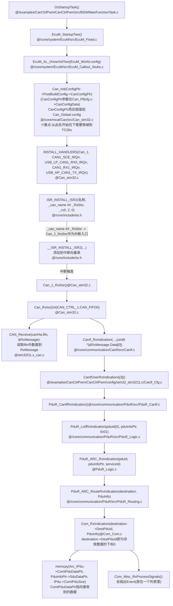

下图是CAN中断后发生的第一步：CanIf实现从`L-PDU`到`I-PDU`（`SWS_CANInterface.pdf`  P139 Receive indication (interrupt mode)）


下图是CAN中断后发生的第2步：IPDU从Canif到PDUR，再到COM（`SWS_PDURouter.pdf`  P88 CanIf module I-PDU reception）：


`Com_RxIndication`实现了将中断中的数据（通过结构体pduInfo指向了中断中的数据、数据长度等内容，pduInfo交给`Com_RxIndication`处理，而不是直接处理中断中的数据）拷贝到Buffer中。此时，可以通过抛出信号更新的事件（要使用到`ComSignal@Com_PbCfg.c`），供其他的任务来进行处理。

2.OsBswTask将IPDU数据拷贝到DEFERRED_IPDU中

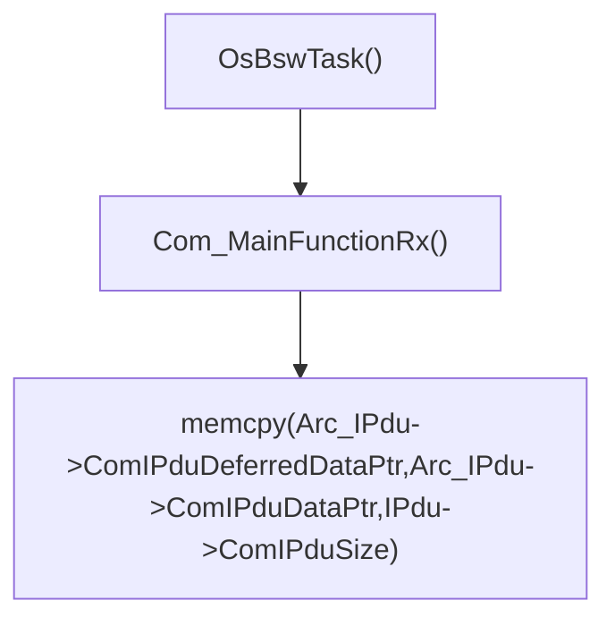

3.OsRteTask从DEFERRED_IPDU获取数据

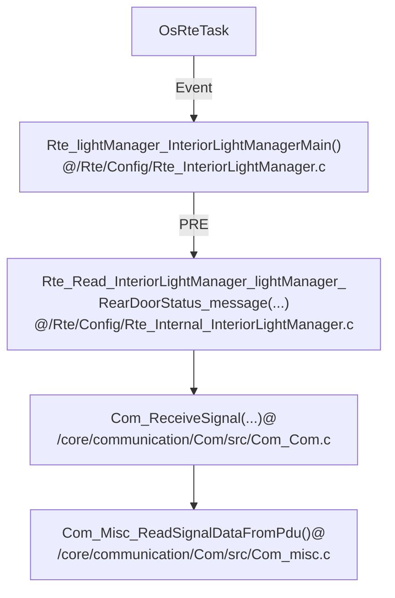

*相关数据结构*

1.PRE

```c
// @/Rte/Contract/Rte_InteriorLightManager.h
typedef struct {
    Rte_DE_DoorStatusImpl * const InteriorLightManagerMain_LeftDoorStatus_status;
    Rte_DE_IntImpl * const InteriorLightManagerMain_RearDoorStatus_message;
    Rte_DE_DoorStatusImpl * const InteriorLightManagerMain_RightDoorStatus_status;
    Rte_DE_LightStatusImpl * const InteriorLightManagerMain_FrontLightStatus_status;
    Rte_DE_IntImpl * const InteriorLightManagerMain_LightStatusOnCommMedia_message;
} Rte_CDS_InteriorLightManager;
typedef Rte_CDS_InteriorLightManager const * const Rte_Instance;
#define self (Rte_Inst_InteriorLightManager)  // 在.c中创建Rte_Inst_InteriorLightManager

// @ /Rte/Config/Rte_InteriorLightManager.c
Rte_DE_IntImpl ImplDE_lightManager_InteriorLightManagerMain_RearDoorStatus_message;//存放CAN发送过来的数据
const Rte_CDS_InteriorLightManager InteriorLightManager_lightManager = {
    .InteriorLightManagerMain_RearDoorStatus_message = &ImplDE_lightManager_InteriorLightManagerMain_RearDoorStatus_message,  //1.PRE指向存放CAN发送过来的空间
    .InteriorLightManagerMain_RightDoorStatus_status = &ImplDE_lightManager_InteriorLightManagerMain_RightDoorStatus_status,
    .InteriorLightManagerMain_LeftDoorStatus_status = &ImplDE_lightManager_InteriorLightManagerMain_LeftDoorStatus_status,
    .InteriorLightManagerMain_FrontLightStatus_status = &ImplDE_lightManager_InteriorLightManagerMain_FrontLightStatus_status, //2.MAIN处理1数据，结果写入到此处；3.POST写入到Rte_Buffer_frontLightActuator_InteriorLightStatus_status @ Rte_Buffers.c
    .InteriorLightManagerMain_LightStatusOnCommMedia_message = &ImplDE_lightManager_InteriorLightManagerMain_LightStatusOnCommMedia_message
};
const Rte_Instance Rte_Inst_InteriorLightManager = &InteriorLightManager_lightManager;
```

2.MAIN

获取`/Rte/Config/Rte_InteriorLightManager.c`中的数值，并进行处理，最终写入到`Rte_Inst_InteriorLightManager ->InteriorLightManagerMain_FrontLightStatus_status`。

3.POST

```c
// /Rte/Config/Rte_Buffers.c
LightStatusImpl Rte_Buffer_frontLightActuator_InteriorLightStatus_status; // 3.将MAIN处理结果拷贝到此处
```

**执行器根据上述结果执行相应操作**

*数据结构*

```c
// \Rte\Config\Rte_LightActuator.c
Rte_DE_LightStatusImpl ImplDE_frontLightActuator_LightActuatorMain_InteriorLightStatus_status;
const Rte_CDS_LightActuator LightActuator_frontLightActuator = {
    .LightActuatorMain_InteriorLightStatus_status = &ImplDE_frontLightActuator_LightActuatorMain_InteriorLightStatus_status,  // 将Rte_Buffer_frontLightActuator_InteriorLightStatus_status内保存的处理结果拷贝到此处
    .DigitalLight = {
        .Call_Write = Rte_Call_LightActuator_frontLightActuator_DigitalLight_Write  //需要执行的操作
    }
};
```

* **CAN数据发送**

  对于CanCtrlPwm工程而言，在OsRteTask任务中将数据放到IPDU中，在从OsBswTask通过CAN周期性发送出去

  1.OsRteTask任务中将数据放到IPDU中
  
  `EcuMWorld.config = EcuMConfig@EcuM_PBcfg.c`在函数`EcuM_Init()@EcuM.c`中配置，具体语句是`EcuM_World.config = EcuM_DeterminePbConfiguration();`
  
  ` EcuM_AL_DriverInitTwo(EcuM_World.config)`被调用，用于Com初始化`Com_Init`，也就是给`Com_ConfigType * ComConfig`赋值为ComConfiguration。

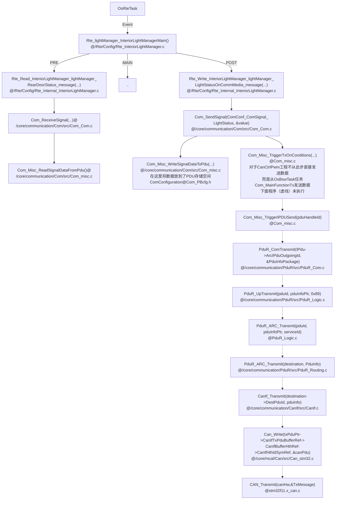

2.周期性从IPdu发送CAN数据

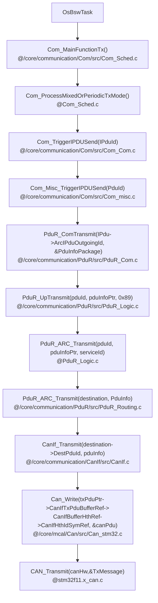

### 9.3.5 运行OsBswTask

*未完待续*

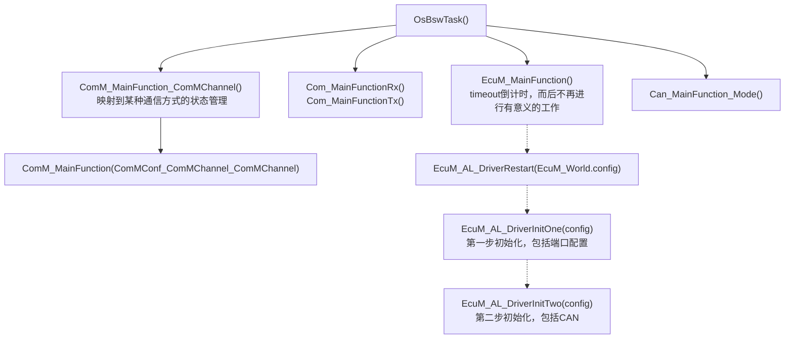

### 9.3.6 RTE设置PWM

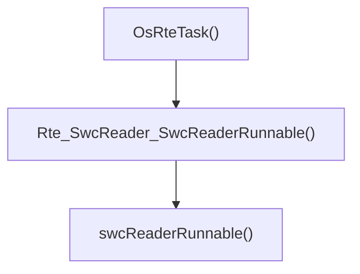

### 9.3.7 OsRteTask读取数据和设置灯PWM

* 流程图


*说明*：接收和发送的`IPdu`类型（下标分别为0和1）指向`Com_Arc_Buffer[COM_MAX_BUFFER_SIZE]`空间（见上图，接收和发送缓存连续），按照配置文件的配置顺序进行指向（`Can_Init`函数中一个`for`循环），每次初始化指向一块空间，`bufferIndex`就会`+空间大小`，为后面的指向做准备。*其他地方关于IPDU指向不同Buffer的说明不正确，以此说明为准，如有和本说明违背的地方，请联系我*。

* 变量声明和定义


* Runnable调用的函数和定义

  （1）获取数据和处理数据

  实际系统处理数据后，会通过CAN发送函数`Rte_Write_InteriorPwmSetManager_pwmSetManager_PwmSetDutyOnCommMedia_message@Rte\Config\Rte_Internal_InteriorPwmSetManager.c（在Rte\Config\Rte_Internal.h声明）`发送至外部。

  

  （2）执行Pwm占空比设置

  

  **函数定义总结**

  `Rte_Internal_xxxx.c/Rte_Internal.h`（`Rte/Config`）：定义/声明内容包括从IPDU读取（通信接收到的）数据、将数据写入RteBuff、读取RteBuff、设置IO（Pwm）占空比、写入IPDU（准备发送），**总结下来就是，所有连接BSW的接口和缓存区的操作（不包括和SWC任务绑定的缓存区）**。

  `Rte_xxxx.c`（`Rte/Config`）：定义Runnables，在要使用的地方extern引入

  `Rte_xxxx.h`（`Rte/Contract`）：声明`xxxx.c`中定义的执行器函数；定义内联函数，直接和Runnables**绑定**的操作变量。

  `Rte_xxxx_Type.h`（`Rte/Config`）：结构体声明

  `xxxx.c`（`Rte/src`）：定义执行器函数，具体进行Pwm占空比设置、Bsw主任务、IO操作等。

### 9.3.8 OsStartUp任务

* 流程

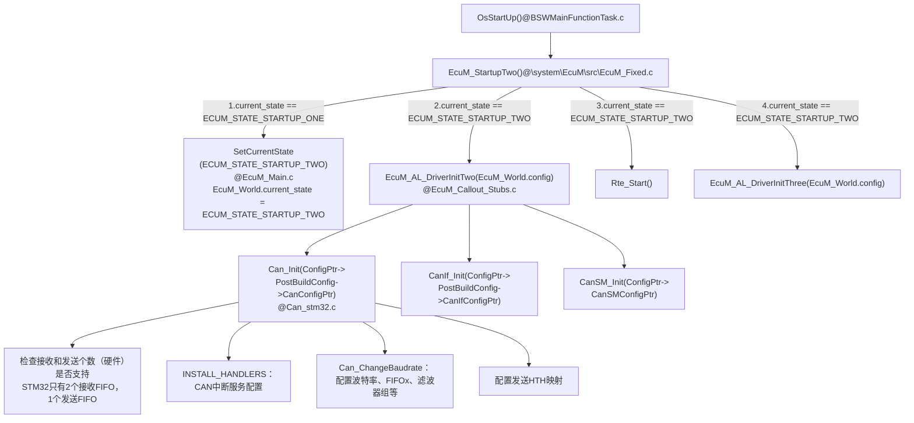

* 数据结构

  ```c
  // EcuM_World
  typedef struct
  {
      boolean                           initiated;
      EcuM_ConfigType                   *config;  // 在EcuM_Init()指向EcuMConfig @ EcuM_PBcfg.c，见下方
      EcuM_StateType                    shutdown_target;
      AppModeType                       app_mode;
      EcuM_StateType                    current_state;
      uint32                            run_requests;
      uint32                            postrun_requests;
      boolean                           killAllRequest;
      boolean                           killAllPostrunRequest;
  #if (defined(USE_ECUM_FLEXIBLE))
      EcuM_ShutdownCauseType            shutdown_cause;
  #endif
      uint8                             sleep_mode;
      /* Events set by EcuM_SetWakeupEvent */
      uint32                            wakeupEvents;
      uint32                            wakeupTimer;
      /* Events set by EcuM_ValidateWakeupEvent */
      uint32                            validEvents;
      uint32                            validationTimer;
  #if (ECUM_ARC_SAFETY_PLATFORM == STD_ON)
      EcuM_SP_SyncStatus                syncStatusMaster;
  #endif
  } EcuM_GlobalType;
  
  /*@req SWS_EcuM_00793*/ /*@req SWS_EcuMf_00046*/
  const EcuM_ConfigType EcuMConfig = {
      .EcuMPostBuildVariant = 1,
      .EcuMConfigConsistencyHashLow = PRE_COMPILED_DATA_HASH_LOW, 
      .EcuMConfigConsistencyHashHigh = PRE_COMPILED_DATA_HASH_HIGH,  /* @req SWS_EcuM_02795 */
      .EcuMDefaultShutdownTarget = ECUM_STATE_OFF,
      .EcuMDefaultSleepMode = ECUM_SLEEP_MODE_FIRST,
      .EcuMDefaultAppMode = OSDEFAULTAPPMODE,
      .EcuMNvramReadAllTimeout = ECUM_NVRAM_READALL_TIMEOUT,
      .EcuMNvramWriteAllTimeout = ECUM_NVRAM_WRITEALL_TIMEOUT,
      .EcuMRunMinimumDuration = ECUM_NVRAM_MIN_RUN_DURATION,
      .EcuMNormalMcuMode = McuConf_McuModeSettingConf_NORMAL,
      .EcuMSleepModeConfig = EcuM_SleepModeConfig,
      .EcuMWakeupSourceConfig = EcuM_WakeupSourceConfig,
  #if defined(USE_COMM)
      .EcuMComMConfig = EcuM_ComMConfig,
  #endif
  #if defined(USE_MCU)
      .McuConfigPtr = McuConfigData,
  #endif
  #if defined(USE_PORT)
      .PortConfigPtr = &PortConfigData,
  #endif
  #if defined(USE_DIO)
      .DioConfigPtr = &DioConfigData,
  #endif
  #if defined(USE_CANSM)
      .CanSMConfigPtr = &CanSM_Config,
  #endif
  #if defined(USE_ADC)
      #if defined(CFG_ZYNQ)
          .AdcConfigPtr = NULL,
      #else
          .AdcConfigPtr = AdcConfig,
      #endif
  #endif
  #if defined(USE_PWM)
      .PwmConfigPtr = &PwmConfig,
  #endif
  #if defined(USE_BSWM) || defined(USE_PDUR) || defined(USE_COM) || defined(USE_CANIF) ||\
      defined(USE_CANTP) || defined(USE_CANNM) || defined(USE_COMM) || defined (USE_CANTRCV) || defined (USE_CAN) || (defined(USE_FIM) && (FIM_POSTBUILD_MODE == STD_ON))
      .PostBuildConfig = &Postbuild_Config,  //指向一个包含以上模块配置信息的数据结构，见下方
  #endif
  // ...未完全展示
  };
  
  // \core\system\EcuM\src\EcuM_PBHeader.c
  SECTION_POSTBUILD_HEADER const PostbuildConfigType Postbuild_Config = {
      .startPattern = 0x5A5A5A5A,
      .postBuildVariant = 1,
      .preCompileHashLow = PRE_COMPILED_DATA_HASH_LOW,
      .preCompileHashHigh = PRE_COMPILED_DATA_HASH_HIGH,
  #if defined (USE_BSWM)
      .BswMConfigPtr = &BswM_Config,
  #endif
  #if defined (USE_CAN)
      .CanConfigPtr = &CanConfigData,  //指向CanConfigData@Can_PBcfg.c，见下方
  #endif
  #if defined(USE_CANIF)
      .CanIfConfigPtr = &CanIf_Config,
  #endif
  #if defined (USE_CANNM)
      .CanNmConfigPtr = &CanNm_Config,
  #endif
  #if defined(USE_COM)
      .ComConfigPtr = &ComConfiguration,
  #endif
  #if defined (USE_COMM)
      .ComMConfigPtr = &ComM_Config,
  #endif
  #if defined(USE_PDUR)
      .PduRConfigPtr = &PduR_Config,
  #endif
  // ...未完全展示
  };
  //@Can_PBcfg.c
  SECTION_POSTBUILD_DATA  const  Can_ConfigType CanConfigData = {
  	.CanConfigSetPtr =	&CanConfigSetData
  };
  ```

* 对`HTH MAP`的探究

  **问题**

  在`Can_Cfg.h`中定义了

  ```c
  #define CanConf_CanHardwareObject_CanHardwareObjectTx (Can_HwHandleType)0
  #define Can_CanHardwareObjectTx CanConf_CanHardwareObject_CanHardwareObjectTx
  #define NUM_OF_HTHS (Can_HwHandleType)1  // HTH(Transmit Handle) 个数 
  
  #define CanConf_CanHardwareObject_CanHardwareObjectRx (Can_HwHandleType)1
  #define Can_CanHardwareObjectRx CanConf_CanHardwareObject_CanHardwareObjectRx
  ```

  但是EB中必须定义Tx比Rx高。所以这里设置成`Tx 1`和`Rx 0`，但是单片机无法通过CAN发送和接收数据（CAN中断服务函数也无法进入）。

  **解释(我们的项目工程代码带注释)**

  `Can_Init()`初始化的时候，需要给`Can_Global.CanHTHMap`（Transmit Handle）设置

  ```c
  // @Can_Init()
  //     {  // Can_Arc_Hoh ptr to ...
  //         .CanObjectId	=	CanConf_CanHardwareObject_CanHardwareObjectTx,//CanHardwareObjectTx,
  //         .CanHandleType	=	CAN_ARC_HANDLE_TYPE_BASIC,
  //         .CanIdType		=	CAN_ID_TYPE_STANDARD,
  //         .CanObjectType	=	CAN_OBJECT_TYPE_TRANSMIT,
  //         .CanHwFilterMask =	0, // Not applicable for Transmit object
  //         .Can_Arc_EOL	= 	1  // [Chaochao Song] Stop while in Can_Init func , set the last enum's  Can_Arc_EOL = 1
  //     },
  hoh = canHwConfig->Can_Arc_Hoh;
  hoh--;
  do
  {
      hoh++;
  
      if (hoh->CanObjectType == CAN_OBJECT_TYPE_TRANSMIT)  // hoh ptr to 上面的元素
      {
          //设置哪个CAN，对于CanCtrlPwm Proj是CAN_CTRL_1
          // !!!!! 这里hoh->CanObjectId就是上面所说的发送和接收的数值（Tx比Rx高）
          // CanHTHMap只定义了1个（NUM_OF_HTHS），下标为0，Tx数值CanObjectId为1而造成溢出
          // 但是这里不能单纯的 -1，因为还会在发送的时候检查是否存在HTH，造成ID不对应，具体见下面的解释
          Can_Global.CanHTHMap[hoh->CanObjectId].CanControllerRef = canHwConfig->CanControllerId;
          // 设置HOH(Hardware Object Handle)
          Can_Global.CanHTHMap[hoh->CanObjectId].CanHOHRef = hoh;
      }
  } while (!hoh->Can_Arc_EOL);
  ```

  另外在发送的时候，也会检测（接上面的问题——“但是这里不能单纯的 -1，因为还会在发送的时候检查是否存在HTH，造成ID不对应，具体见下面的解释”）是否符合。见下图调用过程：

  ```mermaid
  graph TB;
  CanIf_Transmit["CanIf_Transmit()"] --> txPduPtr["txPduPtr = &CanIf_ConfigPtr->InitConfig->CanIfTxPduConfigPtr<br>定义见下方补充"]
  txPduPtr --> Can_Write["Can_Write(txPduPtr->CanIfTxPduBufferRef->CanIfBufferHthRef->CanIfHthIdSymRef, &canPdu)<br>CanIfHthIdSymRef = CanConf_CanHardwareObject_CanHardwareObjectTx<br>定义见下方补充"]
  Can_Write --> Can_FindHoh["Can_FindHoh(Hth, &controller)<br>判断输入的hth是否和HTHmap中的一样"]
   
  ```

  ```c
  SECTION_POSTBUILD_DATA const CanIf_TxPduConfigType CanIfTxPduConfigData[] = {//下面的hth指向
      {
          .CanIfTxPduId               = PDUR_REVERSE_PDU_ID_PDUTX,
          .CanIfCanTxPduIdCanId       = 2,
          .CanIfCanTxPduIdDlc         = 8,
          .CanIfCanTxPduType          = CANIF_PDU_TYPE_STATIC,
          .CanIfTxPduPnFilterEnable   = STD_OFF,
  #if ( CANIF_PUBLIC_READTXPDU_NOTIFY_STATUS_API == STD_ON )
          .CanIfReadTxPduNotifyStatus = FALSE,
  #endif
          .CanIfTxPduIdCanIdType      = CANIF_CAN_ID_TYPE_11,
          .CanIfUserTxConfirmation    = PDUR_CALLOUT,
          /* [CanIfBufferCfg] */
          .CanIfTxPduBufferRef        = &CanIfBufferCfgData[0],//指向下面的CanIfBufferCfgData
      },
  };
  SECTION_POSTBUILD_DATA const CanIf_TxBufferConfigType CanIfBufferCfgData[] = {
  	{
  		.CanIfBufferSize = 0,
  		.CanIfBufferHthRef = &CanIfHthConfigData_CanIfInitHohCfg[0],//指向下面的CanIfHthConfigData_CanIfInitHohCfg
  		.CanIf_Arc_BufferId = 0
  	},
  };
  SECTION_POSTBUILD_DATA const CanIf_HthConfigType CanIfHthConfigData_CanIfInitHohCfg[] =
  {
  	{ 
      	.CanIfHthType 				= CANIF_HANDLE_TYPE_BASIC,
      	.CanIfCanControllerIdRef 	= CanIfConf_CanIfCtrlCfg_CanIfCtrlCfg,
      	.CanIfHthIdSymRef 			= CanConf_CanHardwareObject_CanHardwareObjectTx,//出现了!!!!!即为上面所定义的CanConf_CanHardwareObject_CanHardwareObjectTx
  	},
  };
  ```

  **解决方案**

  ```c
  #define NUM_OF_HTHS 2 //定义两个HTH，只用第二个
  ```

  *不能在Can_Init的时候，单纯将CanConf_CanHardwareObject_CanHardwareObjectTx -1 输入到HTHmap下标，解释是发送的时候会检测是否对应，具体见上面**解释***

### 9.3.9 RTE任务和BSW任务的通信模式如何联系

**1.Rte任务初始化通信模式**

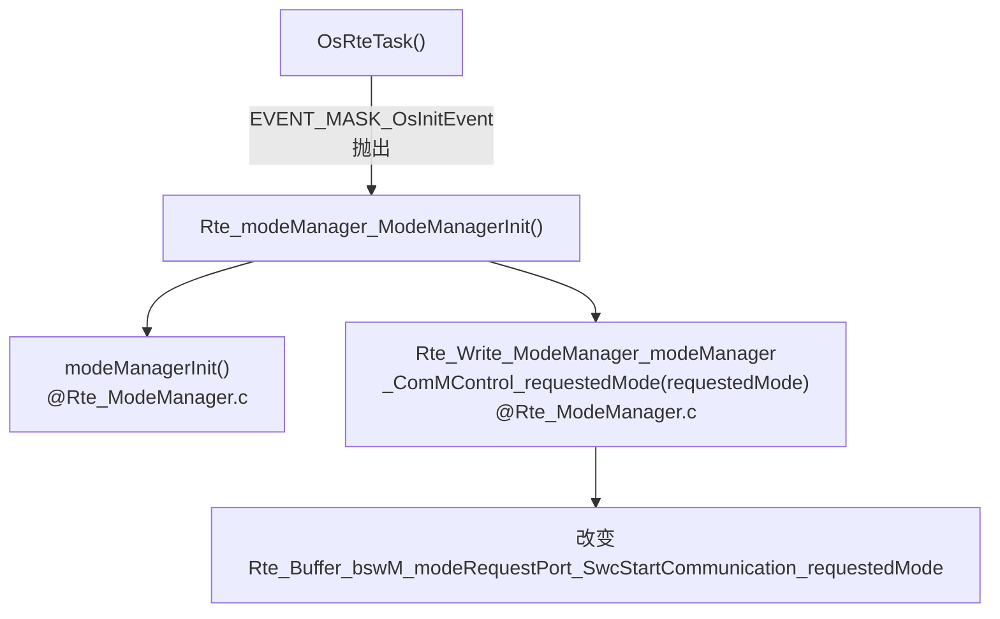

**2.Bsw获取开始的通信模式**

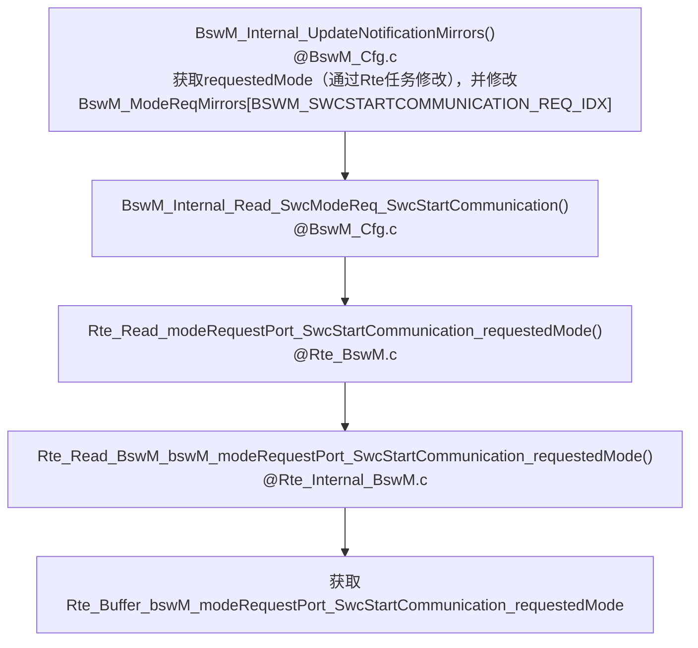

**3.BswM修改通信模式**

根据`BswM_ModeReqMirrors[BSWM_SWCSTARTCOMMUNICATION_REQ_IDX]`修改`BswM_ModeReqMirrors[BSWM_BSWCOMMINDICATION_REQ_IDX]`。

**4.Com发送数据**

通信模块根据`Com_Arc_IpduStarted`是否是`TRUE`来发送数据

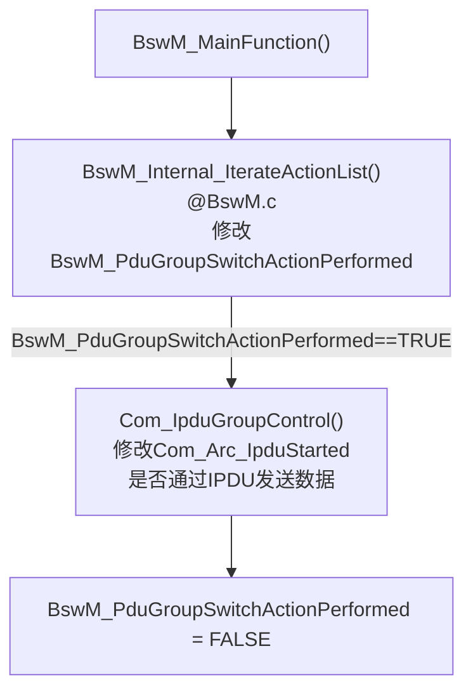

### 9.3.11 如何注册中断向量表

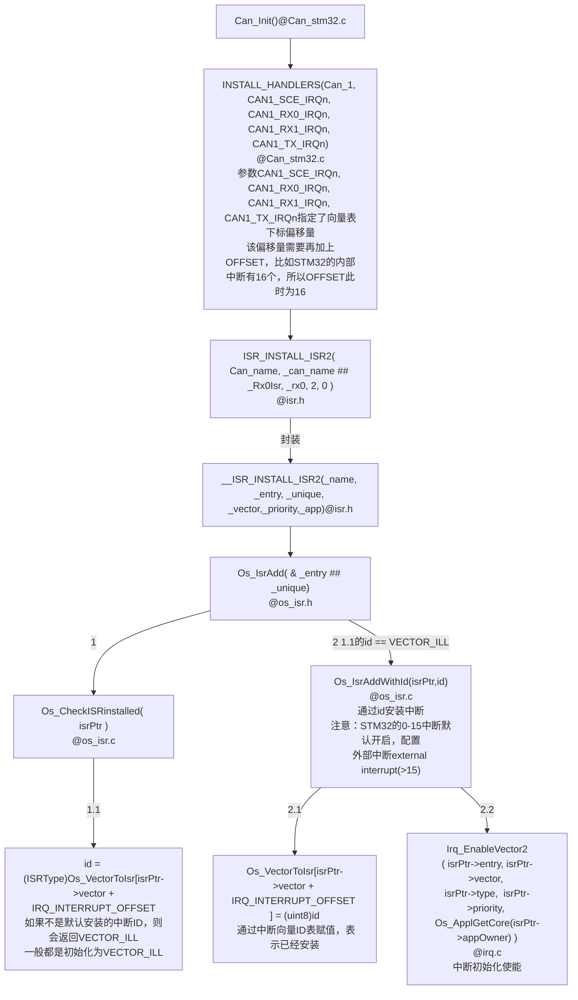

### 9.3.11 OS任务调度

* Os_AlarmCheck函数

  Os_AlarmCheck函数按照OS的系统时钟运行，周期由变量OsTickFreq决定，在CanCtrlPwm中，定义为11.00（us），即Os_AlarmCheck每1ms运行一次。在Os_AlarmCheck函数中，会进行每个ALARM时间是否到达，到达则运行相关动作。

  *如何判断ALARM时间是否到达？*

  每个ALARM都会有一个expire_val，每次运行后，就增加到下一次运行的时间。在下一次判断到系统时间和该时间相同，则运行。


## 9.4 顶层移植、配置和应用

路径：`\examples\CanCtrlPwm\CanCtrlPwm\config\stm32_stm3211.c`

### 9.4.1 Os

配置文件主要包括：`Os_Cfg.c`和`Os_Cfg.h`

* `Os_Cfg.c`

  **（1）外部参考——EXTERNAL REFERENCES**

  *Application externals*

  *Interrupt externals*：设置Os Tick频率

  **（2）DEBUG输出——DEBUG OUTPUT**

  变量`os_dbg_mask`来控制OS_DEBUG的日志输出等级。

  **（3）应用——APPLICATIONS**

  每个应用下由多个任务TASK组成。

  **需要修改的内容**：`.appId`和`.name`

  ```c
  const OsAppConstType Os_AppConst[OS_APPLICATION_CNT]  = {			
  	{
      .appId = APPLICATION_ID_OsApplicationInteriorLight,  // 应用ID：0,1,2...
      .name = "OsApplicationInteriorLight",  //应用名称
      .core = 0,     //运行该应用的内核
      .trusted = true,    //是否信任
  	}
  };
  ```

  **（4）计数器——COUNTERS**

  主要用于定时给任务ALARM，周期性运行

  **需要修改的内容**：无

  **隐含变量**：`OS_COUNTER_CNT`  （`@Os_Cfg.h`）计数器个数，对应`GEN_COUNTER_HEAD`元素个数；

  ```c
  GEN_COUNTER_HEAD = {
  	GEN_COUNTER(
          /* id          */		COUNTER_ID_OsRteCounter,  //唯一ID标识，指示计数器下标，从0开始，GEN_COUNTER函数中未用到_id变量，主要给下面Os_Arc_OsTickCounter指示
          /* name        */		"OsRteCounter",           //counter名称
          /* counterType */		COUNTER_TYPE_HARD,        // @/Os/rtos/src/os_counter_i.h
          /* counterUnit */		COUNTER_UNIT_NANO,        // @/Os/rtos/src/os_counter_i.h
          /* maxAllowed  */		OSMAXALLOWEDVALUE,        // 计数器最大值
          /*             */		1,
          /* minCycle    */		1,                       //最小周期
          /*             */		0,
          /* owningApp   */		APPLICATION_ID_OsApplicationInteriorLight,  //使用该计数器的应用，上方Os_AppConst定义应用
          /* accAppMask..*/       ((1u << APPLICATION_ID_OsApplicationInteriorLight))
      ) 
  };
  //定义Os的tick下标，所以上面的定义中id必须从0
  CounterType Os_Arc_OsTickCounter = COUNTER_ID_OsRteCounter;
  ```

  **（5）ALARMS**

  两个功能：1、周期性唤醒任务执行（通过`GEN_ALARM_AUTOSTART`设置）；2、周期性抛出事件ALARM（通过`GEN_ALARM_HEAD`设置），在任务内判断是否有相应事件出现。

  **需要修改的内容**：无

  ```c
  GEN_ALARM_AUTOSTART(  // 命名方式  Os_AlarmAutoStart_ ## _id，可以通过GEN_ALARM_AUTOSTART_NAME获取
  				ALARM_ID_OsRteAlarm11.0ms,  // _id，0,1,...
  				ALARM_AUTOSTART_RELATIVE,
  				11.0,                      //ALARM周期
  				11.0,                      //循环周期
  				OSDEFAULTAPPMODE );
  
  GEN_ALARM_AUTOSTART(
  				ALARM_ID_OsAlarmBswServices,
  				ALARM_AUTOSTART_RELATIVE,
  				5,
  				5,
  				OSDEFAULTAPPMODE );
  
  GEN_ALARM_HEAD = {
  	GEN_ALARM(	ALARM_ID_OsRteAlarm11.0ms,  //对应于上面生成的ALARM
  				"OsRteAlarm11.0ms",
  				COUNTER_ID_OsRteCounter,  //对应生成的计数器的id
  				GEN_ALARM_AUTOSTART_NAME(ALARM_ID_OsRteAlarm11.0ms), //指向ALARM_AUTOSTART变量
  				ALARM_ACTION_SETEVENT,    //设置事件
  				TASK_ID_OsRteTask,     //任务ID @ Os_Cfg.h
  				EVENT_MASK_OsMainEvent,
  				0,
  				APPLICATION_ID_OsApplicationInteriorLight, /* Application owner */
  				(( 1u << APPLICATION_ID_OsApplicationInteriorLight ) 
  				) /* Accessing application mask */
  			)
  ,
  	GEN_ALARM(	ALARM_ID_OsAlarmBswServices,
  				"OsAlarmBswServic",
  				COUNTER_ID_OsRteCounter,
  				GEN_ALARM_AUTOSTART_NAME(ALARM_ID_OsAlarmBswServices),
  				ALARM_ACTION_ACTIVATETASK,//激活任务
  				TASK_ID_OsBswTask,
  				0,
  				0,
  				APPLICATION_ID_OsApplicationInteriorLight, /* Application owner */
  				(( 1u << APPLICATION_ID_OsApplicationInteriorLight ) 
  				) /* Accessing application mask */
  			)
  };
  ```

  **（6）资源——RESOURSES**

  

  **（7）任务栈空间——STACKS(TASKS)**

  **需要修改的内容**：无

  ```c
  //DECLARE_STACK(_name,_size)  ->  stack__
  DECLARE_STACK(OsIdle, OS_OSIDLE_STACK_SIZE);  //定义空闲任务的栈空间，栈空间名称stack_OsIdle
  DECLARE_STACK(OsBswTask,  2048);             // 栈空间stack_OsBswTask
  DECLARE_STACK(OsRteTask,  2048);
  DECLARE_STACK(OsStartupTask,  2048);
  ```

  **（8）任务——TASKS**

  **需要修改的内容**：无

  **EVENT_MASK_OsInitEvent说明**：`SetCurrentState() -> Rte_Switch_currentMode_currentMode(currentMode) -> Rte_Switch_EcuM_ecuM_currentMode_currentMode(currentMode) ->SYS_CALL_SetEvent(TASK_ID_OsRteTask, EVENT_MASK_OsInitEvent)`，将事件`EVENT_MASK_OsInitEvent`产生，由`OsRteTask`任务（ID为TASK_ID_OsRteTask）处理。

  ```c
  GEN_TASK_HEAD = {
  	{
  	.pid = TASK_ID_OsIdle,
  	.name = "OsIdle",
  	.entry = OsIdle,     //任务函数入口
  	.prio = 0,           //优先级
  	.scheduling = FULL,   // ??
  	.autostart = TRUE,    // ??
  	.proc_type = PROC_BASIC,
  	.stack = {
  		.size = sizeof stack_OsIdle,   //由上方的栈空间定义 
  		.top = stack_OsIdle,
  	},
  	.resourceIntPtr = NULL_PTR, 
  	.resourceAccess = 0,
  	.activationLimit = 1,
      .applOwnerId = OS_CORE_0_MAIN_APPLICATION,  //使用该任务的应用  定义为APPLICATION_ID_OsApplicationInteriorLight
      .accessingApplMask = (1u << OS_CORE_0_MAIN_APPLICATION),
  	},
  	
  {
  	.pid = TASK_ID_OsBswTask,
  	.name = "OsBswTask",
  	.entry = OsBswTask,
  	.prio = 2,
  	.scheduling = FULL,
  	.proc_type = PROC_BASIC,
  	.stack = {
  		.size = sizeof stack_OsBswTask,
  		.top = stack_OsBswTask,
  	},
  	.autostart = TRUE,
  	.resourceIntPtr = NULL_PTR, 
  	.resourceAccess = 0 , 
  	.activationLimit = 1,
  	.eventMask = 0 ,
  	.applOwnerId = APPLICATION_ID_OsApplicationInteriorLight,
  	.accessingApplMask = (1u <<APPLICATION_ID_OsApplicationInteriorLight)
  ,
  },
  {
  	.pid = TASK_ID_OsRteTask,
  	.name = "OsRteTask",
  	.entry = OsRteTask,
  	.prio = 1,
  	.scheduling = FULL,
  	.proc_type = PROC_EXTENDED,
  	.stack = {
  		.size = sizeof stack_OsRteTask,
  		.top = stack_OsRteTask,
  	},
  	.autostart = TRUE,
  	.resourceIntPtr = NULL_PTR, 
  	.resourceAccess = 0 , 
  	.activationLimit = 1,
  	.eventMask = 0 | EVENT_MASK_OsMainEvent | EVENT_MASK_OsInitEvent ,  //两个时间在OsRteTask任务中判断。EVENT_MASK_OsInitEvent在Rte_Internal_EcuM.c中（每次模式转换都会）生成该事件
  	
  	.applOwnerId = APPLICATION_ID_OsApplicationInteriorLight,
  	.accessingApplMask = (1u <<APPLICATION_ID_OsApplicationInteriorLight)
  ,
  },
  {
  	.pid = TASK_ID_OsStartupTask,
  	.name = "OsStartupTask",
  	.entry = OsStartupTask,
  	.prio = 1,
  	.scheduling = FULL,
  	.proc_type = PROC_BASIC,
  	.stack = {
  		.size = sizeof stack_OsStartupTask,
  		.top = stack_OsStartupTask,
  	},
  	.autostart = TRUE,
  	.resourceIntPtr = NULL_PTR, 
  	.resourceAccess = 0 , 
  	.activationLimit = 1,
  	.eventMask = 0 ,
  	.applOwnerId = APPLICATION_ID_OsApplicationInteriorLight,
  	.accessingApplMask = (1u <<APPLICATION_ID_OsApplicationInteriorLight)
  ,
  },
  };
  ```

  **（9）勾子函数——HOOKS**

  ```c
  GEN_HOOKS( 
  NULL,
  NULL,
  NULL,
  NULL,
  NULL,
  NULL
  );
  ```

  **（11.）中断——ISRS**

  ```c
  #if (!defined(CFG_TC2XX) && !defined(CFG_TC3XX)) // Table Os_VectorToIsr is not used for Aurix architecture.
  GEN_ISR_MAP = {
    0
  };
  #endif
  ```

  **（11）调度表——SCHEDULE TABLES**

  **（12）自旋锁——SPINLOCKS**

* `Os_Cfg.h`

  **OS_NUM_CORES**：核个数 

  具体见代码注释。

### 9.4.2 Com

* `Com_Cfg.c`

  **需要修改的内容**：无

  定义`callout`函数，例子：

  ```c
  const ComNotificationCalloutType ComNotificationCallouts [] = { // Notifications
  	NULL};
  const ComRxIPduCalloutType ComRxIPduCallouts[] = {// Rx callouts
  	NULL};
  const ComTxIPduCalloutType ComTxIPduCallouts[] = {// Tx callouts
  	NULL};
  const ComTxIPduCalloutType ComTriggerTransmitIPduCallouts[] = {// Trigger transmit callouts
  	NULL};
  ```

* `Com_Cfg.h`

  **需要修改的内容**：`信号ID`，及关联文件

  通信相关配置，例如：

  `COM_MAX_BUFFER_SIZE`：通信缓存192字节，见**7.3.7 OsRteTask读取数据和设置灯PWM**

  `COM_MAX_N_IPDUS`：通信`IPdu`（类型为`Com_Arc_IPdu_type`）最多个数2个——发送和接收，结合上面`COM_MAX_BUFFER_SIZE`，共2个192字节通信缓存。

  `COM_MAX_N_SIGNALS`：信号Signal（类型为`Com_Arc_Signal_type`）个数，如果大于0，则会开启`IPDU`计数

  `COM_MAX_N_GROUP_SIGNALS`：信号组（类型为`Com_Arc_GroupSignal_type`）个数

  `一些通错误编号`：`COM_INVALID_PDU_ID(11.4)`、`COM_INVALID_SIGNAL_ID(11.9)`等

  **`信号ID`**：如

  ```c
  // COM SIGNAL GROUPS and SIGNAL IDs
  #define ComConf_ComSignal_DoorStatus          0
  #define ComConf_ComSignal_LightStatus          1
  ```

  **关联文件**：

  1.`Com_PbCfg.c`的`ComSignal[n]->ComHandleId`

  2.调用`Com_ReceiveSignal`或者`Com_SendSignal`时候，如`Rte_Internal_PwmSetManager.c`的`retVal |= Com_ReceiveSignal(信号ID, value)`，函数体内通过`GET_Signal(信号ID)`获取`ComSignal_type * Signal`，通过`GET_ArcIPdu(Signal->ComIPduHandleId)`获取`Com_Arc_IPdu_type *Arc_IPdu`。

  3.`Com_PbCfg.c`的`IPdu signal`，如

  ```c
  SECTION_POSTBUILD_DATA const ComSignal_type * const ComIPduSignalRefs_DoorStatusPdu[] = {
  	&ComSignal[信号ID],
  	NULL
  };
  ```

* `Com_PbCfg.c`

  **需要修改的内容**：`ComSignal[n].ComIPduHandleId`对应`Com_PbCfg.h`中的某一个ID、信号初始数值如` Com_SignalInitValue_DoorStatus`、Post Build的一些结构体如SignalRef：`ComIPduSignalRefs_DoorStatusPdu`、GroupRef：`ComIpduGroupRefs_DoorStatusPdu`

  定义通信需要的数据结构——`ComConfiguration`，即`Signal`（非`Arc_IPdu`）。

  *注*：`Arc_IPud`在`/core/communication/Com/src/Com_Internal.h`中定义，不需要自行定义。见**7.3.4 CAN调用过程**中的IPDU说明。

* `Com_PbCfg.h`

  **需要修改的内容**：`IPDU ID`号，并修改关联文件

  定义`IPDU ID`号，指定数据对应对应不同`IPDU`。如

  ```c
  // COM IPDU IDs 
  #define ComConf_ComIPdu_DoorStatusPdu               0
  #define ComConf_ComIPdu_LightStatusPdu               1
  ```

  定义了门状态信息为`IPDU[0]`。

  **关联文件**：

  1.`Com_PbCfg.c`的`ComSignal[n].ComIPduHandleId`

  2.`PduR_PbCfg.c`的`PduRDestination_PduRRoutingPathRx_PduRDestPdu->DestPduId`（接收）或者`PduRRoutingPath_PduRRoutingPathTx->SrcPduId`（发送）

**关于信号ID的总结**：`Com_Cfg.h`和`Com_PbCfg.h`中定义了`SignalId`(命名为`ComConf_ComSignal_xxx`)和`IPduId`(命名为`ComConf_ComIPdu_xxx`)，分别制定了`IPdu`、`Arc_IPdu`和`Signal`获取地址——通过`GET_Signal(SignalId)`获取`ComSignal_type * Signal`，通过`GET_ArcIPdu(Signal->ComIPduHandleId)`获取`Com_Arc_IPdu_type *Arc_IPdu`，通过`GET_IPdu(Signal->ComIPduHandleId)`获取`ComIPdu_type *IPdu `；信号ID需要修改三个地方：`PDUR(Arc_IPdu)`、`Signal(IPdu)`和具体函数调用的信号ID参数。

**`IPdu`、`Arc_IPdu`和`Signal`的区别**：见**7.3.4 CAN调用过程**

### 9.4.3 ComM

* `ComM_Cfg.c`

  **需要修改的内容**：无

  定义了`ComM_MainFunction_ComMChannel()`调用`ComM_MainFunction(ComMConf_ComMChannel_ComMChannel)`，`ComMConf_ComMChannel_ComMChannel`定义了`ComMChannelId`，*每个通信端口对应一个channel？*

* `ComM_Cfg.h`

  **需要修改的内容**：无

  宏定义，如`ComMConf_ComMChannel_ComMChannel`、`COMM_NETWORK_HANDLE_ComMChannel`、`COMM_CHANNEL_COUNT`、`COMM_USER_COUNT`。

* `ComM_PbCfg.c`

  **需要修改的内容**：无

  定义ComM的通道和使用者信息。

* `ComM_PbCfg.h`

  `ComM_Config`的`extern`声明。

### 9.4.4 BswM

* `BswM_Cfg.c`

  **需要修改的内容**：无

  根据`USE`来包含特定`.h`文件。

* `BswM_Cfg.h`

  **需要修改的内容**：针对使用了不同的模块，使能相应内容

  使能BswM具体功能，如`BSWM_CANSM_ENABLED   STD_ON`、`BSWM_COMM_ENABLED     STD_ON`等

  宏定义数值

* `BswM_PBcfg.c`

  **需要修改的内容**：无

  定义BswM需要用到的数据结构。

### 9.4.5 EcuM

- `EcuM_PBcfg.c`

  **需要修改的内容**：无

  定义EcuM需要用到的数据结构。

- `EcuM_GeneratedCallouts.c`

  **需要修改的内容**：无

  无

- `EcuM_Cfg.h`

  **需要修改的内容**：无

  宏定义唤醒源对应数值、复位方式对应数值

### 9.4.6 RTE

#### 9.4.6.1 Config

* `Rte`

  **需要修改的内容**：RTE任务具体执行的运行实体Runnable

  (1)`Rte.c`

  Rte任务，等待事件（包括系统满足条件后抛出的事件和定时抛出的事件）；调用EcuM状态机转化函数；调用运行实体（RE, Runnable Entity）。

  (2)`Rte.h`

  定义RTE相关的宏定义，如错误码、RTE版本等。

* `Rte_BswM`

  **需要修改的内容**：无

  (1)`Rte_BswM.c`

  BswM运行实体`Rte_bswM_BswMRunnable`，实际未被调用。**思考**：BswM是否可作为RTE任务的一个运行实体，循环调用？实际上Bsw任务直接调用了`Rte_bswM_BswMRunnable`中的MAIN功能函数`BswM_MainFunction`。

  (2)`Rte_BswM_Type.h`

  定义ComM三种模式，NO、SILENT和FULL，为什么在这里定义？？`Rte_ComM_Type.h`中也有定义。

* `Rte_ComM`

  (1)`Rte_ComM.c`

  定义函数：获取当前通信模式（状态）、获取请求的通信模式（模式）、请求通信模式（状态）等。

  (2)`Rte_ComM_Type.h`

  定义ComM三种模式，NO、SILENT和FULL。

  **问题**：为什么`RTE_MODE_ComMMode_COMM_FULL_COMMUNICATION`和`COMM_FULL_COMMUNICATION`定义的值不同？用处是？

* `Rte_EcuM`

  (1)`Rte_EcuM.c`

  `Rte_ecuM_GetBootTarget()`、`Rte_ecuM_GetLastShutdownTarget()`等。

  (2)`Rte_EcuM_Type.h`

  定义ECUM状态，如`ECUM_STATE_OFF`、`ECUM_STATE_SLEEP`等，`ECUM_BOOT_TARGET_APP`、`ECUM_BOOT_TARGET_OEM_BOOTLOADER`等。

* `Rte_ModeManager`

  (1)`Rte_ModeManager.c`

  模式管理初始化

  (2)`Rte_ModeManager_Type.h`

  如果`Rte_EcuM_Type.h`和`Rte_ComM_Type.h`未定义，在此处定义。

* `Rte_Internal`

  **需要修改的内容**：函数声明

  (1)`Rte_Internal.c`

  `RteInitialized`：初始化为`FALSE`，并`include <Rte_MemMap.h>`

  (2)`Rte_Internal.h`

  *状态机定义*：EcuM和ComM状态机类型声明。

  *状态机取值定义*：EcuM的运行、停止、睡眠、启动等；ComM的`FULL_COMMUNICATION`（接收发送均使能）、`NO_COMMUNICATION`（不使能通信）和`SILENT_COMMUNICATION`（只接受，不发送）。

  *函数声明*：BswM、ComM、EcuM、PwmSetManager（主要通过RTE进行数据的读写，见**7.3.7 OsRteTask读取数据和设置灯PWM-函数定义总结**）、IO操作

* `Rte_Internal_xxx.c`

  `Rte_Internal_BswM.c`：获取请求的模式（状态）

  `Rte_Internal_ComM.c`：获取当前通信模式（状态）、获取请求的通信模式（模式）、请求通信模式（状态）等，封装了`Rte_ComM.c`中的函数。

  `Rte_Internal_EcuM.c`：封装了`Rte_EcuM.c`中的函数。

  `Rte_Internal_IoHwAb.c`：操作IO端口的接口。

  `Rte_Internal_ModeManager.c`：模式管理——通信控制、运行控制等，其实是获取状态。

  `Rte_Internal_PwmSetActuator.c`：面向执行器（运行实体），将RteBuff中数据拷贝到执行器数据结构或者给出BSW的接口。

  `Rte_Internal_PwmSetManager.c`：面向数据管理/获取（运行实体），将数据拷贝到数据获取实体的数据结构，或者拷贝到RteBuff，或者给出BSW的接口。

* `Rte_Main`

  RTE启动、关闭，一块初始化 Ioc。

* `Rte_Buffers`

  **需要修改的内容**：RTE缓存区

  (1)`Rte_Buffers.c`

  定义RTE缓存区，作为Runnable之间信息交换的桥梁。

  (2)`Rte_Buffers.h`

  EcuM、ComM函数、RTE缓存区（桥梁）变量的extern声明。

* `Rte_Type.h`

  **需要修改的内容**：用到的基础变量

  声明基础变量，如

  ```c
  /* Redefinition type DigitalLevel */
  typedef uint8 DigitalLevel;
  /* Redefinition type DutyCycle */
  typedef uint32 DutyCycle;
  /* Redefinition type Frequency */
  typedef uint32 Frequency;
  //.....
  ```

* `Rte_DataHandleType.h`

  **需要修改的内容**：用到的数据结构

  对`Rte_Type.h`内基础变量进一步封装成数据结构（结构体），如

  ```c
  typedef struct {
      PwmSetDutyImpl value;
  } Rte_DE_PwmSetDutyImpl;
  ```

* `Rte_Cbk`

  **需要修改的内容**：添加需要使用的回调函数。

  定义回调函数，如，

  ```c
  void Rte_COMCbk_PwmSetDuty(void) {
      //unused
  }
  ```

  *补充*：什么是回调函数？回调函数，顾名思义，就是使用者自己定义一个函数，使用者自己实现这个函数的程序内容，然后把这个函数作为参数传入别人（或系统）的函数中，由别人（或系统）的函数在运行时来调用的函数。

* `Rte_Hook.h`

  钩子函数。

  *补充*：什么是钩子函数？ 钩子实际上是一个处理消息的程序段，通过系统调用，把它挂入系统。每当特定的消息发出，在没有到达目的窗口前，钩子程序就先捕获该消息，亦即钩子函数先得到控制权。这时钩子函数即可以加工处理（改变）该消息，也可以不作处理而继续传递该消息，还可以强制结束消息的传递。

* `Rte_Utils.h`

  **需要修改的内容**：无

  封装工具，如`memcpy`。

* `Rte_Fifo`

  **需要修改的内容**：无

  初始化和使用Fifo。**很好用的一个数据结构。**

* `Ioc（Inter OsApplication Communication）`

  **需要修改的内容**：无

  核间通信。

* `Rte_Assert.h`

  **需要修改的内容**：无

  DET错误追踪分类，见《AUTOSAR_SWS_RTE》的DET Error Classification。

* `Rte_Calprms`

  **需要修改的内容**：无

  校验功能。

* `RTE_Types_Workarounds.h`

   宏定义，可以使得ArcCore RTE 集成Simulink SWC更加 简单，此文件不是AUTOSAR标准。

#### 9.4.6.2 Contract

* `Rte_xxxx.h`

  声明`xxxx.c`内的函数

#### 9.4.6.3 MemMap

* `xxxx_MemMap.h`

  实现内存映射

# 10.Artop

## 10.1 介绍

Artop基于Eclipse的EMF建模框架而构建，提供一些公共的基础功能，如所有工具均要用到的元模型实现，而将具体的应用功能留给工具开发商实现。（来自硕士论文《基于Artop的汽车电子软件架构工具的设计与实现》）

ARTOP针对AUTOSAR标准的XML文档，提供了专门的处理方法。其实现了AUTOSAR标准元模型的定义和一些列相关服务：符合AUTOSAR标准的XSD序列化和XML文件验证、AUTOSAR XML文件编辑、基于模板的目标代码、文件和报告生成。（来自硕士论文《基于AUTOSAR标准的VFB仿真工具》）

**Artop架构层次**


**Artop 1.0 内部结构 **


### 10.1.1 子项目

|                             Name                             |                         Description                          | Status |
| :----------------------------------------------------------: | :----------------------------------------------------------: | :----: |
| [Core](https://www.artop.org/mediawiki/index.php?title=Core) | The core of Artop that mainly includes the Meta Models, Serialization and Workspace Management. | ACTIVE |
| [Validation Sub-Project](https://www.artop.org/mediawiki/index.php?title=Validation_Sub-Project) | A framework which provides mechanisms for validating loaded AUTOSAR and non-AUTOSAR models. | ACTIVE |
| [ECU Configuration Sub-Project](https://www.artop.org/mediawiki/index.php?title=ECU_Configuration_Sub-Project) | ECU Configuration editors, generators, wizards and further ECU configuration related functionalities. | ACTIVE |
| [AUTOSAR Textual Language Sub-Project](https://www.artop.org/mediawiki/index.php?title=AUTOSAR_Textual_Language_Sub-Project) (ARText) |         A textual modeling environment for AUTOSAR.          | ACTIVE |
| [AUTOSAR Test Environment Sub-Project](https://www.artop.org/mediawiki/index.php?title=AUTOSAR_Test_Environment_Sub-Project) (ARUnit) |          Artop based test environment for AUTOSAR.           | ACTIVE |

[2019-8-15 Artop Demonstrator使用过程](<http://neyzoter.cn/2019/08/15/Record-Artop-Demo-Usage/>)

### 10.1.2 三个文件

`Artop Technology Demonstrator`、`Artop SDK`、`ARText SDK`

* Artop Technology Demonstrator

  > The Artop Technology Demonstrator is a collection of examples that demonstrate the features and capabilities of the underlying platform, i. e. Artop. It is a standalone application that can be used to conveniently explore Artop, it does not require an existing Eclipse installation.

* Artop SDK

  > The Artop SDK contains all Artop plug-ins needed to develop own plug-ins based on Artop. The SDK also contains source code and documentation, examples are provided as separate download. To get started with the SDK please refer to the Getting Started Guide in the Artop Wiki.

* ARText SDK

  文本建模语言框架，基于XText（语言开发框架）开发。

  > The ARText SDK contains all the ARText plug-ins needed to develop your own AUTOSAR textual language based on Artop, as well as the current textual language plug-ins. The SDK contains source code and documentation. For more information please refer to the [ARText](https://www.artop.org/artext/) section.

  *什么是XText*：XText帮助程序员创建一套基于文本的小型领域特定语言（DSL），抑或是实现一门成熟的通用计算机程序设计语言。

## 10.2 代码生成技术

**（1）面向属性编程（AOP）**

AOP通过在代码中添加元数据的方式来自动生成代码.

优秀软件`xDoclet`，是一个经过拓展的Javadoc Doclet引擎，允许用户使用类似于JavaDoc标记之类的东西来向诸如类、方法和字段之类的语言特征中添加元数据，然后利用这些额外的元数据来生成相关文件。

**（2）模板技术**

代码生成要有一定文本结构的文件，使用文本模板工具。Velocity开源项目（Apache），基于Java的模板引擎，用户可以使用Velocity Template Language（VTL）的脚本语言来引用Java代码定义的对象，将对象的信息和模板的内容相结合生成代码文件。

## 10.3 Artop例程

### 10.3.1  org.artop.aal.examples.actions

#### 10.3.1.1 文件夹结构

```
org.artop.aal.examples.actions
|-- META-INF
|   `-- MANIFEST.MF
|-- build.properties
|-- icons
|   `-- sample.gif
|-- plugin.properties
|-- plugin.xml
|-- pom.xml
`-- src
    `-- org
        `-- artop
            `-- aal
                `-- examples
                    `-- actions
                        |-- AdvancedAddShortNamePrefixAction.java
                        |-- CountIdentifiablesAction.java
                        |-- CreateSaveNewAutosarAction.java
                        |-- ShowProxyReferencesAction.java
                        |-- SimpleAddShortNamePrefixAction.java
                        |-- internal
                        |   |-- Activator.java
                        |   |-- dialogs
                        |   |   |-- SelectTargetTypesDialog.java
                        |   |   `-- ShortNamePrefixDialog.java
                        |   `-- messages
                        |       |-- Messages.java
                        |       `-- messages.properties
                        `-- providers
                            |-- AbstractArtopExampleActionProvider.java
                            `-- AutosarExampleActionProvider.java
```

# 11.Matlab Simulink

## 11.1 AUTOSAR Blockset

AUTOSAR Blockset 提供了用于 AUTOSAR 库例程和基础软件 (BSW) 服务（包括 NVRAM 和诊断）的模块和结构。通过将 BSW 服务与应用程序软件模型一起进行仿真，可以在不离开 Simulink 的情况下验证 AUTOSAR ECU 软件。

### 11.1.1 对 AUTOSAR Classic 软件组件进行建模

在 Simulink 中，使用默认 AUTOSAR 端口、接口和其他配置自动创建 AUTOSAR Classic 软件组件。

# X.一些笔记

## X.文件命名

`General Specification of Basic Software Modules`文件中有定义，包括配置文件的c文件、h文件等。