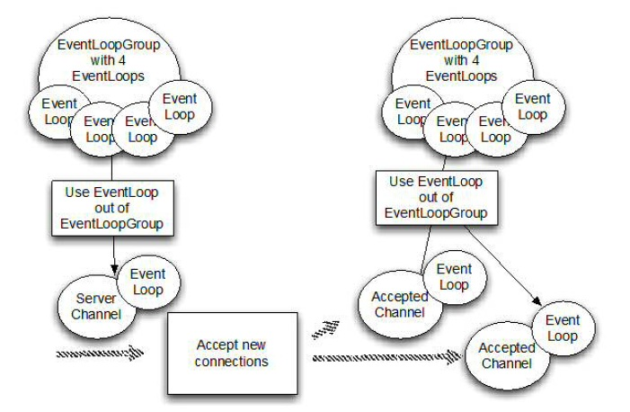

# 1、Netty结构和功能
## 1.1 Netty组成部分
### 1.1.1 Channel

NIO的基本结构，代表了一个用于连接到实体如硬件设备、文件、网络套接字或程序组建，能够执行一个或多个不同的I/O操作（例如读和写）的开放连接。

* callback(回调)

Netty 内部使用回调处理事件时。一旦这样的回调被触发，事件可以由接口 ChannelHandler 的实现来处理。如下面的代码，一旦一个新的连接建立了,调用 channelActive(),并将打印一条消息。

当建立一个连接时，调用channelActive方法。

```Java
public class ConnectHandler extends ChannelInboundHandlerAdapter {
    @Override
    public void channelActive(ChannelHandlerContext ctx) throws Exception {   //1
        System.out.println(
                "Client " + ctx.channel().remoteAddress() + " connected");
    }
}
```

### 1.1.2 Future

Future 提供了另外一种通知应用操作已经完成的方式。这个对象作为一个异步操作结果的占位符,它将在将来的某个时候完成并提供结果。

ChannelFuture 提供多个附件方法来允许一个或者多个 ChannelFutureListener 实例。这个回调方法 operationComplete() 会在操作完成时调用。事件监听者能够确认这个操作是否成功或者是错误。如果是后者,我们可以检索到产生的 Throwable。简而言之, ChannelFutureListener 提供的通知机制不需要手动检查操作是否完成的。

每个 Netty 的 outbound I/O 操作都会返回一个 ChannelFuture;这样就不会阻塞。这就是 Netty 所谓的“自底向上的异步和事件驱动”。

```Java
Channel channel = ...;
//不会阻塞
ChannelFuture future = channel.connect(
    new InetSocketAddress("192.168.0.1", 25));//异步连接到远程地址

```


```Java
Channel channel = ...;
//不会阻塞
ChannelFuture future = channel.connect(            //1
        new InetSocketAddress("192.168.0.1", 25));
future.addListener(new ChannelFutureListener() {  //2
@Override
public void operationComplete(ChannelFuture future) {
    if (future.isSuccess()) {                    //3
        ByteBuf buffer = Unpooled.copiedBuffer(
                "Hello", Charset.defaultCharset()); //4
        ChannelFuture wf = future.channel().writeAndFlush(buffer);                //5
        // ...
    } else {
        Throwable cause = future.cause();        //6
        cause.printStackTrace();
    }
}
});

```

1.异步连接到远程对等节点。调用立即返回并提供 ChannelFuture。

2.操作完成后通知注册一个 ChannelFutureListener 。

3.当 operationComplete() 调用时检查操作的状态。

4.如果成功就创建一个 ByteBuf 来保存数据。

5.异步发送数据到远程。再次返回ChannelFuture。

6.如果有一个错误则抛出 Throwable,描述错误原因。

### 1.1.3 Event和Handler

Netty 使用不同的事件来通知我们更改的状态或操作的状态。使我们能够根据发生的事件触发适当的行为（日志、数据转换、流控制、应用程序逻辑）

每个事件都可以分配给用户实现处理程序类的方法。这说明了事件驱动的范例可直接转换为应用程序构建块。

一个事件可以由一连串的事件处理器来处理，如下图


### 1.1.4 组成部分的整合说明

* FUTURE, CALLBACK 和 HANDLER

Netty 的异步编程模型是建立在 future 和 callback 的概念上的。所有这些元素的协同为自己的设计提供了强大的力量。

拦截操作和转换入站或出站数据只需要您提供回调或利用 future 操作返回的。这使得链操作简单、高效,促进编写可重用的、通用的代码。一个 Netty 的设计的主要目标是促进“关注点分离”:你的业务逻辑从网络基础设施应用程序中分离。

* SELECTOR, EVENT 和 EVENT LOOP

Netty 通过触发事件从应用程序中抽象出 Selector，从而避免手写调度代码。EventLoop 分配给每个 Channel 来处理所有的事件，包括

1、注册感兴趣的事件

2、调度事件到 ChannelHandler

3、安排进一步行动

该 EventLoop 本身是由只有一个线程驱动，它给一个 Channel 处理所有的 I/O 事件，并且在 EventLoop 的生命周期内不会改变。这个简单而强大的线程模型消除你可能对你的 ChannelHandler 同步的任何关注，这样你就可以专注于提供正确的回调逻辑来执行。该 API 是简单和紧凑。

## 1.2 Netty构架模型

**BOOTSTRAP**

Netty 应用程序通过设置 bootstrap（引导）类的开始，该类提供了一个用于应用程序网络层配置的容器。

**CHANNEL**

底层网络传输 API 必须提供给应用 I/O操作的接口，如读，写，连接，绑定等等。对于我们来说，这是结构几乎总是会成为一个“socket”。 Netty 中的接口 Channel 定义了与 socket 丰富交互的操作集：bind, close, config, connect, isActive, isOpen, isWritable, read, write 等等。 Netty 提供大量的 Channel 实现来专门使用。这些包括 AbstractChannel，AbstractNioByteChannel，AbstractNioChannel，EmbeddedChannel， LocalServerChannel，NioSocketChannel 等等。

**CHANNELHANDLER**

ChannelHandler 支持很多协议，并且提供用于数据处理的容器。我们已经知道 ChannelHandler 由特定事件触发。 ChannelHandler 可专用于几乎所有的动作，包括将一个对象转为字节（或相反），执行过程中抛出的异常处理。

常用的一个接口是 ChannelInboundHandler，这个类型接收到入站事件（包括接收到的数据）可以处理应用程序逻辑。当你需要提供响应时，你也可以从 ChannelInboundHandler 冲刷数据。一句话，业务逻辑经常存活于一个或者多个 ChannelInboundHandler。

**CHANNELPIPELINE**

ChannelPipeline 提供了一个容器给 ChannelHandler 链并提供了一个API 用于管理沿着链入站和出站事件的流动。每个 Channel 都有自己的ChannelPipeline，当 Channel 创建时自动创建的。 ChannelHandler 是如何安装在 ChannelPipeline？ 主要是实现了ChannelHandler 的抽象 ChannelInitializer。ChannelInitializer子类 通过 ServerBootstrap 进行注册。当它的方法 initChannel() 被调用时，这个对象将安装自定义的 ChannelHandler 集到 pipeline。当这个操作完成时，ChannelInitializer 子类则 从 ChannelPipeline 自动删除自身。

**EVENTLOOP**

EventLoop 用于处理 Channel 的 I/O 操作。一个单一的 EventLoop通常会处理多个 Channel 事件。一个 EventLoopGroup 可以含有多于一个的 EventLoop 和 提供了一种迭代用于检索清单中的下一个。

**CHANNELFUTURE**

Netty 所有的 I/O 操作都是异步。因为一个操作可能无法立即返回，我们需要有一种方法在以后确定它的结果。出于这个目的，Netty 提供了接口 ChannelFuture,它的 addListener 方法注册了一个 ChannelFutureListener ，当操作完成时，可以被通知（不管成功与否）。

### 1.2.1 Channel, Event 和 I/O


一个 EventLoopGroup 具有一个或多个 EventLoop。想象 EventLoop 作为一个 Thread 给 Channel 执行工作。 （事实上，一个 EventLoop 是势必为它的生命周期一个线程。）

当创建一个 Channel，Netty 通过 一个单独的 EventLoop 实例来注册该 Channel（并同样是一个单独的 Thread）的通道的使用寿命。这就是为什么你的应用程序不需要同步 Netty 的 I/O操作;所有 Channel 的 I/O 始终用相同的线程来执行。

### 1.2.2 Bootstrapping
Bootstrapping（引导） 是出现在Netty 配置程序的过程中，Bootstrapping在给服务器绑定指定窗口或者要连接客户端的时候会使用到。分为客户端的Bootstrap和ServerBootstrap

|分类 | Bootstrap  | ServerBootstrap|
|-|-|-|
|网络功能  |  连接到远程主机和端口 | 绑定本地端口|
|-|-|-|
|EventLoopGroup | 数量  | 1 |  2|

Bootstrap和ServerBootstrap的差异：1、“ServerBootstrap”监听在服务器监听一个端口轮询客户端的“Bootstrap”或DatagramChannel是否连接服务器；2、一个 ServerBootstrap 可以认为有2个 Channel 集合，第一个集合包含一个单例 ServerChannel，代表持有一个绑定了本地端口的 socket；第二集合包含所有创建的 Channel，处理服务器所接收到的客户端进来的连接。



### 1.2.3 Channel和ChannlePipeline
ChannelInboundHandler 和 ChannelOutboundHandler 继承自父接口 ChannelHandler


为了使数据从一端到达另一端，一个或多个 ChannelHandler 将以某种方式操作数据。这些 ChannelHandler 会在程序的“引导”阶段被添加ChannelPipeline中，并且被添加的顺序将决定处理数据的顺序。进站和出站的处理器都可以被安装在相同的 pipeline 


**在当前的链（chain）中，事件可以通过 ChanneHandlerContext 传递给下一个 handler。Netty 为此提供了抽象基类ChannelInboundHandlerAdapter 和 ChannelOutboundHandlerAdapter，用来处理你想要的事件。**可以简单地通过调用 ChannelHandlerContext 上的相应方法将事件传递给下一个 handler。在实际应用中，您可以按需覆盖相应的方法即可。

在 Netty 发送消息可以采用两种方式：直接写消息给 Channel 或者写入 ChannelHandlerContext 对象。这两者主要的区别是， 前一种方法会导致消息从 ChannelPipeline的尾部开始，而后者导致消息从 ChannelPipeline 下一个处理器开始。

### 1.2.4 ChannelHandler
Netty提供了一些默认的处理程序来实现形式的“adapter（适配器）”类。pipeline 中每个的 ChannelHandler 主要负责转发事件到链中的下一个处理器。这些适配器类（及其子类）会自动帮你实现，所以你只需要实现该特定的方法和事件。

适配器的作用：有几个适配器类，可以减少编写自定义 ChannelHandlers ，因为他们提供对应接口的所有方法的默认实现。（也有类似的适配器，用于创建编码器和解码器，这我们将在稍后讨论。）这些都是创建自定义处理器时，会经常调用的适配器：ChannelHandlerAdapter、ChannelInboundHandlerAdapter、ChannelOutboundHandlerAdapter、ChannelDuplexHandlerAdapter

* 解码

解码：入站消息将从字节转为一个Java对象。


* 编码

编码：消息出战，从java对象转化为字节。

* SimpleChannelHandler

最常见的处理器是接收到解码后的消息并应用一些业务逻辑到这些数据。

SimpleChannelHandler将覆盖基类的一个或多个方法，将获得被作为输入参数传递所有方法的 ChannelHandlerContext 的引用。

I/O 线程一定不能完全阻塞，因此禁止任何直接阻塞操作在你的 ChannelHandler， 有一种方法来实现这一要求。你可以指定一个 EventExecutorGroup。当添加 ChannelHandler 到ChannelPipeline。此 EventExecutorGroup 将用于获得EventExecutor，将执行所有的 ChannelHandler 的方法。这EventExecutor 将从 I/O 线程使用不同的线程，从而释放EventLoop。

## 1.3 Transport(传输)
### 1.3.1 Netty的好处
迁移方便，见下方从阻塞IO（OIO）到非阻塞IO（NIO）的转化。

下面是阻塞IO

```Java
public class NettyOioServer {

    public void server(int port) throws Exception {
        final ByteBuf buf = Unpooled.unreleasableBuffer(
                Unpooled.copiedBuffer("Hi!\r\n", Charset.forName("UTF-8")));
        EventLoopGroup group = new OioEventLoopGroup();
        try {
            ServerBootstrap b = new ServerBootstrap();        //1

            b.group(group)                                    //2
             .channel(OioServerSocketChannel.class)
             .localAddress(new InetSocketAddress(port))
             .childHandler(new ChannelInitializer<SocketChannel>() {//3
                 @Override
                 public void initChannel(SocketChannel ch) 
                     throws Exception {
                     ch.pipeline().addLast(new ChannelInboundHandlerAdapter() {            //4
                         @Override
                         public void channelActive(ChannelHandlerContext ctx) throws Exception {
                             ctx.writeAndFlush(buf.duplicate()).addListener(ChannelFutureListener.CLOSE);//5
                         }
                     });
                 }
             });
            ChannelFuture f = b.bind().sync();  //6
            f.channel().closeFuture().sync();
        } finally {
            group.shutdownGracefully().sync();        //7
        }
    }
}

```

1.创建一个 ServerBootstrap

2.使用 OioEventLoopGroup 允许阻塞模式（OIO）

3.指定 ChannelInitializer 将给每个接受的连接调用

4.添加的 ChannelHandler 拦截事件，并允许他们作出反应

5.写信息到客户端，并添加 ChannelFutureListener 当一旦消息写入就关闭连接

6.绑定服务器来接受连接

7.释放所有资源

下面是非阻塞IO

```Java
public class NettyOioServer {

    public void server(int port) throws Exception {
        final ByteBuf buf = Unpooled.unreleasableBuffer(
                Unpooled.copiedBuffer("Hi!\r\n", Charset.forName("UTF-8")));
        EventLoopGroup group = new OioEventLoopGroup();
        try {
            ServerBootstrap b = new ServerBootstrap();        //1

            b.group(group)                                    //2
             .channel(OioServerSocketChannel.class)
             .localAddress(new InetSocketAddress(port))
             .childHandler(new ChannelInitializer<SocketChannel>() {//3
                 @Override
                 public void initChannel(SocketChannel ch) 
                     throws Exception {
                     ch.pipeline().addLast(new ChannelInboundHandlerAdapter() {            //4
                         @Override
                         public void channelActive(ChannelHandlerContext ctx) throws Exception {
                             ctx.writeAndFlush(buf.duplicate()).addListener(ChannelFutureListener.CLOSE);//5
                         }
                     });
                 }
             });
            ChannelFuture f = b.bind().sync();  //6
            f.channel().closeFuture().sync();
        } finally {
            group.shutdownGracefully().sync();        //7
        }
    }
}
```

1.创建一个 ServerBootstrap

2.使用 NioEventLoopGroup 允许非阻塞模式（NIO）

3.指定 ChannelInitializer 将给每个接受的连接调用

4.添加的 ChannelInboundHandlerAdapter() 接收事件并进行处理

5.写信息到客户端，并添加 ChannelFutureListener 当一旦消息写入就关闭连接

6.绑定服务器来接受连接

7.释放所有资源

### 1.3.2 基于Netty传输的API
还可以在运行时根据需要添加 ChannelHandler 实例到ChannelPipeline 或从 ChannelPipeline 中删除，这能帮助我们构建高度灵活的 Netty 程序。

**channel的主要方法**

|方法名称  |  描述|
|-|-|
|eventLoop() | 返回分配给Channel的EventLoop|
|-|-|
|pipeline() | 返回分配给Channel的ChannelPipeline|
|-|-|
|isActive() | 返回Channel是否激活，已激活说明与远程连接对等|
|-|-|
|localAddress() | 返回已绑定的本地SocketAddress|
|-|-|
|remoteAddress() | 返回已绑定的远程SocketAddress|
|-|-|
|write()  | 写数据到远程客户端，数据通过ChannelPipeline传输过去|
|-|-|
|flush()  | 刷新先前的数据|
|-|-|
|writeAndFlush(...) | 一个方便的方法用户调用write(...)而后调用y flush()|


# 2、Netty使用
## 2.1 echo服务器
echo服务器需要：

* 一个服务器handler

这个组件实现了服务器的业务逻辑，决定了连接创建后和接收到信息后该如何处理

* Bootstrapping

这个是配置服务器的启动代码。最少需要设置服务器绑定的端口，用来监听连接请求。

**通过ChannelHandler来实现服务器的逻辑**

1、handler

```Java
@Sharable                                        //@Sharable 标识这类的实例之间可以在 channel 里面共享
public class EchoServerHandler extends
        ChannelInboundHandlerAdapter {

    @Override
    public void channelRead(ChannelHandlerContext ctx,Object msg) {     //每个信息入站都会调用
        ByteBuf in = (ByteBuf) msg;
        System.out.println("Server received: " + in.toString(CharsetUtil.UTF_8));//日志消息输出到控制台
        ctx.write(in);         //将所接收的消息返回给发送者。注意，这还没有冲刷数据
    }

    @Override
    public void channelReadComplete(ChannelHandlerContext ctx) throws Exception {   //通知处理器最后的 channelread() 是当前批处理中的最后一条消息时调用
        ctx.writeAndFlush(Unpooled.EMPTY_BUFFER)        //冲刷所有待审消息到远程节点。关闭通道后，操作完成
        .addListener(ChannelFutureListener.CLOSE);
    }

    @Override
    public void exceptionCaught(ChannelHandlerContext ctx, Throwable cause) {    //读操作时捕获到异常时调用
        cause.printStackTrace();                //打印异常堆栈跟踪
        ctx.close();                            //关闭通道
    }
}
```

如果异常没有被捕获，会发生什么？

每个 Channel 都有一个关联的 ChannelPipeline，它代表了 ChannelHandler 实例的链。适配器处理的实现只是将一个处理方法调用转发到链中的下一个处理器。因此，如果一个 Netty 应用程序不覆盖exceptionCaught ，那么这些错误将最终到达 ChannelPipeline，并且结束警告将被记录。出于这个原因，你应该提供至少一个实现exceptionCaught 的 ChannelHandler。

关键两点：

ChannelHandler 是给不同类型的事件调用

应用程序实现或扩展 ChannelHandler 挂接到事件生命周期和 提供自定义应用逻辑。

2、引导服务器

监听和接收进来的连接请求

配置 Channel 来通知一个关于入站消息的 EchoServerHandler 实例

```Java
public class EchoServer {

    private final int port;

    public EchoServer(int port) {
        this.port = port;
    }
        public static void main(String[] args) throws Exception {
        if (args.length != 1) {
            System.err.println(
                    "Usage: " + EchoServer.class.getSimpleName() +
                    " <port>");
            return;
        }
        int port = Integer.parseInt(args[0]);        //1  设置端口值（抛出一个 NumberFormatException 如果该端口参数的格式不正确）
        new EchoServer(port).start();                //2  呼叫服务器的 start() 方法
    }

    public void start() throws Exception {
        NioEventLoopGroup group = new NioEventLoopGroup(); //3 创建 EventLoopGroup接受和处理新连接
        try {
            ServerBootstrap b = new ServerBootstrap();
            b.group(group)                                //4  建 ServerBootstrap
             .channel(NioServerSocketChannel.class)        //5  指定使用 NIO 的传输 Channel为信道类型,channel方法内部，只是初始化了一个用于生产指定channel类型的工厂实例。
             .localAddress(new InetSocketAddress(port))    //6  置 socket 地址使用所选的端口
             .childHandler(new ChannelInitializer<SocketChannel>() { //7  添加 EchoServerHandler 到 Channel 的 ChannelPipeline
                 @Override
                 public void initChannel(SocketChannel ch) 
                     throws Exception {
                     ch.pipeline().addLast(
                             new EchoServerHandler());
                 }
             });

            ChannelFuture f = b.bind().sync();            //8  绑定的服务器;sync 等待服务器关闭
            System.out.println(EchoServer.class.getName() + " started and listen on " + f.channel().localAddress());
            f.channel().closeFuture().sync();            //9  关闭 channel 和 块，直到它被关闭
        } finally {
            group.shutdownGracefully().sync();            //10  关机的 EventLoopGroup，释放所有资源。
        }
    }

}

```

第7步，在这里我们使用一个特殊的类，ChannelInitializer 。当一个新的连接被接受，一个新的子 Channel 将被创建， ChannelInitializer 会添加我们EchoServerHandler 的实例到 Channel 的 ChannelPipeline。正如我们如前所述，如果有入站信息，这个处理器将被通知。

.sync()的原因：当前线程阻塞。

总结：

echo服务器包括handler处理和引导服务器

引导服务器的步骤(1-5)：

1.创建 ServerBootstrap 实例来引导服务器并随后绑定

2.创建并分配一个 NioEventLoopGroup 实例来处理事件的处理，如接受新的连接和读/写数据。

3.指定本地 InetSocketAddress 给服务器绑定

4.通过 EchoServerHandler 实例给每一个新的 Channel 初始化

5.最后调用 ServerBootstrap.bind() 绑定服务器

## 2.2 echo客户端

```Java
@Sharable                                //1
public class EchoClientHandler extends
        SimpleChannelInboundHandler<ByteBuf> {

    @Override
    public void channelActive(ChannelHandlerContext ctx) {
        ctx.writeAndFlush(Unpooled.copiedBuffer("Netty rocks!", //2
        CharsetUtil.UTF_8));
    }

    @Override
    public void channelRead0(ChannelHandlerContext ctx,
        ByteBuf in) {
        System.out.println("Client received: " + in.toString(CharsetUtil.UTF_8));    //3
    }

    @Override
    public void exceptionCaught(ChannelHandlerContext ctx,
        Throwable cause) {                    //4
        cause.printStackTrace();
        ctx.close();
    }
}

```

channelRead0()：这种方法会在接收到数据时被调用。注意，由服务器所发送的消息可以以块的形式被接收。即，当服务器发送 5 个字节是不是保证所有的 5 个字节会立刻收到 - 即使是只有 5 个字节，channelRead0() 方法可被调用两次，第一次用一个ByteBuf（Netty的字节容器）装载3个字节和第二次一个 ByteBuf 装载 2 个字节。唯一要保证的是，该字节将按照它们发送的顺序分别被接收。 

**SimpleChannelInboundHandler vs. ChannelInboundHandler**

何时用这两个要看具体业务的需要。在客户端，当 channelRead0() 完成，我们已经拿到的入站的信息。当方法返回时，SimpleChannelInboundHandler 会小心的释放对 ByteBuf（保存信息） 的引用。而在 EchoServerHandler,我们需要将入站的信息返回给发送者，由于 write() 是异步的，在 channelRead() 返回时，可能还没有完成。所以，我们使用 ChannelInboundHandlerAdapter,无需释放信息。最后在 channelReadComplete() 我们调用 ctxWriteAndFlush() 来释放信息。

```Java
public class EchoClient {

    private final String host;
    private final int port;

    public EchoClient(String host, int port) {
        this.host = host;
        this.port = port;
    }

    public void start() throws Exception {
        EventLoopGroup group = new NioEventLoopGroup();
        try {
            Bootstrap b = new Bootstrap();                //1
            b.group(group)                                //2
             .channel(NioSocketChannel.class)            //3
             .remoteAddress(new InetSocketAddress(host, port))    //4
             .handler(new ChannelInitializer<SocketChannel>() {    //5
                 @Override
                 public void initChannel(SocketChannel ch) 
                     throws Exception {
                     ch.pipeline().addLast(
                             new EchoClientHandler());
                 }
             });

            ChannelFuture f = b.connect().sync();        //6

            f.channel().closeFuture().sync();            //7
        } finally {
            group.shutdownGracefully().sync();            //8
        }
    }

    public static void main(String[] args) throws Exception {
        if (args.length != 2) {
            System.err.println(
                    "Usage: " + EchoClient.class.getSimpleName() +
                    " <host> <port>");
            return;
        }

        final String host = args[0];
        final int port = Integer.parseInt(args[1]);

        new EchoClient(host, port).start();
    }
}

```

1.创建 Bootstrap

2.指定 EventLoopGroup 来处理客户端事件。由于我们使用 NIO 传输，所以用到了 NioEventLoopGroup 的实现

3.使用的 channel 类型是一个用于 NIO 传输

4.设置服务器的 InetSocketAddress

5.当建立一个连接和一个新的通道时，创建添加到 EchoClientHandler 实例 到 channel pipeline

6.连接到远程，等待连接完成

7.阻塞直到 Channel 关闭

8.调用 shutdownGracefully() 来关闭线程池和释放所有资源

与以前一样，在这里使用了 NIO 传输。请注意，您可以在 客户端和服务器 使用不同的传输 ，例如 NIO 在服务器端和 OIO 客户端。在第四章中，我们将研究一些具体的因素和情况，这将导致 您可以选择一种传输，而不是另一种。


