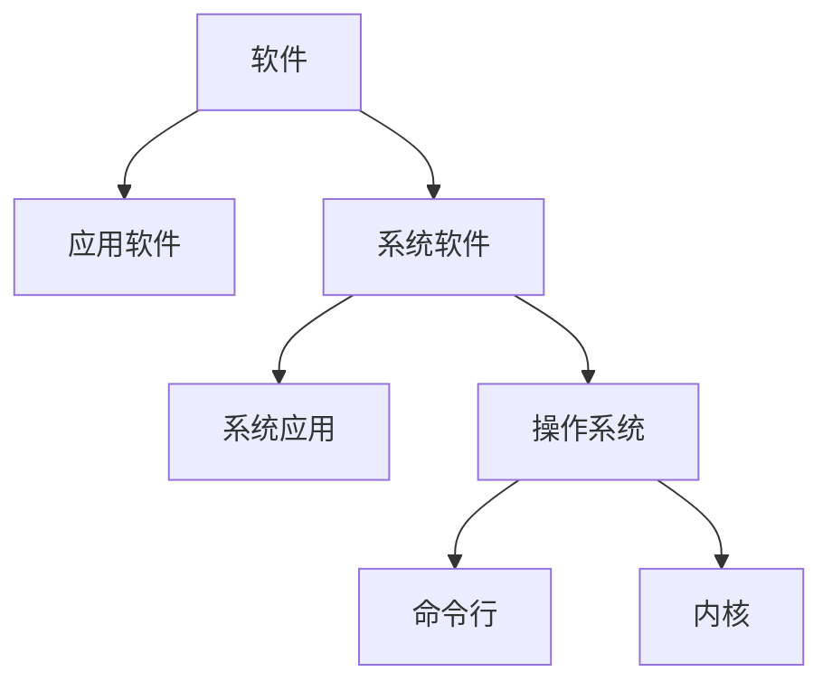

# 1.操作系统结构

## 1.1 操作系统的定位



其中操作系统分为命令行和内核，


其中内核包括系统调用接口、进程管理、内存管理、虚拟文件系统、网络堆栈、设备驱动代码、依赖体系结构的代码等。


## 1.2 操作系统演变

（1）单用户系统

程序只能一段一段执行。

（2）批处理系统

打印等IO操作会占用大量的时间，而CPU利用率会因为IO操作大大降低。

> `CPU利用率=执行时间/(执行时间+IO操作时间)`

为了提高CPU利用率，批处理系统一次执行多个代码，这些代码的打印操作一块进行，减小打印时间，即提高CPU利用率。

（3）多道程序

多道程序利用一段程序等待IO操作完成的时间，进行另外一段程序的执行，实现了CPU复用。


（4）分时

通过定时中断，实现CPU复用。分时没有提升CPU利用率，甚至降低了CPU利用率，但是减小了小段（执行时间短）程序的执行等待时间，让用户体验到并行执行的感觉，而不是要等待前面的任务执行完毕。


（5）个人计算机

每个用户一个系统。

（6）分布式计算机

每个用户多个系统。


## 2.3 操作系统结构

* 分层结构

  

* 微内核结构

  由于分层结构中内核包含功能太多，造成效率下降。微内核为解决分层结构的效率问题，将一些功能放到用户态（用户空间），内核中只保留进程间通信和硬件抽象层。**用户模块间的通信通过内核，使用消息传递**。

  

  >内核空间里存放的是整个内核代码和所有内核模块，以及内核所维护的数据。当用户运行一个程序时，该程序所创建的进程一开始是运行在用户空间的，当它要执行网络发送数据等动作时，必须通过调用write、send等系统函数来完成，这些系统调用会去调用内核中的代码来完成用户的请求操作，这时CPU必须从ring3切换到ring0，然后进入内核地址空间去执行这些代码完成操作，完成后又切换回ring3，回到用户态。

* 外核结构

  **外核只负责资源的分配** 。让内核分配机器的物理资源给多个应用程序，并每个程序决定如何处理这些资源。

  

* 虚拟机管理器VMM

  虚拟机管理器负责将真实硬件映射成多个虚拟硬件。VMM决定虚拟机可以使用具体的资源。

  


# 2.中断及系统调用

## 2.1 BIOS

### 2.1.1 加载程序


实模式下最多访问1MB空间。**BIOS（启动）固件的功能**：

* 基本输入输出的程序

  完成从磁盘读数据、从键盘读输入

* 系统设置信息

  设置系统从哪里启动，如网络、磁盘等


具体的**加载过程**如下：

* BIOS固件

  1.将**磁盘**中的引导扇区（引导扇区的文件系统格式固定，使得BIOS认识）的**加载程序**加载到的**内存**的0x7c00

  2.跳转到CS:IP = 0000:7c00

* 加载程序

  3.将**操作系统**的代码和数据从硬盘（文件系统为加载程序认识）加载到**内存**

  4.跳转到内存中的操作系统起始地址开始执行

### 2.1.2 BIOS系统调用

**只能在实模式下工作。**

BIOS以中断调用的方式，提供了基本的IO功能：

* INT 10h：字符显示
* INT 13h：磁盘扇区读写
* INT 15h：检测内存大小
* INT 16h：键盘输入

**为什么不是直接从文件系统中加载代码，还要一个加载程序？**

磁盘文件系统多种多样，机器出厂时不可能在BIOS中加入认识所有文件系统的代码。所以在有一个基本的约定，可以读取加载程序，将代码和数据从硬盘加载到内存中。

## 2.2 系统启动流程

### 2.2.1 系统启动流程

在现有计算机中，可能有多个磁盘、系统，所以需要一个主引导分区，再由主引导分区指向特定的活动分区。

```
BIOS -> 主引导记录（主引导扇区代码） -> 活动分区的引导扇区代码 -> 加载程序 -> 启动菜单（可选的操作系统内核列表和加载参数） -> 根据配置加载指定内核并跳转到内核执行
```

* **1.CPU初始化**

  *1.1 CPU加电稳定后从0XFFFF0读第一条指令*

  `CS:IP=0xF000:FFF0`

  第一条指令是跳转指令

  *1.2 CPU初始化为16位实模式*

  CS:IP都是16位寄存器，但是IP只用了4位。

  指令指针`PC = 16*CS+IP`

  最大地址空间是1MB（20位）

* **2.BIOS初始化**

  *2.1 硬件自检POST*

  *2.2 检测系统中内存和显卡等关键部件的存在和工作状态*

  比如内存有问题，系统不会工作

  *2.3 查找并执行显卡等接口卡BIOS，进行设备初始化*

  *2.4 执行系统BIOS，进行系统检测*

  检测和设置系统中安装的即插即用设备

  *2.5 更新CMOS中的拓展系统设置数据ESCD*

  ESCD里面保存了拓展设备的信息，比如USB等

  *2.6 按指定顺序从软盘、硬盘或者光驱启动*

* **3.主引导分区MBR（Master Boot Record）**

  

  * 启动代码：446字节

    检查分区表正确性

    加载并跳转到磁盘上对应**活动分区**的引导程序

  * 硬盘分区表：64字节

    描述分区状态和位置

    每个分区描述信息占据16字节，**最多4个**

  * 结束标准

* **4.分区引导扇区**

  

  * 跳转指令JMP

    与平台相关的代码

  * 文件卷头

    文件系统描述信息

  * 启动代码

    跳转到加载程序**bootloader**

  * 结束标志

### 2.3.1 系统启动规范

* **BIOS**

  * 固化到计算机主板上的程序

  * 包括系统设置、自检程序和系统自启动程序
  * BIOS-MBR（主引导记录，为了满足从几个分区中选择一个启动，最多4个，见上面解释）、BIOS-GPT（全局唯一标识表，在分区表中描述更多的分区结构）、PXE（满足从网络上加载内核，BIOS中需要加入通信栈）

* **UEFI**
  * 接口标准
  * 在所有平台上一致的操作系统启动服务，只有可信的才会加载

## 2.3 中断、异常和系统调用

### 2.3.1 介绍

和内核 打交道的方法包括中断（来自硬件设备的处理请求）、异常（非法指令或者其他原因导致当前指令执行失败后的处理请求）、系统调用（应用程序主动向操作系统发出的服务请求），具体信息流见下图。


**异常处理可嵌套，就像中断可嵌套一样。**

### 2.3.2 中断描述符表的作用

**（1）中断描述符表**

中断向量和中断服务例程的对应关系主要是由IDT(中断描述符表)负责。操作系统在IDT中设置好各种中断向量对应的中断描述符,留待CPU在产生中断后查询对应中断服务例程的起始地址。而IDT本身的起始地址保存在IDTR寄存器中。同GDT一样,IDT是一个8字节的描述符数组,但IDT的第一项可以包含一个描述符。


LIDT和SIDT两条指令用于操作IDTR寄存器（一个6字节）。

* LIDT(Load IDT Register)指令

  使用一个包含线性地址基址和界限的内存操作数来加载IDT。

* SIDT(Store IDT Register)指令

  拷贝IDTR的基址和界限部分到一个内存地址。这条指令可以在任意特权级执行。

在保护模式下,最多会存在256个Interrupt/Exception Vectors。范围`[0,31]`内的32个向量被异常Exception和NMI使用,但当前并非所有这32个向量都已经被使用,有几个当前没有被使用的,请不要擅自使用它们,它们被保留,以备将来可能增加新的Exception。

**（2）IDT gate descriptors**

Interrupts/Exceptions应该使用Interrupt Gate和Trap Gate，它们之间的唯一区别就是：当调用Interrupt Gate时，Interrupt会被CPU自动禁止；而调用Trap Gate时，CPU则不会去禁止或打开中断，而是保留它原来的样子。下面是三种门的结构，任务门没有使用。


**（3）中断处理中硬件负责完成的工作**

* 起始

  从CPU收到中断事件后，打断当前程序或任务的执行，根据某种机制跳转到中断服务例程去执行的过程。

  (1)CPU每次执行完一条指令，都会检查有无中断，如果有则会读取总线上的中断向量

  (2)CPU根据得到的中断向量，到IDT中找到该中断向量的段选择子

  (3)根据段选择子和GDTR寄存器中保存的段描述符起始地址，找到了相应的段描述符中，保存了中断服务函数的段基址和属性信息，基地址加上IDT中的Offset就得到了中断服务函数的地址。以下是IDT找到相应中断服务程序的过程：

  

  (4)CPU根据IDT的段选择子中的CPL和中断服务函数的GDT（段描述符）中的DPL确认是否发生了特权级的改变。比如当前程序处于用户态（ring3），而中断程序运行在内核态（ring0），意味着发生了特权级的转换。CPU会从当前的程序的TSS信息（该信息在内存中的起始地址存在TR寄存器中）里取得该程序的内核栈地址，即包括内核态的SS（堆栈段寄存器(Stack Segment Register)，其值为堆栈段的段值）和ESP寄存器（堆叠指标暂存器，存放栈的偏移地址，指向栈顶）。*CPU切换到相应的内核栈。*

  

  (5)CPU保存被打断程序的现场（一些寄存器的值），比如用户态切换到了内核态，需要保存EFLAGS、CS、EIP、ERROR CODE(如果是有错误码的异常)信息

  (6)CPU加载第一条指令

* 结束

  每个中断服务例程在有中断处理工作完成后需要通过IRET(或IRETD)指令恢复被打断的程序的执行。

  (1)IRET指令执行，从内核栈弹出先前保存的被打断的程序的现场信息，如EFLAGS、CS、EIP

  (2)如果存在特权级转换（内核态到用户态），则还需要从内核栈弹出用户态栈的SS和ESP，回到用户态的栈

  (3)如果此次处理的是带有错误码的异常，CPU恢复先前程序的现场时，不会弹出错误码。这一步需要软件完成，相应的中断服务函数在掉用IRET返回之前，添加出栈代码主动弹出错误码。

以下是优先级未切换和切换时的栈变换，


## 2.4 系统调用

### 2.4.1 系统调用举例

* **printf函数的系统调用过程**

  printf为标准C库，其实C库是调用的内核的write()，并且有多个不同的write函数，实现指向文件等。

  

* **三种常用的应用程序变成接口**
  * win32 API用于windows
  * POSIX API用于POSIX-based systems（Unix、Linux、Mac OS X的所有版本）
  * Java API用于Java虚拟机

### 2.4.2 系统调用的实现

系统调用接口根据**系统调用号**来维护表的索引，具体为应用程序调用系统调用接口，系统调用接口通过**软中断**来选择系统调用表的功能（每个功能对应一个编号）。

**系统调用和函数调用的区别?**

* 系统调用

  INT和IRET（Int RETurn）指令用于系统调用。函数调用时，**堆栈切换（内核态和用户态使用不同的堆栈）和特权级的转换**。

* 函数调用

  CALL和RET用于常规调用，没有堆栈切换。

## 2.5 系统调用实例

```
1. kern/trap/trapentry.S: alltraps()
2. kern/trap/trap.c: trap()
	tf->trapno == T_SYSCALL  // 发现是系统调用
3. kern/syscall/syscall.c: syscall()
	tf->tf_regs.reg_eax ==SYS_read   // 发现是系统调用的读取函数
4. kern/syscall/syscall.c: sys_read()
	从 tf->sp 获取 fd， buf， length   //参数
5. kern/fs/sysfile.c: sysfile_read()
	读取文件
6. kern/trap/trapentry.S: trapret()  //返回
```


# 3.内存管理

## 3.1 计算机体系结构和内存层次

* **内存管理的功能和概念**

  计算机内存管理需要MMU实现从逻辑地址空间的抽象，地址空间的保护，内存空间的共享和虚拟化实现最大的地址空间。

  

* **内存管理方式**

  与计算机存储架构紧耦合、MMU（内存管理单元）处理CPU处理访问请求的硬件

  * 重定位（relocation）

    比如通过段地址+偏移的方式将代码、数据进行整体偏移。

  * 分段（segmentation）

    分成代码、数据和堆栈

  * 分页（paging）

    将内存分成最基本的单位

  * 虚拟存储（virtual memory）

    可以实现比物理地址空间更大的虚拟地址空间

    目前多数系统（如Linux）采用按需页式虚拟存储

## 3.2 地址空间和地址生成

* **物理地址**

* **逻辑地址**

  CPU运行的进程看到的地址

### 3.2.1 地址生成

计算机先进性编译，然后汇编，汇编生成的文件（如.o文件）需要有明确的地址（如下面的`jmp 75`），而不是以函数符号代替地址（如`jmp _foo`）。包括后面要做的链接（如模块A需要调用模块B的函数），将模块和用到的模块、库函数放在一起，排成一个线性的序列，这个时候要生成对应的链接地址（如下面的`jmp 175`，这个175是在）。程序加载表示，程序真实运行的时候，不是从0开始，需要重定位到物理地址。


所以说，地址生成包含几个时机：

* 编译时

  假设起始地址已知

  如果起始地址改变，需要重新编译

* 加载时

  编译时起始地址未知，编译器需要生成可重定位的代码

  加载时，生成绝对地址，此后地址难以改变

* 执行时

  执行时代码可移动

  需要地址转换（映射）硬件支持

**详细的逻辑地址到物理地址的转换**

* CPU
  * ALU：需要逻辑地址的内存内容
  * MMU：进行逻辑地址和物理地址的转换
  * CPU控制逻辑：给总线发送物理地址请求
* 内存
  * 发送物理地址给CPU
  * 或者接收CPU数据到物理地址
* 操作系统
  * 建立逻辑地址LA和物理地址PA的映射，**供MMU实现逻辑地址和物理地址的转换**。


### 3.2.1 地址检查

操作系统可以设置最大逻辑地址空间，如果逻辑地址过多，会超出，出现内存异常。


## 3.3 连续内存分配

### 3.3.1 内存碎片的概念

给进程分配一块不小于指定大小的连续的物理地址区域

* **内存碎片**

  进程结束后，空闲出来的内存不能被利用

* **外部碎片**

  分配单元之间的未被使用内存

* **内部碎片**（2的整数幂空间被占用了一部分，剩下的部分不能被利用）

  分配单元内部的未被使用内存

  取决于分配单元大小是否要取整


### 3.3.2 动态分区分配

* **动态分区分配**

  当程序被加载执行时，分配一个进程指定大小可变的分区（块、内存块），分区的地址是连续的。

* **操作系统维护的数据结构**

  * 所有进程的已分配分区
  * 空闲分区（Empty-blocks）

* **动态分区分配策略**

  * 最先匹配

    *原理和实现*

    * 空闲分区列表按地址顺序排序

    * 分配过程中，搜索*第一个*合适的分区
    * 释放分区时，检查是否可与临近的空闲分区合并

    *优点*

    * 简单
    * 在高地址空间有大块的空闲分区

    *缺点*

    * 产生较多外部碎片
    * 分配大块时较慢，需要搜索到较为后面

  * 最优匹配（找最小适配的）

    *原理和实现*

    * 空闲分区列表按照大小排序
    * 分配时，查找一个合适的分区
    * 释放时，查找并且合并临近的空闲分区（如果能找到）

    *优点*

    * 大部分分配的*尺寸较小*时，效果较好
    * 避免大的空闲分区被拆分，可减小外部碎片的大小，并且相对简单

    *缺点*

    * 外部碎片太小，无法使用
    * 维护空闲分区开销较大

  * 最差匹配（找最大的）

    *原理和实现*

    * 空闲分区列表按由大到小排序
    * 分配时，选最大的分区
    * 释放时，检查是否可与临近的空闲分区合并，进行可能的合并，并调整空闲分区列表顺序

    *优点*

    * 中等大小的分配较多时，效果最好
    * 避免出现太多的小碎片

    *缺点*

    * 释放分区较慢
    * 容易破坏大的空闲分区，因此后续难以分配大的分区


### 3.3.3 碎片整理

调整进程占用的分区位置，来减少或者避免分区碎片

* **碎片紧凑**

  要求所有的应用程序可动态重定位

* **分区对换**

  通过抢占并回收处于等待状态进程的分区，以增大可用内存空间

  

### 3.3.5 伙伴系统（Buddy System）

一种连续空间分配的方法，整个可分配的分区大小为`2^u`。

* **数据结构**

  * 按照大小和起始地址组织成二维数组

  * 初始状态，只有一个大小为`2^u`的空闲块

* **分配过程**
  * 如`s ≤2^i－1`，将大小为`2^i` 的当前空闲分区划分成两个大小为`2^i－1` 的空闲分区
  * 重复划分过程，直到`2^i-1 < s ≤ 2^i`，并把一个空闲分区分配给该进程
  * 在进程内存回收时，连续空闲空间是否能够合并，也要满足合并后可分配的分区大小为`2^u`，而不是连续就能合并的。

以下是一个伙伴系统内存分配举例：


以下是一个树，也是一种存放空闲块大小和起始地址的结构：


## 3.4 非连续内存分配

允许一个程序使用非连续的物理地址空间；允许共享代码与数据；支持动态加载和动态链接。

### 3.4.1 段式存储管理

以段为最小连续单位，段必须连续，不同段之间可以不连续。**段的大小很有可能是不一样的。**

* 逻辑地址和物理地址

  进程段地址空间由多个段组成：

  * 主代码段
  * 子模块代码段
  * 共用库代码段
  * 堆栈段（stack）
  * 堆数据（heap）
  * 初始化数据段
  * 符号表

  

  

* 段访问机制

  **段表示访问方式和存储数据等属性相同的一段地址空间**，对应一个连续的内存块，若干个段组成进程逻辑地址空间

  * 段访问

    逻辑地址由二元组`(段号, 段内偏移)`表示。

    

### 3.4.2 页式存储管理

用户程序的地址空间被划分成若干固定大小的区域，称为“页”，相应地，内存空间分成若干个物理块，页和块的大小相等。可将用户程序的任一页放在内存的任一块中，实现了离散分配。

* **页帧**（帧、物理页面，Frame，Page Frame）

  以页为单位来分配，页与页之间可以不连续。页帧把物理地址空间划分为**大小相同**的基本分配单位，`2^n`字节。

* **页面**（页、逻辑页面，Page）

  把逻辑地址空间也划分为相同大小的基本分配单位，页帧和页面的大小必须相同

* **地址空间描述方式**

  二元组`(页号, 页内偏移)`来表示地址空间，页帧和页面的表达方式相同，只是页号会经过转换。

* **页表**

  描述了页面到页帧的转换关系（逻辑页号到物理页号），而**MMU**（存储管理单元）和**TLB**（快表）实现了转换。下面是逻辑地址（页面）到物理地址（页帧）的转换：

  

  * 每个进程都有一个页表，每个页面对应一个页表项
  * 随着进程运行，页表动态变换，也就是会给进程动态分配空间
  * 页表基址寄存器（PTBR, Page Table Base Register）保存了页表的基址。

  页表项除了包含物理页面页号，也包含存在位、修改位、引用位。

  


### 3.4.3 快表和多级页表

* **快表**

  快表(Translation Look-aside Buffer, TLB)，用于缓存近期访问的页表项。

  * TLB 使用关联存储(associative memory)实现，具备快速访问性能
  * 如果TLB命中，物理页号可以很快被获取
  * 如果TLB未命中，对应的表项被更新到TLB中

  

* **多级页表**

  通过间接引用将页号分成k级

  * 建立页表“树”
  * 减少每级页表的长度

  
  
  下面是一个简单的二级页表实例，因特尔芯片的CR3寄存器中存储起始位置PTBR。
  
  

### 3.4.4 反置页表

对于大地址空间（64bits）系统，多级页表变得繁琐，因为需要多次访问地址空间。和多级页表的区别：

> 多级页表相当于给某一块区域设置了搜索方式，而反置页表是一个页表项对应一个帧。

下面是反置页表查询过程，通过hash实现，如果发生冲突，则查找链表中的下一个。


冲突解决：hash后找到了一个pid为1的页表项，但是不正确，此时查找链表的下一个页表项，可以验证是正确的。见下图。


**几种页表的总结**

* 快表

  通过缓存机制，减少对页表的访问

* 多级页表

  多级减少页表的大小，但是页表过多可能造成越来越多的浪费。

* 反置页表

  也是为了减小页表，但是不像多级页表，反置页表占用空间少。

  比如，

  > 物理内存大小: `4096*4096=4K*4KB=16 MB`
  >
  > 页面大小: `4096 bytes = 4KB`
  >
  > 页帧数:` 4096 = 4K`
  >
  > 页寄存器使用的空间 (假设每个页寄存器占8字节):`8*4096=32 Kbytes`
  >
  > 页寄存器带来的额外开销: `32K/16M = 0.2%` (大约)
  >
  > 虚拟内存的大小： 任意

## 3.5 段页式存储管理

段式存储在内存保护方面有优势，页式存储在内存利用和优化转移到后备存储方面有优势。

* **段页式存储管理**

  在段式存储管理基础上，**给每个段加一级页表**，具体访问过程如下：

  

  可以将段表指向相同的页表基址，则实现**进程间的段分享**，如下图：

  

  **具体参考实验课程设计的实验二。**

  
  

## 3.6 虚拟存储

可以把一部分内存中的内容放到外存，以让正在运行的程序有更多的内存空间可以利用。

### 3.6.1 覆盖技术和交换技术

* **覆盖技术**

  在较小的可用内存中运行较大的程序（对于一个程序/进程而言）

  **实现方法：**依据程序逻辑结构，将程序划分为若干功能相对独立的模块；将不会同时执行的模块共享同一块内存区域，下面是覆盖技术的使用实例：

  

* **交换技术**

  增加正在运行或需要运行的程序的内存（对于多个程序/进程而言）。

  **实现方法：**可将暂时不能运行的程序放到外存。

* **局部性原理（Principle of Locality）**

  程序在执行过程中的一个较短时期，所执行的指令地址和指令的操作数地址，分别局限与一定区域

  * 时间局限性

    一条指令的一次执行和下次执行，一个数据的一次访问和下次访问都集中在一个较短时期内

  * 空间局限性

    当前指令和邻近的几条指令，当前访问的数据和邻近的几个数据都集中在一个较小区域内

  * 分支局部性

    一条跳转指令的两次执行，很可能跳到相同的内存位置。

  下面是一个只有1K内存，但是需要访问4K数组的实例，如果按照一行一行搜索出现缺页的次数大约是1024次，而按照一列一列搜索出现的缺页次数大约是`1024*1024`次

  

### 3.6.2 虚拟存储

将不常用的部分内存块暂存到外存

* **虚拟存储原理**

  装载程序：只将当前指令执行所需要的部分页面或段装入内存

  指令执行需要的指令或数据不在内存（称为缺页或缺段）：处理器通知操作系统将相应的页面或者段装入内存

  操作系统将内存中暂时不用的页面或段保存到外存：置换算法

* **虚拟页式存储管理**

  在页式存储管理的基础上，增加请求调页和页面置换

  * 当用户程序要装载到内存运行时，只装入部分页面，就启动程序运行
  * 进程在运行中发现有需要的代码或数据不在内存时，则向系统发出缺页异常请求
  * 操作系统在处理缺页异常时，将外存中相应的页面调入内存，使得进程能继续运行

  下图是页式存储出现缺页的情况：

  

  要实现虚拟存储，在页表项定义了一些标志位（实际情况标志位更多）：

  

  驻留位：该页是否存在于内存，1：存在于内存；0：存在于外存

  修改位：在内存中该页是否被修改过，回收该物理页面时，据此判断是否要把它的内容写回外存

  访问位：该页面是否被访问过（统计出使用频率），用于页面置换算法

  保护位：该页的访问方式，如只读、可读写、可执行等。

### 3.6.3 缺页异常

驻留位为0，说明页不在内存中，出现了缺页异常。操作系统需要进行从外存读取该页。


* 虚拟页式存储的外存选择

  代码段：本身是不需要修改的可执行二进制文件，只需要指向存储代码段的位置。

  动态加载的共享库程序段：本身是不需要修改的，指向动态调用的库文件

  其他项：交换空间 Swap

* 有效存储访问时间

  EAT = Effective memory Access Time

  `EAT =访存时间 * (1 - p) + 缺页异常处理时间 * 缺页率p`

  比如访存时间：10ns，磁盘访问时间：5ms，缺页率p，页修改概率q，`EAT = 10ns(1-p) + 5ms * p * (1 + q)`		 

### 3.6.4 置换算法

当出现缺页异常，需调入新页面而内存已满，置换算法选择被置换的物理页面。

* **设计目标**

  尽可能减少页面的调入调出次数

  把未来不再访问或短期内不再访问的页面调出

* **页面锁定**

  锁定对象：描述必须常驻内存的逻辑页面；操作系统的关键部分；要求响应速度的代码和数据

  措施：页表中的锁定标志位（lock bit），从而不会将页面放到外存

* **局部页面置换算法种类**

  局部页面置换算法：仅限于当前进程占用的物理页面，具体方法最优置换算法（实际无法使用，可用于其他算法的评价依据）、先进先出、最近最久未使用算法、时钟算法、最不常用算法

  全局页面置换算法：所有可能换出的物理页面，具体方法工作集算法、缺页率算法

    * **最优置换算法**

      将未来不使用时间最长的的页面置换，**实际无法实现**，可用于其他算法的评价依据：

      1. 在模拟器上运行某个程序，并记录每一次页面访问情况
      2. 第二次运行时使用最优置换算法

    * **先进先出算法**

      选择在内存驻留时间最长（第一次缺页加入的时间到最近时间）的页面进行置换，可能会造成很多置换，**性能缺陷大**

    * **最近最久未使用算法（Least Recently Used, LRU）**

      选择最长时间没有被引用的页面进行置换

      **实现**：计算内存中每个逻辑页面的上一次访问时间，选择上一次使用到当前时间最长的页面

      **缺点**：太过复杂，实施不可能

    * **时钟页面置换算法**（LRU的简化）

      尽对页面的访问情况进行大致统计

      **实现**：

      1. 页面装入内存时，访问位初始化为0

      2. 访问页面（读/写）时，访问位置1

      3. 缺页时，从指针当前位置顺序检查环形链表

         访问位为0，则置换该页；访问位为1，则访问位置置0，并指针移动到下一个页面，直到找到可置换的页面。

      **改进**：

      在页面中增加修改位，并在访问时进行相应修改（写：将访问位和修改位都设置为1；读将访问位设置为1）；缺页时，修改页面标志位，以跳过有修改的页面。

      

    * **最不常用算法（Least Frequently Used, LFU）**（LRU的简化）

      缺页时，置换访问次数最少的页面。

      **实现**：每个页面设置一个访问计数；访问页面时，访问计数加1；缺页时，置换计数最小的页面。

      **特征**：一些早期较多访问的数据不会被置换，可以通过定期将计数器右移来实现计数器的衰减。

* **全局页面置换算法种类**

  进程在不同阶段的内存需求是变化的，全局置换算法为进程分配可变数目的物理页面。

  * **评估不同阶段内存需求的方法**

    本时刻以前delta时间内的页访问情况，比如t1时刻前delta时间段内，访问了`{1,2,3,7}`，t2时刻前delta时间段内，访问了`{1,2}`，所以前期分配4个页即可，后期分配2个即可。

  * **工作集置换算法**

    置换出不在工作集中的页面。当前时刻前delta个内存访问的页引用是工作集。

    **实现方法**：1. 访存链表，维护窗口内的访存页面链表；2. 访存时，换出不在工作集的页面，更新访存链表；3.缺页时，换出页面，更新访存链表。下面是一个工作集置换算法的举例，以图中方块为例。b页在4次没有使用后，超过了维护窗口，所以需要置换出来。

    

  * **缺页率置换算法**

    `缺页率 = 缺页次数 / 内存访问次数`或者是缺页时间间隔的倒数

    **思想**

    通过调整常驻集，使每个进程的缺页率保持在一个合理的范围内。如果进程缺页率过高，则增加常驻集（取决于分配的物理页面多少和置换算法）以分配更多的物理页面。如果进程缺页率过低，则减少常驻集，分配更少的物理页面，进而提高CPU利用率。

    **实现**

    缺页时，计算上次缺页的时间`Tlast`到现在`Tcurrent`的时间间隔，

    1. 如果`Tcurrent - Tlast > T`，则置换出来`[Tlast,Tcurrent]`时间内没有被引用的页
    2. 如果`Tcurrent - Tlast < T`，则增加缺失页到工作集中

    

    *工作集置换算法和缺页率置换算法的区别？*工作集置换算法是每次访问页都要执行，开销大；缺页率置换算法是在缺页处理中断时处理。

* **Belady现象**

  采用FIFO算法时，可能出现分配的物理页面数增加（也就是原来只给这段程序3个页面，后来给了4个），缺页数（率）反而升高的异常

  FIFO算法有Belady现象，LRU没有Belady现象。

  *时钟和改进的时钟页面置换算法是否有Belady现象？*
  
* **抖动和负载控制**

  * **抖动**（thrashing）

    1. 进程物理页面太少，不能包含工作集
    2. 造成大量缺页，频繁置换
    3. 进程运行速度变慢

  * **负载控制**

    通过调节并发进程数（MPL）来进行系统负载控制

    MTBF = 平均缺页间隔时间；PFST = 缺页异常处理时间，

    

# 4.进程及线程

# 5.处理机调度

# 6.同步互斥

# 7.文件系统

# 8.IO子系统

# 9.实验课程设计

## 9.1 操作系统实验环境准备

### 9.1.1 课程设计内容


### 9.1.2 X86-32硬件介绍

X86-32指的是80386这种机器，是intel的32位机器，有四种运行模式：实模式、保护模式、SMM模式和虚拟8086模式。

* 实模式

  80386加电启动后处于实模式，访问物理内存空间不能超过1MB（20位）

* 保护模式

  支持内存分页机制，还支持优先级机制，有4GB寻址空间（32位）。

### 9.1.3 X86-32硬件内存架构

```
段机制启动、页机制未启动：逻辑地址 -> 段机制处理 -> 线性地址 = 物理地址
段机制和页机制都启动   ：逻辑地址 -> 段机制处理 -> 线性地址 -> 页机制处理 -> 物理地址
```

**物理地址：**处理器提交到总线上用于访问计算机系统中的内存和外设的最终地址。

**线性地址：**在操作系统的虚存管理之下每个运行的应用程序能访问的地址空间。每个运行的应用程序都认为自己独享整个计算机系统地址空间，这样可以让多个运行的应用程序之间相互隔离。

**逻辑地址：**应用程序直接使用的地址空间。

**段机制、页机制：**地址映射关系

## 9.2 实验一 bootloader启动ucore os

### 9.2.1 X86启动顺序

启动和CS和EIP寄存器相关。


* 1.第一条指令

  `Base + EIP = FFFF0000H + 0000FFF0H = FFFFFFF0H`

  这是BIOS的EPROM (Erasable Programmable Read Only Memory) 所在地，通常第一条指令是长跳转指令（CS和EIP都会更新），跳转到BIOS代码中。

* 2.BIOS

  BIOS进行一些系统设置、自检程序和系统自启动程序，然后**加载存储设备的第一个扇区（主引导扇区 MBR）**的512个字节（**Bootloader**）到内存的0x7c00，CS:IP跳转到0x7c00的第一条指令开始执行。

* 3.Bootloader

  * 使能保护模式(protection mode) & 段机制(segment-level protection)，见下方**段机制**
  * 从硬盘上读取kernel in ELF 格式的ucore kernel（跟在MBR后面的扇区）并放到内存中固定位置，见下方**加载ELF格式的ucore kernel**说明
  * 跳转到ucore OS的入口点（Entry Point）执行，控制权交给ucore

**段机制**

>只有在保护模式下才能使用分段存储管理机制。分段机制将内存划分成以起始地址和长度限制这两个二维参数表示的内存块，这些内存块就称之为段(Segment)。编译器把源程序编译成执行程序时用到的代码段、数据段、堆和栈等概念在这里可以与段联系起来，二者在含义上是一致的。


段寄存器（如CS）指向段描述符，段描述符中包含了起始地址和大小。


在一个段寄存器Segment Register里面，会保存一块区域叫做段选择子Segment Selector。段选择子中包含Index，用于索引段描述符表Descriptor Table中的某一个段描述符，其中段描述符表地址、大小等信息由全局描述符表确定（具体见下方）。Offset（偏移量）是EIP，而段描述符中存放了起始地址Base Addr。**Base Addr是由CS或者是其他段寄存器所指出来的基址**。`Base Addr + Offset`得到线性地址，如果没有启动页机制，则线性地址就是物理地址。


以上是段描述符细节。


以上是段寄存器中的段选择子的内部细节，包括全局描述符表（以GDT全局描述表为例，LDT意思是本地描述表）的地址、优先级（RPL），一般内核优先级为0（最高）、用户态的优先级为3。全局描述符表GDT中包含段描述符表（包含了所有的段描述符）地址，通过**加载GDT来找到段描述符的起始地址**（通过系统表寄存器System Table Register来实现CS、DS等段寄存器和段描述符的对应关系，存放在GDTR，见下方）。

>GDT(Global	Descriptor	Table)和LDT(Local Descriptor	Table)，每一张段表可以包含`8192	(2^13)`个描述符因而最多可以同时存在`2 * 2^13	=	2^14`个段。虽然保护模式下可以有这么多段，逻辑地址空间看起来很大，但实际上段并不能扩展物理地址空间，很大程度上各个段的地址空间是相互重叠的。目前所谓的64TB(2^(14+32)=2^46)逻辑地址空间是一个理论值，没有实际意义。在32位保护模式下，真正的物理空间仍然只有2^32字节那么大。注:在ucore lab中只用到了GDT，没有用LDT。


*为什么需要分段机制？*

虽然EIP可以寻址空间有32位，但是为了**安全**起见，需要引入分段机制，通过段描述符（64位）的段物理首地址、段界限、段属性等描述来限制段的空间大小。

**段描述符**

在分段存储管理机制的保护模式下，每个段由如下三个参数进行定义:段基地址(Base Address)、段界限(Limit)和段属性(Attributes)。在ucore中的`kern/mm/mmu.h`中的`structsegdesc`数据结构中有具体的定义。


（1）段基地址

规定线性地址空间中段的起始地址。在80386保护模式下，段基地址长32位。

（2）段界限

规定段的大小。在80386保护模式下，段界限用20位表示，而且段界限可以是以字节为单位或以4K字节为单位。

（3）段属性

确定段的各种性质。

**全局描述符表**

全局描述符表的是一个保存多个段描述符的“数组”，其**起始地址保存在全局描述符表寄存器GDTR中**。GDTR长48位，其中高32位为基地址，低16位为段界限。

**选择子**


线性地址部分的选择子是用来选择哪个描述符表和在该表中索引一个描述符的。

*索引*(Index)：在描述符表中从8192个描述符中选择一个描述符。处理器自动将这个索引值乘以8(描述符的长度)，再加上描述符表的基址（存放在GDTR）来索引描述符表，从而选出一个合适的描述符。

*表指示位*(Table Indicator，TI):选择应该访问哪一个描述符表。0代表应该访问全局描述符表(GDT)，1代表应该访问局部描述符表(LDT)。

*请求特权级*(Requested Privilege Level，RPL)：保护机制，说明如下：


数值越大，特权级越低，图中MAX找出了CPL（当前活动代码段特权级，Current Privilege Level）和RPL（请求特权级，RPL保存在选择子的最低两位，Request Privilege Level）特权最低的一个，并与描述符特权级（描述符特权，描述对应段所属的特权等级，段本身能被访问的真正特权级，Descriptor Privilege Level）比较，优先级高于描述符特权级，则可以实现访问。**绿色，说明被调用的函数优先级（DPL）低于调用者的优先级（MAX(CPL, RPL)）；红色，说明优先级过低，需要输入密码？**

**加载ELF格式的ucore kernel**

```c
// EFL头信息
struct elfhdr {
    uint magic;   // must equal ELF_MAGIC
    uchar elf[12];
    ushort type;
    ushort machine;
    uint version;
    uint entry;   // program entry point (in va)
    uint phoff;   // offset of the program header tables ，用于查找下下面结构体proghdr
    uint shoff;
    uint flags;
    ushort ehsize;
    ushort phentsize;
    ushort phnum;   // number of program header tables ，用于查找下下面结构体proghdr
    ushort shentsize;
    ushort shnum;
    ushort shstrndx;
};
```


```c
struct proghdr {
uint type;   // segment type
uint offset; // beginning of the segment in the file，从哪个位置将代码段、数据段读取出来
uint va;     // where this segment should be placed at
uint pa;
uint filesz;
uint memsz;  // size of the segment in byte
uint flags;
uint align;
};
```

### 9.2.2 C函数调用的实现

```assembly
...
pushal      ;保存当前函数的寄存器到堆栈
pushl %eax  ;加法乘法指令的缺省寄存器
push1 %ebx  ;在内存寻址时存放基地址
push1 %ecx  ;是重复(REP)前缀指令和LOOP指令的内定计数器
call foo    ;CALL指令内部其实还暗含了一个将返回地址(即CALL指令下一条指令的地址)压栈的动作(由硬件完成)
popl %ecx
popl %ebx
pop1 %eax
popal       ;弹出寄存器

foo:
	;几乎所有本地编译器都会在每个函数体之前插入类似如下的2条汇编指令
	pushl %ebp    ;将上一个函数的EBP保存
	mov %esp，%ebp ;将ESP保存到EBP，即本函数的EBP指向栈区域
	...
	popl %ebp
	ret
```


### 9.2.3 GCC内联汇编

在C语言中使用汇编。比如加载全局描述符表LGDT，必须使用汇编。

```assembly
;asm
movl $0xffff，%eax
```

```c
//c
asm("movl $0xffff，%%eax");
```

**CC汇编语法**

```
asm(assembler template
	:output operands (optional)
	:input operands  (optional)
	:clobbers        (optional)
)
```

*clobbers*：该字段为可选项，用于列出指令中涉及到的且没出现在output operands字段及input operands字段的那些寄存器。若寄存器被列入clobber-list，则等于是告诉gcc，这些寄存器可能会被内联汇编命令改写。因此，执行内联汇编的过程中，这些寄存器就不会被gcc分配给其它进程或命令使用。

**实例1**

```c
uint32_t cr0;
// volatile：不优化
// cr0-4：控制寄存器
// %0：第一个用到的寄存器
// r：任意寄存器，r0-r15
// = ：被修饰的操作只写
asm volatile ("movl %%cr0， %0\n" :"=r"(cr0));   //  输出到cr0
cr0 |= 0x80000000;
asm volatile ("movl %0， %%cr0\n" ::"r"(cr0));   //cr0变量复制给寄存器cr0
```

对应的汇编：

```assembly
movl %cr0， %ebx
movl %ebx， 12(%esp)   ;12(%esp)表示局部变量
orl $-2147483648， 12(%esp)
movl 12(%esp)， %eax
movl %eax， %cr0
```

*补充*


**实例2**

```c
long __res， arg1 = 2， arg2 = 22， arg3 = 222， arg4 = 233;
__asm__ volatile ("int $0x80"   //软中断
: "=a" (__res)   // 将eax内容赋值给__res
: "0" (11)，"b" (arg1)，"c" (arg2)，"d" (arg3)，"S" (arg4)); // "b" (arg1)：ar1数值赋值给寄存器ebx
```

等同于以下汇编：

```assembly
movl $11， %eax
movl -28(%ebp)， %ebx
movl -24(%ebp)， %ecx
movl -20(%ebp)， %edx
movl -16(%ebp)， %esi
int  $0x80            ;软中断
movl %eax， -12(%ebp)
```

*内联汇编中的一些简写补充*

```
a = %eax
b = %ebx
c = %ecx
d = %edx
S = %esi
D = %edi
0 = same as the first
```

### 9.2.4 文件说明

编译后在bin文件夹下会生成文件，包括：

* ucore.img

  被qemu访问的虚拟硬盘文件

* kernel

  ELF格式的toy ucore kernel执行文件，被嵌入到了ucore.img中

* bootblock

  虚拟的硬盘主引导扇区(512字节，可以看到bootblock文件大小为0x200字节，即500字节)，包含了bootloader执行代码，被嵌入到了ucore.img中。由bootasm.S（经过sign外部执行程序）生成，会指定启示地址为0x7c00。

* sign

  外部执行程序，用来生成虚拟的硬盘主引导扇区

* `.S`和`.asm/s`的区别

  `.S`（大写）文件还需要进行预处理、汇编等操作，`.asm/s`文件只需要汇编形成`.o`文件。

## 9.3 实验二 物理内存管理

### 9.2.1 X86保护模式中的特权级

利用X86硬件实现内存保护，下面是Intel支持的特权级共4个，一般只需要用到内核态的Level0和用户态的Level3即可。


**特权级区别？**

一些指令（如修改页表、响应中断、访问内核数据）只能在ring0

访问数据段、访问页、进入中断服务例程（ISRs）会检查特权级。

**特权级表示**

* 段选择子

  

  RPL：段寄存器 DS、ES、FS、GS的低两位，指向数据段

  CPL：段寄存器 CS，指向程序段（*注*：SS指向堆栈段，CS指向程序段，两者特权级是一样的，比如内核态SS CPL是0，SS需要指向特权级为ring0的堆栈）

* 段描述符

  

  DPL：段描述符，门描述符（当中断发生时必须先访问这些“门”，进而进入相应的程序）

**访问门和访问段时候的区别**

访问门：满足`CPL<=DPL[门] && CPL >= DPL[段]`，`CPL >= DPL[段]`使得低优先级程序可以访问高优先级段（比如内核态的数据）。

访问段：`MAX(CPL, RPL) <= DPL`

*实现特权级跳转*

* ring0到ring3

  ring0内核态进入中断后，将ring3用户态的信息更新到栈中，调用IRET将信息弹出栈，进而能进入用户态。如下图所示：

  

* ring3到ring0

  使用软中断/trap来从ring3到ring0，ring3进入中断后，将内核态信息更新到栈中，调用IRET将信息出栈，进而能进入内核态。

  

**实现特权级转换的时候，如何知道堆栈地址在哪里**

**一块内存地址空间中有一块区域保存任务状态段Task State Segment，其中保存了不同特权级的栈地址，可以通过TSS描述符来找到这块TSS，从而知道EIP（SS:ESP）地址。**


下面是如何通过一个任务寄存器找到TSS的描述符，进而找到TSS。


具体的设置方式是：

```
分配TSS空间 -> 初始化TSS -> 段描述符表中添加TSS描述符 -> 设置TSS的选择子（也就是上述任务寄存器）
```

### 9.2.2 内存管理单元MMU

将虚拟地址空间映射到分散的物理地址空间

**页机制过程**

页机制通过CR0的第31位（PG）来启动。

下图中，线性地址Linear Address是段机制产生的地址。线性地址高10位用来索引页目录中的页目录（CR3寄存器保存页目录基址）入口PDE，也就是页表的基址，再通过线性地址中间10位索引页表，得到页的基址，最后12位（4K空间）是在页中找到对应的物理地址空间。*注意*：页表项保存的是线性地址。


**建立页表**

```
创建一个目录页 -> 初始化/清除分配好的页 -> 将0xC0000000-OxF8000000（虚拟地址）映射到0x00000000-0x38000000（物理地址） -> 将0x00000000-Ox00100000（虚拟地址）映射到0x00000000-0x00100000（物理地址） -> 设置CR3寄存器（目录页基址）和CR0的PG（启动页机制） -> 更新GDT -> 取消将0x00000000-Ox00100000（虚拟地址）映射到0x00000000-0x00100000（物理地址）
```

**段页式机制**

1.逻辑地址通过段选择子选择全局描述符表中的段描述符得到某一个段的基址，并加上Offset来得到对应的线性地址。*注意*：线性地址其实也是虚的，只是一个数字，而不对应物理空间。

2.线性地址会被拆分Dir、Table和Offset三部分，经过页机制找到对应的物理地址空间。


**页数据结构创建**

*可参考清华`ucore_os_docs.pdf`P149 以页为单位管理物理内存*

1.创建一块free页管理列表（以`free_area_t`类型数据开头），列表中包含多个可以使用的连续内存空间块的信息（page来描述），这个page占用了连续内存空间的第一页

```c
struct Page {
    int ref;        // 页被页表引用的次数
    uint32_t flags;// 物理页的状态标记：被保留（已经被使用，不会存在于free页管理列表中）、可被使用
    unsigned int property;// 连续内存空间块的大小
    list_entry_t page_link;// 连接其他的page和free_list
};

typedef struct {
    list_entry_t free_list;         // 列表头
    unsigned int nr_free;           // 共有多少个列表
} free_area_t;
```

下图是free_list链接多个page的视图（`free_list`和`page_link`双向链接）：


2.分配一块n个页的区域给一个页表引用

查找方法较多，以搜索到的首个page为例。搜索page1，发现page1后面跟着多于n个的页，那么就可以将前面n个页分配给页表引用（连续的线性地址）。剩下的一些页，重新创建一个以page4开头的连续内存空间。page4加入到free页管理列表，并将page1从列表中删除（因为已经被使用了）。


**操作系统如何给进程分配段表和页表？**

* 分页机制

  操作系统会为每个进程或任务建立一个页表（这个页表可能是一级的也可能是多级的）。整个操作系统中有多个进程在运行，那么系统就会有多个页表。页表在内存中的存储位置由寄存器CR3给出。

* 分段机制

  操作系统会为每个进程或任务建立一个段表（段描述符，一般不用多级），用于记录数据段、代码段等各类段在内存中的具体位置。

* 段页式机制

  一般一个进程或任务，操作系统会给其建立一个段表，而段表中的每个段又会对应一个页表（由段描述符得到的线性地址分割为页目录、页表索引和Offset，页目录每一项加上页表索引就是页表中的某一个页基址），也就是说，段页式机制的每个进程有一个段表，有多个页表。

## 9.4 实验三 虚存管理

### 9.4.1 虚存管理总体框架

* 完成初始化虚拟内存管理机制：IDE 硬盘读写，缺页异常处理

  `@ kern_init`函数。

* 设置虚拟页空间和物理页帧空间，表述不在物理内存中的“合法”虚拟页

  `mm_struct @ vmm.h`和`vma_struct @ vmm.h`两个结构体。

* 完善建立页表映射、页访问异常处理操作等函数实现

  `do_pgfault @ vmm.c`

* 执行访存测试，查看建立的页表项是否能够正确完成虚实地址映射

* 执行访存测试，查看是否正确描述了虚拟内存页在物理内存中还是在硬盘上

* 执行访存测试，查看是否能够正确把虚拟内存页在物理内存和硬盘之间进行传递

* 执行访存测试，查看是否正确实现了页面替换算法等

  `check_vmm @ vmm.c`测试vma的结构体、pgfault、页置换算法（`swap.c/h`）。

### 9.4.2 关键数据结构

`vma_struct @ \kern\mm\vmm.h`和`mm_struct @ \kern\mm\vmm.h`，mm用于管理一系列vma（使用同一个页目录PDT，Page Directory Table），而vma全称是虚拟**连续**存储区域（Virtual continuous Memory Area）


具体代码如下：

```c
// the virtual continuous memory area(vma), [vm_start, vm_end), 
// addr belong to a vma means  vma.vm_start<= addr <vma.vm_end 
// [scc] 合法的用户使用空间
struct vma_struct {
    struct mm_struct *vm_mm; // the set of vma using the same PDT 
    uintptr_t vm_start;      // start addr of vma      
    uintptr_t vm_end;        // end addr of vma, not include the vm_end itself
    uint32_t vm_flags;       // flags of vma
    list_entry_t list_link;  // linear list link which sorted by start addr of vma
};

// the control struct for a set of vma using the same PDT
struct mm_struct {
    list_entry_t mmap_list;        // linear list link which sorted by start addr of vma
    struct vma_struct *mmap_cache; // current accessed vma, used for speed purpose
    pde_t *pgdir;                  // the PDT of these vma
    int map_count;                 // the count of these vma
    void *sm_priv;                   // the private data for swap manager
};

```

### 9.4.3 缺页异常处理

1. `vector14 @ vector.S`

   中断向量表找到特定的入口，将中断号入栈，然后调用`__alltraps`。

2. `__alltraps @ trapentry.S`

   将必要的寄存器入栈，然后调用`trap`。

3. `trap @ trap.c`

   调用`trap_dispatch`

4. `trap_dispatch @ trap.c`

   根据`vector14 @ vector.S`入栈的中断号来进行特定的处理，这里是缺页错误编号。

5. `pgfault_handler @ trap.c`

   调用`do_pgfault`

6. `do_pgfault @ vmm.c`

   

### 9.4.4 页置换机制

* 应该换出哪些页

  * `check_swap @ swap.c`

  * 如何建立虚拟页和磁盘扇区的对应关系

    PTE（页表入口, Page Table Entry），如果页表的标志位为0，表示虚拟页和物理页没有对应关系，需要从磁盘扇区读取，而磁盘扇区的地址保存位置就是物理页保存的问题，实现复用。

    ```
    swap_entry_t
    |----------------------|----------|--|
         offset              reserved   0
         24bits              7bits      1bit
    ```

* 何时进行页置换

  * 换入

    `check_swap -> page fault -> do_pgfault`

  * 换出

    主动策略

    被动策略（ucore）

    在ucore通过Page结构体来实现空闲页的管理。