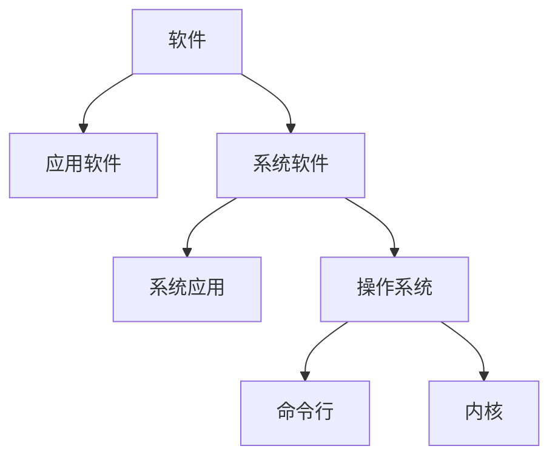

# 1.操作系统结构

## 1.1 操作系统的定位



其中操作系统分为命令行和内核，


其中内核包括系统调用接口、进程管理、内存管理、虚拟文件系统、网络堆栈、设备驱动代码、依赖体系结构的代码等。


## 1.2 操作系统演变

（1）单用户系统

程序只能一段一段执行。

（2）批处理系统

打印等IO操作会占用大量的时间，而CPU利用率会因为IO操作大大降低。

> `CPU利用率=执行时间/(执行时间+IO操作时间)`

为了提高CPU利用率，批处理系统一次执行多个代码，这些代码的打印操作一块进行，减小打印时间，即提高CPU利用率。

（3）多道程序

多道程序利用一段程序等待IO操作完成的时间，进行另外一段程序的执行，实现了CPU复用。


（4）分时

通过定时中断，实现CPU复用。分时没有提升CPU利用率，甚至降低了CPU利用率，但是减小了小段（执行时间短）程序的执行等待时间，让用户体验到并行执行的感觉，而不是要等待前面的任务执行完毕。


（5）个人计算机

每个用户一个系统。

（6）分布式计算机

每个用户多个系统。


## 2.3 操作系统结构

* 分层结构

  

* 微内核结构

  由于分层结构中内核包含功能太多，造成效率下降。微内核为解决分层结构的效率问题，将一些功能放到用户态（用户空间），内核中只保留进程间通信和硬件抽象层。**用户模块间的通信通过内核，使用消息传递**。

  

  >内核空间里存放的是整个内核代码和所有内核模块，以及内核所维护的数据。当用户运行一个程序时，该程序所创建的进程一开始是运行在用户空间的，当它要执行网络发送数据等动作时，必须通过调用write、send等系统函数来完成，这些系统调用会去调用内核中的代码来完成用户的请求操作，这时CPU必须从ring3切换到ring0，然后进入内核地址空间去执行这些代码完成操作，完成后又切换回ring3，回到用户态。

* 外核结构

  **外核只负责资源的分配** 。让内核分配机器的物理资源给多个应用程序，并每个程序决定如何处理这些资源。

  

* 虚拟机管理器VMM

  虚拟机管理器负责将真实硬件映射成多个虚拟硬件。VMM决定虚拟机可以使用具体的资源。

  


# 2.中断及系统调用

## 2.1 加载程序


## 2.2 BIOS系统调用

**只能在实模式下工作。**

BIOS以中断调用的方式，提供了基本的IO功能：

* INT 10h：字符显示
* INT 13h：磁盘扇区读写
* INT 15h：检测内存大小
* INT 16h：键盘输入

**为什么不是直接从文件系统中加载代码，还要一个加载程序？**

磁盘文件系统多种多样，机器出厂时不可能在BIOS中加入认识所有文件系统的代码。所以在有一个基本的约定，可以读取加载程序，将代码和数据从硬盘加载到内存中。

# 3.内存管理

# 4.进程及线程

# 5.处理机调度

# 6.同步互斥

# 7.文件系统

# 8.IO子系统

# 9.实验课程设计

## 9.1 操作系统实验环境准备

### 9.1.1 课程设计内容


### 9.1.2 X86-32硬件介绍

X86-32指的是80386这种机器，是intel的32位机器，有四种运行模式：实模式、保护模式、SMM模式和虚拟8086模式。

* 实模式

  80386加电启动后处于实模式，访问物理内存空间不能超过1MB（20位）

* 保护模式

  支持内存分页机制，还支持优先级机制，有4GB寻址空间（32位）。

### 9.1.3 X86-32硬件内存架构

```
段机制启动、页机制未启动：逻辑地址 -> 段机制处理 -> 线性地址 = 物理地址
段机制和页机制都启动   ：逻辑地址 -> 段机制处理 -> 线性地址 -> 页机制处理 -> 物理地址
```

**物理地址：**处理器提交到总线上用于访问计算机系统中的内存和外设的最终地址。

**线性地址：**在操作系统的虚存管理之下每个运行的应用程序能访问的地址空间。每个运行的应用程序都认为自己独享整个计算机系统地址空间，这样可以让多个运行的应用程序之间相互隔离。

**逻辑地址：**应用程序直接使用的地址空间。

**段机制、页机制：**地址映射关系