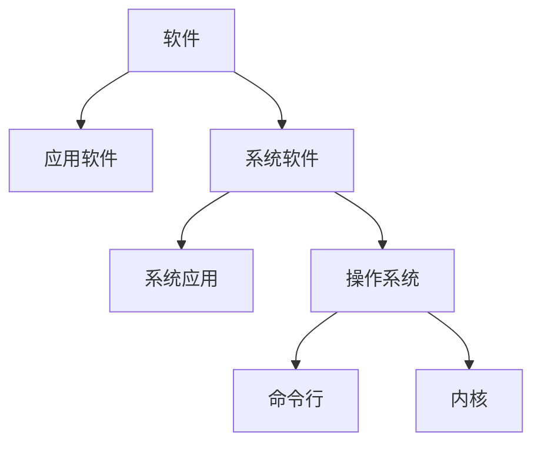

# 1.操作系统结构

## 1.1 操作系统的定位

其中操作系统分为命令行和内核，

其中内核包括系统调用接口、进程管理、内存管理、虚拟文件系统、网络堆栈、设备驱动代码、依赖体系结构的代码等。

## 1.2 操作系统演变

（1）单用户系统

程序只能一段一段执行。

（2）批处理系统

打印等IO操作会占用大量的时间，而CPU利用率会因为IO操作大大降低。

> `CPU利用率=执行时间/(执行时间+IO操作时间)`

为了提高CPU利用率，批处理系统一次执行多个代码，这些代码的打印操作一块进行，减小打印时间，即减小CPU利用率。

（3）多道程序

多道程序利用一段程序等待IO操作完成的时间，进行另外一段程序的执行，实现了CPU复用。

（4）分时

通过定时中断，实现CPU复用。分时没有提升CPU利用率，甚至降低了CPU利用率，但是减小了小段（执行时间短）程序的执行等待时间，让用户体验到并行执行的感觉，而不是要等待前面的任务执行完毕。

（5）个人计算机

每个用户一个系统。

（6）分布式计算机

每个用户多个系统。

# 2.中断及系统调用

# 3.内存管理

# 4.进程及线程

# 5.处理机调度

# 6.同步互斥

# 7.文件系统

# 8.IO子系统

